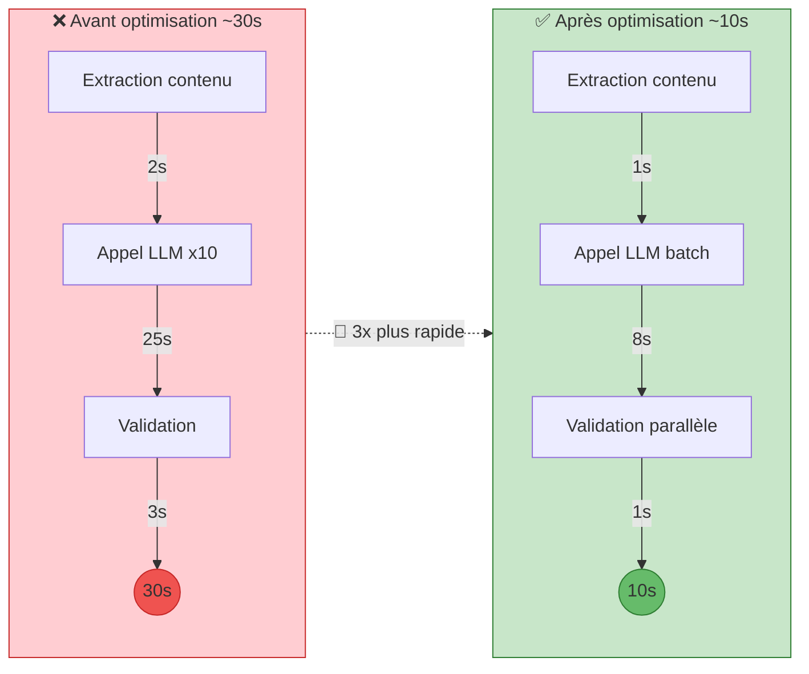
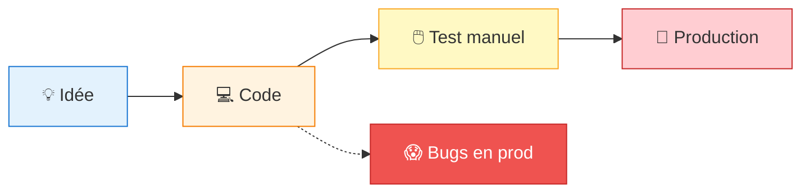

import { Aside, Badge, Card, CardGrid, Steps } from '@astrojs/starlight/components';
import MermaidDownload from '../../../components/MermaidDownload.astro';

# 🔧 Difficultés et retours d'expérience

<Aside type="note">
  Cette section documente honnêtement les difficultés rencontrées durant le développement de Mindlet et les leçons que nous en avons tirées.
</Aside>

## Difficultés techniques

### 1. Migration FastAPI → Laravel

<Badge text="Impact : Élevé" variant="danger" />

**Contexte :**
Notre prototype initial était développé en FastAPI (Python). Nous avons décidé de migrer vers Laravel pour bénéficier d'un écosystème plus complet.

**Problèmes rencontrés :**
- Réécriture complète du code backend
- Perte de temps significative (3 semaines)
- Courbe d'apprentissage de Laravel
- Adaptation des patterns Python → PHP

**Leçons apprises :**
> "Mieux vaut prendre le temps de choisir les bonnes technologies au départ que de devoir migrer en cours de projet."

**Résolution :**
- Documentation systématique des endpoints existants
- Tests automatisés pour valider la migration
- Migration progressive par modules

---

### 2. Performance du service IA

<Badge text="Impact : Critique" variant="danger" />

**Contexte :**
La génération de cartes par l'IA prenait parfois plus de 30 secondes, causant des timeouts et une mauvaise expérience utilisateur.

**Problèmes rencontrés :**
- Timeouts HTTP côté mobile
- Coûts API OpenAI élevés
- Latence variable selon la charge

**Analyse :**

<MermaidDownload title="Optimisation IA avant/après">

</MermaidDownload>

**Solutions implémentées :**
<Steps>
1. **Traitement asynchrone** - Jobs Laravel Horizon
2. **Batch processing** - Générer plusieurs questions en un appel
3. **Cache d'embeddings** - Éviter les calculs redondants
4. **WebSockets** - Notification temps réel de fin de génération
</Steps>

---

### 3. Échec du lancement beta

<Badge text="Impact : Critique" variant="danger" />

**Contexte :**
En décembre 2025, nous avons lancé une version beta qui s'est révélée être un échec technique majeur.

**Bugs critiques découverts :**
| Bug | Impact | Cause |
|-----|--------|-------|
| Crash au démarrage sur iOS 16 | Bloquant | Dépendance incompatible |
| Perte de données synchronisation | Critique | Race condition |
| Lenteur extrême en offline | Majeur | Pas de cache local |
| Auth token expiré silencieusement | Majeur | Pas de refresh automatique |

**Retours utilisateurs :**
> "L'app crash à chaque ouverture" - 3 utilisateurs
> 
> "J'ai perdu toutes mes cartes" - 2 utilisateurs
> 
> "C'est inutilisable sans internet" - 5 utilisateurs

**Leçons apprises :**
- **Tests insuffisants** : Notre couverture était de ~40%
- **Pas de beta testing** : Nous avons publié directement
- **Feature creep** : Trop de fonctionnalités ajoutées par peur

**Plan d'action post-mortem :**
<Steps>
1. Gel des nouvelles fonctionnalités
2. Focus 100% sur la stabilité
3. Suite de tests complète (400+ tests)
4. Programme de beta-testeurs privés
5. Monitoring et alertes en production
</Steps>

---

### 4. Gestion de l'état mobile

<Badge text="Impact : Modéré" variant="caution" />

**Contexte :**
La synchronisation de l'état entre l'application et le serveur causait des incohérences.

**Problèmes rencontrés :**
- État local désynchronisé après perte de connexion
- Conflits lors de modifications simultanées
- Cache local obsolète

**Solution : Architecture avec Zustand + Query**

```typescript
// Avant : État global fragile
const [cards, setCards] = useState([]);

useEffect(() => {
  fetchCards().then(setCards);
}, []);

// Après : Cache intelligent avec invalidation
const { data: cards, isLoading } = useQuery({
  queryKey: ['cards', collectionId],
  queryFn: () => cardsService.getByCollection(collectionId),
  staleTime: 5 * 60 * 1000, // 5 minutes
});
```

---

### 5. Intégration des services cloud

<Badge text="Impact : Modéré" variant="caution" />

**Contexte :**
Configuration de l'infrastructure Kubernetes sur OVHcloud.

**Difficultés :**
- Documentation OVHcloud parfois incomplète
- Configuration des secrets Kubernetes
- Certificats SSL avec Let's Encrypt
- Debugging des pods en production

**Résolutions :**
- Utilisation de Helm pour standardiser les déploiements
- Mise en place de logs centralisés
- Scripts d'automatisation du provisioning

---

## Difficultés organisationnelles

### 1. Équipe de 2 personnes

**Défis :**
- Charge de travail importante
- Polyvalence obligatoire
- Risque de burnout

**Solutions adoptées :**
- Répartition claire des responsabilités
- Rituels de synchronisation quotidiens
- Priorisation impitoyable des tâches

---

### 2. Statut étudiant-entrepreneur

**Défis :**
- Jongler entre cours et projet
- Ressources financières limitées
- Manque d'expérience business

**Opportunités :**
- Accompagnement PEPITE
- Concours et visibilité
- Réseau d'entrepreneurs

---

### 3. Questions légales et éthiques

<Badge text="En cours" variant="note" />

**Questionnements :**
- Propriété intellectuelle du code
- Utilisation des données utilisateurs
- Éthique de l'IA dans l'éducation
- Publication sur les stores

**Actions entreprises :**
- Consultation d'un avocat spécialisé
- Rédaction de CGU et politique de confidentialité
- Charte éthique IA interne

---

## Importance de la phase de conception

<CardGrid>
  <Card title="Architecture" icon="setting">
    Prendre le temps de concevoir l'architecture évite les migrations coûteuses
  </Card>
  <Card title="Tests" icon="approve-check">
    Écrire les tests AVANT le code (TDD) améliore la qualité
  </Card>
  <Card title="Documentation" icon="document">
    Documenter les décisions techniques aide à la maintenance
  </Card>
  <Card title="Revue de code" icon="magnifier">
    Le regard d'un pair détecte les problèmes tôt
  </Card>
</CardGrid>

### Méthodologie améliorée

**Avant (Phase prototype) :**

<MermaidDownload title="Méthodologie avant">

</MermaidDownload>

**Après (Phase actuelle) :**

<MermaidDownload title="Méthodologie après">

</MermaidDownload>

---

## Regard critique sur le projet

### Ce qui a bien fonctionné ✅

| Aspect | Pourquoi |
|--------|----------|
| **Stack technique** | Choix pragmatiques adaptés à notre équipe |
| **Communication équipe** | Rituels réguliers et transparence |
| **Pivot B2B** | Réactivité face aux retours du marché |
| **Concours PEPITE** | Validation externe et visibilité |

### Ce qui aurait pu être mieux ❌

| Aspect | Amélioration possible |
|--------|----------------------|
| **Tests** | Commencer par TDD dès le début |
| **Lancement beta** | Faire une vraie phase de beta fermée |
| **Migration Laravel** | Mieux évaluer les frameworks au départ |
| **Scope** | Éviter le feature creep |

### Recommandations pour des projets similaires

<Steps>
1. **Investir dans les tests** dès le premier jour
2. **Choisir les technologies** avec lesquelles l'équipe est à l'aise
3. **Valider le marché** avant de construire
4. **Itérer rapidement** avec un MVP minimal
5. **Documenter** les décisions et les erreurs
6. **Demander du feedback** régulièrement
7. **Prendre soin de l'équipe** pour éviter le burnout
</Steps>

---

## Conclusion

<Aside type="tip">
  Les échecs sont des opportunités d'apprentissage. Ce projet nous a appris autant par ses difficultés que par ses succès.
</Aside>

L'aventure Mindlet nous a enseigné que :

- La **qualité** prime sur la **quantité** de fonctionnalités
- La **préparation** est plus importante que la **vitesse**
- Les **retours utilisateurs** sont une mine d'or
- L'**humilité** face à l'échec permet de progresser

---

*"L'échec n'est pas l'opposé du succès, c'est une partie du succès." - Arianna Huffington*
