import { Aside, Badge, Card, CardGrid } from '@astrojs/starlight/components';
import MermaidDownload from '../../../components/MermaidDownload.astro';

# 🔍 SEO et site web

<Badge text="Astro" variant="success" />
<Badge text="SSG" variant="note" />

## Site web mindlet.app

Notre site web [mindlet.app](https://www.mindlet.app) est développé avec **Astro**, un framework moderne orienté performance et SEO.

### Pourquoi Astro ?

<CardGrid>
  <Card title="Performance" icon="rocket">
    Zero JavaScript par défaut, chargement ultra-rapide
  </Card>
  <Card title="SEO natif" icon="magnifier">
    SSG avec HTML statique, parfait pour le référencement
  </Card>
  <Card title="Flexibilité" icon="puzzle">
    Support React, Vue, Svelte selon les besoins
  </Card>
  <Card title="DX" icon="star">
    Excellent Developer Experience avec MDX
  </Card>
</CardGrid>

## Stratégie SEO

### Optimisations techniques

| Aspect | Implémentation | Score |
|--------|----------------|-------|
| **Core Web Vitals** | Images optimisées, lazy loading | 95+ |
| **Meta tags** | Titre, description, OG dynamiques | ✅ |
| **Sitemap** | Génération automatique | ✅ |
| **Robots.txt** | Configuration appropriée | ✅ |
| **Schema.org** | Données structurées | ✅ |
| **Mobile-first** | Design responsive | ✅ |

### Meta tags dynamiques

```astro
---
// src/layouts/Layout.astro
const { title, description, image } = Astro.props;
const canonicalURL = new URL(Astro.url.pathname, Astro.site);
---

<head>
  <meta charset="UTF-8" />
  <meta name="viewport" content="width=device-width" />
  
  <!-- SEO -->
  <title>{title} | Mindlet</title>
  <meta name="description" content={description} />
  <link rel="canonical" href={canonicalURL} />
  
  <!-- Open Graph -->
  <meta property="og:type" content="website" />
  <meta property="og:url" content={canonicalURL} />
  <meta property="og:title" content={title} />
  <meta property="og:description" content={description} />
  <meta property="og:image" content={image} />
  
  <!-- Twitter -->
  <meta property="twitter:card" content="summary_large_image" />
  <meta property="twitter:title" content={title} />
  <meta property="twitter:description" content={description} />
  <meta property="twitter:image" content={image} />
  
  <!-- Schema.org -->
  <script type="application/ld+json">
    {JSON.stringify({
      "@context": "https://schema.org",
      "@type": "SoftwareApplication",
      "name": "Mindlet",
      "applicationCategory": "EducationalApplication",
      "operatingSystem": "iOS, Android",
      "offers": {
        "@type": "Offer",
        "price": "0",
        "priceCurrency": "EUR"
      }
    })}
  </script>
</head>
```

### Structure des URLs

```mermaid
flowchart TD
    subgraph Site["🌐 mindlet.app"]
        Home["/  Page d'accueil"]
        Features["/features/  Fonctionnalités"]
        Pricing["/pricing/  Tarifs"]
        
        subgraph Blog["📝 /blog/"]
            BlogIndex["/blog/  Articles"]
            BlogPost["/blog/[slug]/  Article"]
        end
        
        About["/about/  À propos"]
        Contact["/contact/  Contact"]
        
        subgraph Legal["⚖️ /legal/"]
            LegalIndex["/legal/  Mentions légales"]
            Privacy["/legal/privacy/  Confidentialité"]
            Terms["/legal/terms/  CGU"]
        end
    end
    
    Home --> Features
    Home --> Pricing
    Home --> Blog
    Home --> About
    Home --> Contact
    Home --> Legal
    BlogIndex --> BlogPost
    LegalIndex --> Privacy
    LegalIndex --> Terms
    
    style Site fill:#424242,stroke:#616161
    style Blog fill:#1565c0,stroke:#1976d2
    style Legal fill:#e65100,stroke:#f57c00
```

<MermaidDownload title="Structure URLs mindlet.app">

</MermaidDownload>

### Contenu optimisé

**Mots-clés ciblés :**
- "application apprentissage IA"
- "flashcards automatiques"
- "révision intelligente"
- "générateur de quiz"
- "apprentissage adaptatif"

**Structure de contenu :**
```markdown
# H1 : Titre principal avec mot-clé
## H2 : Sections principales
### H3 : Sous-sections détaillées

- Paragraphes courts et lisibles
- Listes pour la scannabilité
- Images avec alt text descriptif
- Liens internes vers pages connexes
```

## Performance web

### Métriques Lighthouse

| Métrique | Score | Objectif |
|----------|-------|----------|
| **Performance** | 98 | > 90 |
| **Accessibility** | 100 | 100 |
| **Best Practices** | 100 | 100 |
| **SEO** | 100 | 100 |

### Optimisations d'images

```astro
---
import { Image } from 'astro:assets';
import heroImage from '../assets/hero.png';
---

<Image 
  src={heroImage} 
  alt="Interface de l'application Mindlet montrant des flashcards"
  width={800}
  height={600}
  format="webp"
  quality={80}
  loading="eager"
/>
```

## Présence en ligne

### Canaux de communication

| Canal | Usage | Fréquence |
|-------|-------|-----------|
| **Site web** | Vitrine, conversion | Mise à jour mensuelle |
| **Blog** | SEO, expertise | 2 articles/mois |
| **LinkedIn** | B2B, networking | Hebdomadaire |
| **Twitter/X** | Actualités, communauté | Quotidien |
| **Product Hunt** | Lancement | Ponctuel |

### Stratégie de contenu

<Aside type="tip">
  Le contenu éducatif positionne Mindlet comme expert dans le domaine de l'apprentissage assisté par IA.
</Aside>

**Types de contenus :**
1. **Articles de blog** - Conseils d'apprentissage, guides
2. **Études de cas** - Témoignages utilisateurs
3. **Tutoriels** - Comment utiliser Mindlet
4. **Actualités** - Nouvelles fonctionnalités

---

*Une présence web soignée pour une visibilité maximale.*
