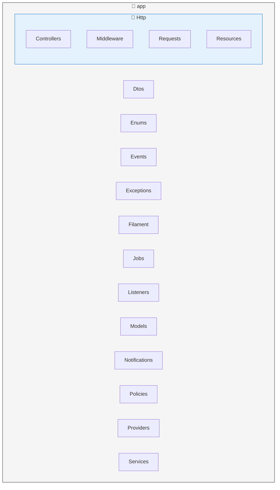

import { Aside, Badge, Steps, TabItem, Tabs } from '@astrojs/starlight/components';
import MermaidDownload from '../../../components/MermaidDownload.astro';

# 🔧 Backend API Laravel

<Badge text="Laravel 12" variant="success" />
<Badge text="PHP 8.4" variant="caution" />
<Badge text="PostgreSQL" variant="note" />

## Présentation

Le backend de Mindlet est une **API RESTful** développée avec **Laravel 12**, offrant une interface robuste et sécurisée pour l'application mobile.

<Aside type="note">
  Nous avons migré de FastAPI (Python) vers Laravel (PHP) pour bénéficier d'un écosystème plus mature et d'une meilleure productivité de développement.
</Aside>

## Stack technique

| Composant | Technologie | Version |
|-----------|-------------|---------|
| **Framework** | Laravel | 12.x |
| **Langage** | PHP | 8.4 |
| **Base de données** | PostgreSQL | 17 |
| **Cache** | Redis | 8.2 |
| **Queue** | Laravel Horizon | - |
| **Auth** | Laravel Sanctum | - |

## Architecture du code

<MermaidDownload title="Structure Laravel">

</MermaidDownload>

## Principes d'architecture

### Design Patterns utilisés

<Tabs>
  <TabItem label="Repository Pattern">
    **Abstraction de la couche données**
    
    ```php
    interface CardRepositoryInterface
    {
        public function findById(int $id): ?Card;
        public function findByCollection(int $collectionId): Collection;
        public function create(array $data): Card;
        public function update(int $id, array $data): Card;
        public function delete(int $id): bool;
    }
    ```
    
    Avantages :
    - Découplage de la logique métier et de la persistance
    - Facilite les tests unitaires (mock des repositories)
    - Permet de changer de source de données sans impacter le code métier
  </TabItem>
  
  <TabItem label="Service Layer">
    **Logique métier centralisée**
    
    ```php
    class CardGenerationService
    {
        public function __construct(
            private AIService $aiService,
            private CardRepository $cardRepository,
            private EmbeddingService $embeddingService
        ) {}
        
        public function generateFromDocument(Document $doc): Collection
        {
            $content = $this->extractContent($doc);
            $questions = $this->aiService->generateQuestions($content);
            
            return $this->createCards($questions);
        }
    }
    ```
  </TabItem>
  
  <TabItem label="Form Requests">
    **Validation déclarative**
    
    ```php
    class CreateCardRequest extends FormRequest
    {
        public function rules(): array
        {
            return [
                'question' => 'required|string|max:1000',
                'answer' => 'required|string|max:5000',
                'collection_id' => 'required|exists:collections,id',
                'type' => 'required|in:flashcard,mcq,truefalse',
            ];
        }
    }
    ```
  </TabItem>
</Tabs>

## Documentation de l'API

L'API est entièrement documentée selon la spécification **OpenAPI 3.0** grâce au package **Scramble**. Celui-ci génère automatiquement la documentation à partir des routes, contrôleurs et annotations, sans maintenance manuelle.

### Points clés

- **Auto‑discovery** des endpoints et schémas depuis le code
- **Documentation OpenAPI** complète et versionnée
- **Interface interactive** intégrée pour tester les requêtes HTTP
- **Sandbox** de test pour valider rapidement les réponses
- **Synchronisation continue** : la doc reste alignée avec l’API

<Aside type="note">
  Le lien vers la documentation complète de l'API : [API Docs](https://api.mindlet.app/docs/api)
</Aside>


## Sécurité

### Authentification

<Steps>
1. L'utilisateur s'authentifie avec email/mot de passe
2. L'API génère un **JWT** avec une durée de vie limitée
3. Le client stocke le token de manière sécurisée
4. Chaque requête inclut le token dans le header `Authorization`
5. Le middleware vérifie et décode le token
</Steps>

### Middlewares de sécurité

```php
// Groupe de middlewares API
Route::middleware([
    'auth:sanctum',      // Authentification JWT
    'throttle:api',      // Rate limiting
    'verified',          // Email vérifié
])->group(function () {
    // Routes protégées
});
```

### Protection des données

| Mesure | Implémentation |
|--------|----------------|
| **Chiffrement** | Données sensibles chiffrées en base (AES-256) |
| **Hashing** | Mots de passe hashés avec bcrypt |
| **HTTPS** | TLS 1.3 obligatoire |
| **CORS** | Configuration restrictive |

## Jobs asynchrones

Les tâches longues sont exécutées de manière asynchrone via **Laravel Horizon** :

```php
class GenerateCardsJob implements ShouldQueue
{
    use Dispatchable, InteractsWithQueue, Queueable, SerializesModels;
    
    public function __construct(
        private Document $document,
        private User $user
    ) {}
    
    public function handle(AIService $aiService): void
    {
        $cards = $aiService->generateCards($this->document);
        
        // Notification à l'utilisateur
        $this->user->notify(new CardsGeneratedNotification($cards));
    }
}
```

### Types de jobs

| Job | Description | Priorité |
|-----|-------------|----------|
| `GenerateCardsJob` | Génération de cartes via IA | High |
| `ProcessDocumentJob` | Analyse de document uploadé | High |
| `SendNotificationJob` | Envoi de notifications | Low |
| `CleanupJob` | Nettoyage des fichiers temporaires | Low |

## Base de données

### Migrations

Les migrations versionnent le schéma de la base de données :

```php
Schema::create('cards', function (Blueprint $table) {
    $table->id();
    $table->foreignId('collection_id')->constrained()->cascadeOnDelete();
    $table->foreignId('user_id')->constrained()->cascadeOnDelete();
    $table->string('type'); // flashcard, mcq, truefalse, etc.
    $table->text('question');
    $table->text('answer');
    $table->json('options')->nullable(); // Pour les QCM
    $table->json('metadata')->nullable();
    $table->timestamps();
    $table->softDeletes();
    
    $table->index(['collection_id', 'type']);
});
```

### Modèles Eloquent

```php
class Card extends Model
{
    use HasFactory, SoftDeletes;
    
    protected $fillable = [
        'collection_id',
        'user_id',
        'type',
        'question',
        'answer',
        'options',
        'metadata',
    ];
    
    protected $casts = [
        'options' => 'array',
        'metadata' => 'array',
    ];
    
    public function collection(): BelongsTo
    {
        return $this->belongsTo(Collection::class);
    }
    
    public function user(): BelongsTo
    {
        return $this->belongsTo(User::class);
    }
}
```

## Tests

<Badge text="400+ tests" variant="success" />

Notre backend dispose d'une suite complète de tests :

```php
class CardControllerTest extends TestCase
{
    use RefreshDatabase;
    
    public function test_user_can_create_card(): void
    {
        $user = User::factory()->create();
        $collection = Collection::factory()->for($user)->create();
        
        $response = $this->actingAs($user)
            ->postJson('/api/v1/cards', [
                'collection_id' => $collection->id,
                'question' => 'What is Laravel?',
                'answer' => 'A PHP framework',
                'type' => 'flashcard',
            ]);
        
        $response->assertStatus(201)
            ->assertJsonStructure([
                'data' => ['id', 'question', 'answer', 'type']
            ]);
    }
}
```

### Couverture des tests

| Type | Nombre | Couverture |
|------|--------|------------|
| **Unit Tests** | 250+ | 85% |
| **Feature Tests** | 150+ | 90% |
| **Integration Tests** | 50+ | - |

---

*API conçue avec les meilleures pratiques Laravel pour la robustesse et la maintenabilité.*
