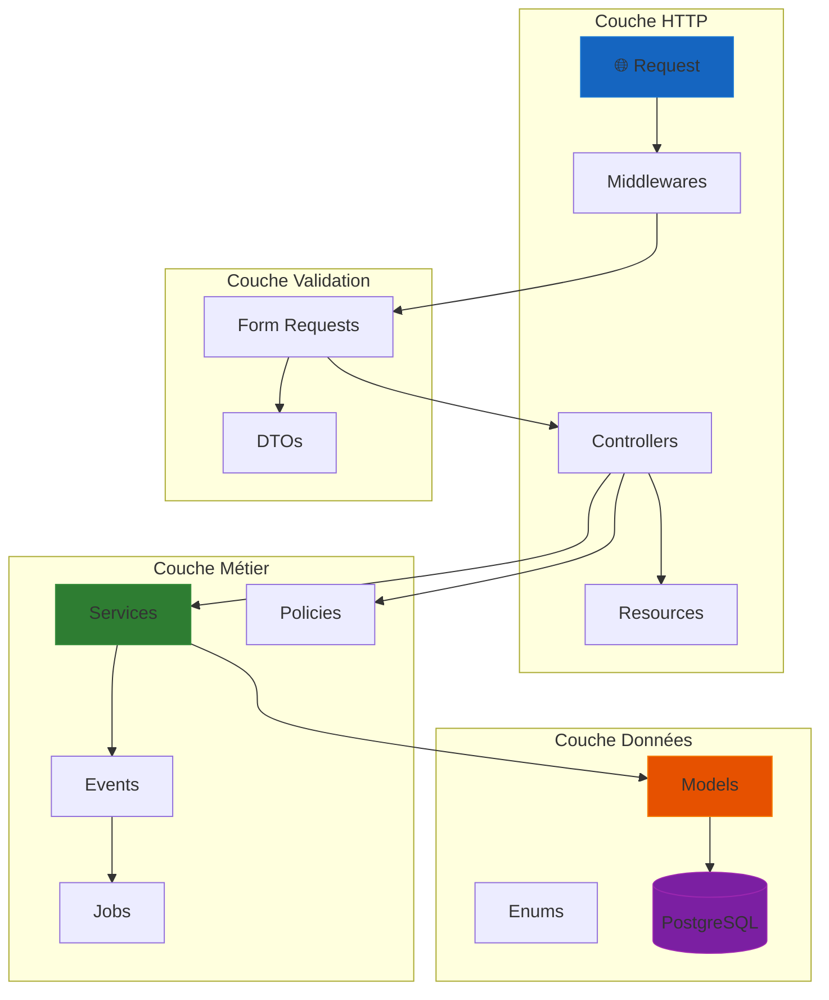
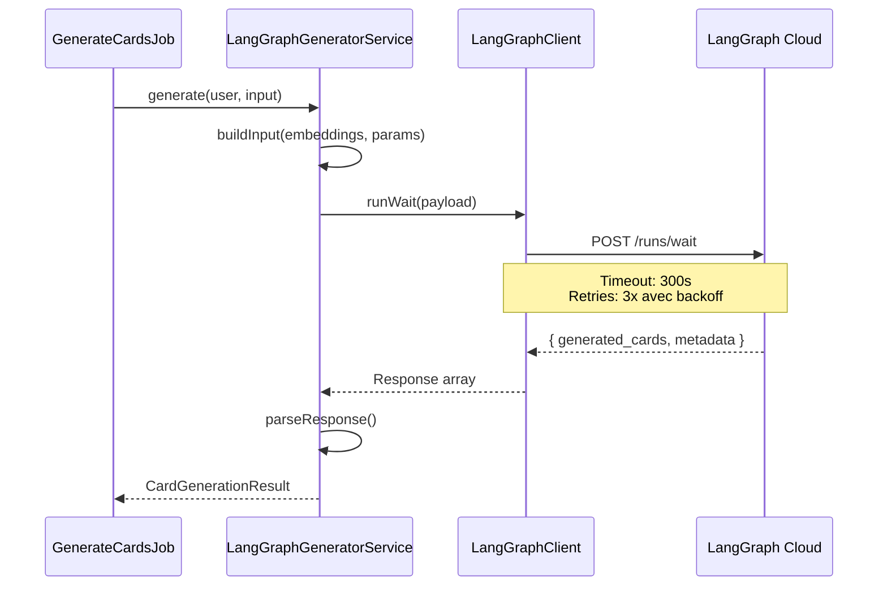
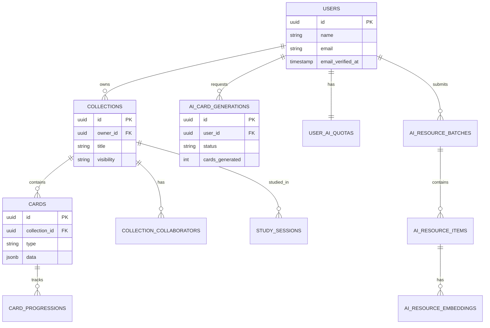

import { Aside, Badge, Card, CardGrid, Steps, TabItem, Tabs } from '@astrojs/starlight/components';
import MermaidDownload from '../../../components/MermaidDownload.astro';

# 🔧 Backend API Laravel

<Badge text="Laravel 12" variant="success" />
<Badge text="PHP 8.4" variant="caution" />
<Badge text="PostgreSQL 17" variant="note" />
<Badge text="Redis" variant="tip" />

## Vue d'ensemble

Le backend de Mindlet est une **API RESTful** développée avec **Laravel 12**, conçue selon une architecture en couches (Layered Architecture) avec une séparation stricte des responsabilités. Cette API constitue le point central de communication entre l'application mobile et le service d'intelligence artificielle.

### Ce que fait le backend

- 🔐 **Authentification** multi-providers (email/password, Google, Apple)
- 📚 **Gestion des collections** et des cartes d'apprentissage
- 🎴 **Orchestration** de la génération de cartes via le service IA
- 📊 **Suivi de progression** et sessions d'étude
- 💬 **Messagerie temps réel** via WebSocket
- 🏢 **Gestion d'organisations** et collaboration

<Aside type="tip" title="Pourquoi Laravel 12 ?">
  Laravel offre un écosystème mature et cohérent qui accélère le développement tout en garantissant la maintenabilité. Les fonctionnalités natives comme **Horizon** (gestion des queues), **Sanctum** (authentification API), et **Reverb** (WebSocket) permettent de construire une API robuste sans dépendances externes complexes.
</Aside>

## Stack technique

| Composant | Technologie | Rôle |
|-----------|-------------|------|
| **Framework** | Laravel 12.x | Structure applicative |
| **Langage** | PHP 8.4 | Typage strict, enums natifs |
| **Base de données** | PostgreSQL 17 | Stockage relationnel, JSONB |
| **Cache & Queues** | Redis 8.2 | Sessions, jobs asynchrones |
| **WebSocket** | Laravel Reverb | Temps réel bidirectionnel |
| **Auth** | Laravel Sanctum | Tokens API, OAuth |
| **Jobs** | Laravel Horizon | Monitoring des workers |
| **API Docs** | Scramble | Génération OpenAPI |
| **Admin** | Filament 4.0 | Interface d'administration |
| **Stockage** | AWS S3 / MinIO | Fichiers et médias |

## Architecture du code

L'organisation du code suit le pattern **Service Layer** enrichi de **DTOs** pour le transfert de données et de **Policies** pour l'autorisation :

<MermaidDownload title="Architecture en couches">

</MermaidDownload>

### Structure des dossiers

```
app/
├── Console/                    # Commandes Artisan
├── Dtos/                       # Data Transfer Objects
│   ├── Ai/                     # DTOs pour l'IA
│   │   └── GeneratedCards/     # DTOs par type de carte
│   ├── CardGeneration/         # DTOs du flux de génération
│   └── Embedding/              # DTOs des embeddings
├── Enums/                      # Énumérations typées
│   ├── Card/                   # CardType, CardDifficulty
│   ├── Collection/             # Visibility, CollaboratorRole
│   └── Ai/                     # AiBatchStatus, CardGenerationStatus
├── Events/                     # Événements broadcast
│   └── CardGeneration/         # 6 événements de génération
├── Exceptions/                 # Exceptions personnalisées
├── Http/
│   ├── Controllers/            # 22+ contrôleurs par domaine
│   ├── Middleware/             # Middlewares personnalisés
│   ├── Requests/               # Form Requests (validation)
│   └── Resources/              # Transformateurs JSON
├── Jobs/                       # Jobs asynchrones
│   └── CardGeneration/         # GenerateCardsJob
├── Listeners/                  # Écouteurs d'événements
├── Models/                     # 35+ modèles Eloquent
├── Notifications/              # Notifications push/email
├── Policies/                   # Politiques d'autorisation
├── Providers/                  # Fournisseurs de services
└── Services/                   # Logique métier
    ├── Ai/                     # Services IA (quota, historique)
    ├── CardGeneration/         # Orchestration de génération
    └── LangGraph/              # Client service IA
```

## Design Patterns utilisés

L'architecture du backend repose sur plusieurs design patterns reconnus, chacun répondant à une problématique spécifique :

<Tabs>
  <TabItem label="Service Layer">
    ### Pattern Service Layer

    **Objectif** : Centraliser la logique métier dans des classes dédiées, indépendantes du framework HTTP.

    Ce pattern permet de :
    - **Découpler** la logique métier des contrôleurs
    - **Réutiliser** la même logique depuis différents points d'entrée (API, Jobs, Console)
    - **Tester** unitairement sans dépendances HTTP

    ```php
    // app/Services/CardGeneration/CardGenerationService.php
    class CardGenerationService
    {
        public function __construct(
            private readonly QuotaService $quotaService,
            private readonly LangGraphGeneratorService $generator,
            private readonly CardPersistenceService $persistence,
            private readonly GenerationHistoryService $history,
        ) {}

        /**
         * Dispatche une génération de cartes de manière asynchrone.
         *
         * @throws QuotaExceededException Si le quota utilisateur est dépassé
         */
        public function dispatchGeneration(
            User $user,
            CardGenerationInput $input
        ): CardGenerationDispatchResult {
            // 1. Vérification du quota
            $this->quotaService->guardCanGenerate(
                $user,
                $input->getTotalCardsRequested()
            );

            // 2. Enregistrement dans l'historique
            $generation = $this->history->recordRequest($user, $input);

            // 3. Dispatch du job asynchrone
            GenerateCardsJob::dispatch(
                $user->id,
                $generation->generation_id,
                $input
            );

            return new CardGenerationDispatchResult(
                generationId: $generation->generation_id,
                status: CardGenerationStatus::QUEUED,
                totalCardsRequested: $input->getTotalCardsRequested(),
            );
        }
    }
    ```

    <Aside type="note">
      Les services sont injectés via le **Service Container** de Laravel, facilitant les tests avec des mocks et la substitution d'implémentations.
    </Aside>
  </TabItem>

  <TabItem label="DTO Pattern">
    ### Pattern Data Transfer Object (DTO)

    **Objectif** : Encapsuler les données transitant entre les couches dans des objets fortement typés.

    Les DTOs garantissent :
    - **Typage fort** : validation à la compilation
    - **Immutabilité** : données readonly après création
    - **Documentation** : structure explicite des données

    ```php
    // app/Dtos/CardGeneration/CardGenerationInput.php
    readonly class CardGenerationInput
    {
        /**
         * @param CardTypeRequest[] $cardTypes Types et quantités demandés
         */
        public function __construct(
            public LanguageCode $language,
            public array $cardTypes,
            public ?string $prompt = null,
            public ?string $userContext = null,
            public ?string $batchId = null,
            public ?string $collectionId = null,
            public CardDifficulty $difficulty = CardDifficulty::INTERMEDIATE,
        ) {}

        public function getTotalCardsRequested(): int
        {
            return array_sum(
                array_map(fn($ct) => $ct->count, $this->cardTypes)
            );
        }

        /**
         * Crée un DTO depuis une Form Request validée.
         */
        public static function fromRequest(GenerateCardsRequest $request): self
        {
            return new self(
                language: $request->enum('language', LanguageCode::class),
                cardTypes: $request->getCardTypeRequests(),
                prompt: $request->validated('prompt'),
                userContext: $request->validated('user_context'),
                batchId: $request->validated('batch_id'),
                collectionId: $request->validated('collection_id'),
                difficulty: $request->enum('difficulty', CardDifficulty::class)
                    ?? CardDifficulty::INTERMEDIATE,
            );
        }
    }
    ```

    **Exemple de transformation DTO → Payload Base de données :**

    ```php
    // app/Dtos/Ai/GeneratedCards/FlashcardGeneratedCard.php
    class FlashcardGeneratedCard implements GeneratedCardDto
    {
        use TruncatesText;

        private function __construct(
            private string $question,
            private string $answer,
            private ?string $explanation,
        ) {}

        public static function fromArray(array $data): self
        {
            return new self(
                question: self::truncate($data['question'] ?? '', 2000),
                answer: self::truncate($data['answer'] ?? '', 5000),
                explanation: isset($data['explanation'])
                    ? self::truncate($data['explanation'], 2000)
                    : null,
            );
        }

        public function toPayload(): GeneratedCardPayload
        {
            return new GeneratedCardPayload(
                type: CardType::FLASHCARD,
                data: [
                    'question' => ['text' => $this->question],
                    'answer' => [
                        'value' => $this->answer,
                        'explanation' => $this->explanation,
                    ],
                ],
            );
        }
    }
    ```
  </TabItem>

  <TabItem label="Policy Pattern">
    ### Pattern Authorization Policy

    **Objectif** : Centraliser les règles d'autorisation par ressource dans des classes dédiées.

    Laravel implémente nativement ce pattern avec les **Policies**, permettant de :
    - **Exprimer** clairement les règles d'accès
    - **Réutiliser** les vérifications dans toute l'application
    - **Auditer** facilement les permissions

    ```php
    // app/Policies/CollectionPolicy.php
    #[UsePolicy(CollectionPolicy::class)]
    class CollectionPolicy
    {
        /**
         * Détermine si l'utilisateur peut voir la collection.
         */
        public function view(User $user, Collection $collection): bool
        {
            // Propriétaire
            if ($collection->owner_id === $user->id) {
                return true;
            }

            // Collection publique
            if ($collection->visibility === CollectionVisibility::PUBLIC) {
                return true;
            }

            // Collaborateur
            return $collection->collaborators()
                ->where('user_id', $user->id)
                ->exists();
        }

        /**
         * Détermine si l'utilisateur peut modifier la collection.
         */
        public function update(User $user, Collection $collection): bool
        {
            if ($collection->owner_id === $user->id) {
                return true;
            }

            return $collection->collaborators()
                ->where('user_id', $user->id)
                ->where('role', CollaboratorRole::EDITOR)
                ->exists();
        }

        /**
         * Détermine si l'utilisateur peut supprimer la collection.
         */
        public function delete(User $user, Collection $collection): bool
        {
            return $collection->owner_id === $user->id;
        }
    }
    ```

    **Utilisation dans un contrôleur :**

    ```php
    public function update(UpdateCollectionRequest $request, Collection $collection)
    {
        // Vérifie automatiquement CollectionPolicy::update()
        $this->authorize('update', $collection);

        $collection->update($request->validated());

        return new CollectionResource($collection);
    }
    ```
  </TabItem>

  <TabItem label="Event-Driven">
    ### Pattern Event-Driven Architecture

    **Objectif** : Découpler les actions de leurs effets secondaires via un système d'événements.

    Ce pattern permet de :
    - **Notifier** le client en temps réel (WebSocket)
    - **Déclencher** des actions sans couplage fort
    - **Tracer** le flux d'exécution

    ```php
    // app/Events/CardGeneration/CardGenerationCompleted.php
    class CardGenerationCompleted implements ShouldBroadcastNow
    {
        use Dispatchable, InteractsWithSockets, SerializesModels;

        public function __construct(
            public readonly string $userId,
            public readonly string $generationId,
            public readonly string $collectionId,
            public readonly int $totalCardsGenerated,
            public readonly int $totalCardsPersisted,
        ) {}

        /**
         * Canal de diffusion (privé par utilisateur).
         */
        public function broadcastOn(): array
        {
            return [
                new PrivateChannel("users.{$this->userId}"),
            ];
        }

        /**
         * Nom de l'événement côté client.
         */
        public function broadcastAs(): string
        {
            return 'card.generation.completed';
        }

        /**
         * Données envoyées au client.
         */
        public function broadcastWith(): array
        {
            return [
                'generation_id' => $this->generationId,
                'status' => 'completed',
                'collection_id' => $this->collectionId,
                'total_cards_generated' => $this->totalCardsGenerated,
                'total_cards_persisted' => $this->totalCardsPersisted,
            ];
        }
    }
    ```

    **Chaîne d'événements de génération de cartes :**

    ```mermaid
    sequenceDiagram
        participant J as GenerateCardsJob
        participant E as Events
        participant WS as WebSocket
        participant C as Client Mobile

        J->>E: CardGenerationStarted
        E->>WS: Broadcast
        WS->>C: Notification "En cours..."

        J->>E: CardsGenerated
        E->>WS: Broadcast
        WS->>C: Progress update

        J->>E: CollectionCreated (si nouvelle)
        J->>E: CardsPersisted

        J->>E: CardGenerationCompleted
        E->>WS: Broadcast
        WS->>C: Notification "Terminé!"
    ```
  </TabItem>
</Tabs>

## Énumérations typées (Enums)

PHP 8.1+ permet l'utilisation d'énumérations natives. Mindlet les utilise intensivement pour garantir la cohérence des données :

<Tabs>
  <TabItem label="Types de cartes">
    ```php
    // app/Enums/Card/CardType.php
    enum CardType: string
    {
        case FLASHCARD = 'flashcard';           // Question/Réponse
        case MCQ = 'mcq';                       // QCM
        case FREE_TEXT = 'free_text';           // Réponse libre
        case TRUE_OR_FALSE = 'true_or_false';   // Vrai/Faux
        case SLIDER = 'slider';                 // Estimation numérique
        case MATCH_PAIRS = 'match_pairs';       // Associer des paires
        case DRAG_AND_DROP = 'drag_and_drop';   // Glisser-déposer
        case RANKING = 'ranking';               // Classement
        case GEO_GUESS = 'geo_guess';           // Géolocalisation

        public function label(): string
        {
            return match($this) {
                self::FLASHCARD => 'Flashcard',
                self::MCQ => 'QCM',
                self::FREE_TEXT => 'Réponse libre',
                // ...
            };
        }
    }
    ```
  </TabItem>

  <TabItem label="Statuts de génération">
    ```php
    // app/Enums/Ai/CardGenerationStatus.php
    enum CardGenerationStatus: string
    {
        case QUEUED = 'queued';         // En file d'attente
        case PROCESSING = 'processing'; // En cours de génération
        case COMPLETED = 'completed';   // Terminé avec succès
        case FAILED = 'failed';         // Échec

        public function isTerminal(): bool
        {
            return in_array($this, [self::COMPLETED, self::FAILED]);
        }
    }
    ```
  </TabItem>

  <TabItem label="Visibilité">
    ```php
    // app/Enums/Collection/CollectionVisibility.php
    enum CollectionVisibility: string
    {
        case PRIVATE = 'private';   // Seul le propriétaire
        case PUBLIC = 'public';     // Visible par tous
        case DRAFT = 'draft';       // Brouillon (non listé)
    }

    // app/Enums/Collection/CollaboratorRole.php
    enum CollaboratorRole: string
    {
        case VIEWER = 'viewer';   // Lecture seule
        case EDITOR = 'editor';   // Modification autorisée
    }
    ```
  </TabItem>
</Tabs>

## Modèles Eloquent

Les modèles Eloquent représentent les entités métier et encapsulent les relations, accesseurs et casts :

### Modèle Card (exemple commenté)

```php
// app/Models/Card.php
class Card extends Model
{
    use HasFactory, SoftDeletes;
    use InteractsWithMedia; // Spatie Media Library
    use LogsActivity;       // Audit trail

    /**
     * Table avec UUID comme clé primaire.
     */
    protected $keyType = 'string';
    public $incrementing = false;

    /**
     * Attributs assignables en masse.
     */
    protected $fillable = [
        'collection_id',
        'type',
        'data',      // JSONB : question, réponse, options
        'config',    // JSONB : comportement, feedback
        'metadata',  // JSONB : tags, niveau, source
    ];

    /**
     * Casting automatique des attributs.
     *
     * - CardType::class : conversion automatique string ↔ enum
     * - 'array' : JSON ↔ array PHP
     */
    protected $casts = [
        'type' => CardType::class,
        'data' => 'array',
        'config' => 'array',
        'metadata' => 'array',
    ];

    // ═══════════════════════════════════════════════════
    // RELATIONS
    // ═══════════════════════════════════════════════════

    public function collection(): BelongsTo
    {
        return $this->belongsTo(Collection::class);
    }

    public function progressions(): HasMany
    {
        return $this->hasMany(CardProgression::class);
    }

    /**
     * Progression de l'utilisateur courant.
     */
    public function userProgression(): HasOne
    {
        return $this->hasOne(CardProgression::class)
            ->where('user_id', auth()->id());
    }

    // ═══════════════════════════════════════════════════
    // ACCESSEURS (colonnes virtuelles)
    // ═══════════════════════════════════════════════════

    /**
     * Accès simplifié à data.question.text
     */
    protected function question(): Attribute
    {
        return Attribute::get(
            fn() => $this->data['question']['text'] ?? null
        );
    }

    /**
     * Accès simplifié à data.answer.value
     */
    protected function answer(): Attribute
    {
        return Attribute::get(
            fn() => $this->data['answer']['value'] ?? null
        );
    }

    // ═══════════════════════════════════════════════════
    // MEDIA LIBRARY
    // ═══════════════════════════════════════════════════

    public function registerMediaCollections(): void
    {
        $this->addMediaCollection('attachments')
            ->acceptsMimeTypes([
                'image/jpeg', 'image/png', 'image/webp',
                'audio/mpeg', 'audio/wav',
            ]);
    }
}
```

<Aside type="note" title="Colonnes JSONB">
  PostgreSQL offre le type **JSONB** qui permet de stocker des données JSON avec indexation et requêtes efficaces. Cela évite de créer des tables supplémentaires pour les données polymorphes comme les différents types de cartes.
</Aside>

## Jobs asynchrones

Les tâches longues sont déléguées à des **Jobs** exécutés en arrière-plan via **Laravel Horizon** :

### GenerateCardsJob (exemple complet)

```php
// app/Jobs/CardGeneration/GenerateCardsJob.php
class GenerateCardsJob implements ShouldQueue
{
    use Dispatchable, InteractsWithQueue, Queueable, SerializesModels;

    /**
     * Nombre maximum de tentatives.
     */
    public int $tries = 5;

    /**
     * Timeout en secondes (10 minutes pour l'IA).
     */
    public int $timeout = 600;

    /**
     * File d'attente dédiée aux jobs IA.
     */
    public string $queue = 'ai';

    private int $waitAttempts = 0;
    private const MAX_WAIT_ATTEMPTS = 10;

    public function __construct(
        private readonly string $userId,
        private readonly string $generationId,
        private readonly CardGenerationInput $input,
    ) {}

    public function handle(
        CardGenerationService $service,
        GenerationHistoryService $history,
    ): void {
        $user = User::findOrFail($this->userId);

        // 1. Marquer comme "en cours"
        $history->markProcessing($this->generationId);
        event(new CardGenerationStarted(
            $this->userId,
            $this->generationId,
            $this->input->getTotalCardsRequested()
        ));

        // 2. Attendre que le batch soit prêt (si applicable)
        if ($this->input->batchId) {
            $this->guardBatchIsReady($this->input->batchId);
        }

        // 3. Générer les cartes
        $result = $service->generate($user, $this->input);

        event(new CardsGenerated(
            $this->userId,
            $this->generationId,
            $result->stats->cardsGenerated
        ));

        // 4. Persister en base
        $persistenceResult = app(CardPersistenceService::class)
            ->persist($user, $result, $this->input);

        if ($persistenceResult->collectionCreated) {
            event(new CollectionCreated(
                $this->userId,
                $this->generationId,
                $persistenceResult->collectionId,
                $persistenceResult->collectionTitle
            ));
        }

        event(new CardsPersisted(
            $this->userId,
            $this->generationId,
            $persistenceResult->collectionId,
            $persistenceResult->cardsPersisted
        ));

        // 5. Consommer le quota APRÈS la persistance
        app(QuotaService::class)->consumeQuota(
            $user,
            $result->stats->cardsGenerated
        );

        // 6. Mettre à jour l'historique
        $history->markCompleted(
            $this->generationId,
            $persistenceResult->collectionId,
            $result->stats
        );

        // 7. Notifier le succès
        event(new CardGenerationCompleted(
            $this->userId,
            $this->generationId,
            $persistenceResult->collectionId,
            $result->stats->cardsGenerated,
            $persistenceResult->cardsPersisted
        ));
    }

    /**
     * Attente active pour la préparation du batch d'embeddings.
     */
    private function guardBatchIsReady(string $batchId): void
    {
        $batch = AiResourceBatch::findOrFail($batchId);

        if ($batch->status === AiBatchStatus::COMPLETED) {
            return;
        }

        if ($this->waitAttempts >= self::MAX_WAIT_ATTEMPTS) {
            throw new BatchNotReadyException(
                "Batch $batchId not ready after max attempts"
            );
        }

        $this->waitAttempts++;
        $delay = min(5 + ($this->waitAttempts * 5), 30); // 5s → 30s

        $this->release($delay); // Relâche le job, sera réessayé
    }

    /**
     * Gestion des échecs.
     */
    public function failed(\Throwable $exception): void
    {
        app(GenerationHistoryService::class)->markFailed(
            $this->generationId,
            $exception->getMessage()
        );

        event(new CardGenerationFailed(
            $this->userId,
            $this->generationId,
            $exception->getMessage(),
            $this->input->batchId
        ));
    }
}
```

<Aside type="caution" title="Consommation du quota">
  Le quota n'est consommé qu'**après** la persistance réussie des cartes. Cela garantit que l'utilisateur n'est pas facturé en cas d'échec technique.
</Aside>

## Communication avec le service IA

L'intégration avec le service **LangGraph** se fait via un client HTTP dédié :

<MermaidDownload title="Communication Backend → Service IA">

</MermaidDownload>

### LangGraphClient

```php
// app/Services/LangGraph/LangGraphClient.php
class LangGraphClient
{
    private const MAX_RETRIES = 3;
    private const MAX_BACKOFF_MS = 5000;

    public function __construct(
        private readonly string $baseUrl,
        private readonly string $apiKey,
        private readonly float $connectTimeout = 5.0,
        private readonly float $readTimeout = 300.0,
    ) {}

    /**
     * Exécute une requête synchrone avec attente du résultat.
     */
    public function runWait(array $payload): array
    {
        return $this->post('/runs/wait', $payload);
    }

    /**
     * POST avec retry et backoff exponentiel.
     */
    private function post(string $path, array $payload): array
    {
        $attempt = 0;
        $lastException = null;

        while ($attempt < self::MAX_RETRIES) {
            try {
                $response = Http::baseUrl($this->baseUrl)
                    ->withToken($this->apiKey)
                    ->timeout($this->readTimeout)
                    ->connectTimeout($this->connectTimeout)
                    ->post($path, $payload);

                if ($response->successful()) {
                    return $response->json();
                }

                throw new \RuntimeException(
                    "LangGraph error: {$response->status()}"
                );

            } catch (\Exception $e) {
                $lastException = $e;
                $attempt++;

                if ($attempt < self::MAX_RETRIES) {
                    $backoff = min(
                        (2 ** $attempt) * 100 + random_int(0, 100),
                        self::MAX_BACKOFF_MS
                    );
                    usleep($backoff * 1000);
                }
            }
        }

        throw $lastException;
    }
}
```

## Validation des requêtes

La validation est centralisée dans des **Form Requests** avec des règles déclaratives :

```php
// app/Http/Requests/CardGeneration/GenerateCardsRequest.php
class GenerateCardsRequest extends FormRequest
{
    public function rules(): array
    {
        return [
            // Prompt requis si pas de batch
            'prompt' => [
                'nullable',
                'string',
                'max:5000',
                Rule::requiredIf(fn() => !$this->filled('batch_id')),
            ],

            // Langue obligatoire (enum validé)
            'language' => [
                'required',
                Rule::enum(LanguageCode::class),
            ],

            // Contexte utilisateur optionnel
            'user_context' => ['nullable', 'string', 'max:2000'],

            // Batch ID requis si pas de prompt
            'batch_id' => [
                'nullable',
                'uuid',
                Rule::requiredIf(fn() => !$this->filled('prompt')),
                $this->batchExistsRule(),
            ],

            // Collection cible (optionnelle)
            'collection_id' => [
                'nullable',
                'uuid',
                Rule::exists('collections', 'id'),
            ],

            // Difficulté (enum optionnel)
            'difficulty' => [
                'sometimes',
                Rule::enum(CardDifficulty::class),
            ],

            // Types de cartes demandés
            'card_types' => ['required', 'array', 'min:1'],
            'card_types.*.card_type' => [
                'required',
                Rule::enum(CardType::class),
            ],
            'card_types.*.count' => [
                'required',
                'integer',
                'min:1',
                'max:50',
            ],
        ];
    }

    /**
     * Règle personnalisée : le batch doit appartenir à l'utilisateur.
     */
    private function batchExistsRule(): \Closure
    {
        return function ($attribute, $value, $fail) {
            $exists = AiResourceBatch::query()
                ->where('id', $value)
                ->where('user_id', $this->user()->id)
                ->exists();

            if (!$exists) {
                $fail("Le batch spécifié n'existe pas.");
            }
        };
    }

    /**
     * Conversion vers DTO après validation.
     */
    public function toDto(): CardGenerationInput
    {
        return CardGenerationInput::fromRequest($this);
    }
}
```

## Documentation de l'API

L'API est documentée automatiquement via **Scramble**, qui génère une spécification **OpenAPI 3.0** à partir du code :

### Configuration Scramble

```php
// config/scramble.php
return [
    'api_path' => 'api',
    'export_path' => 'api.json',

    'ui' => [
        'theme' => 'light',
        'layout' => 'responsive',
    ],

    // Schéma de sécurité
    'security' => [
        'default' => [
            ['bearerAuth' => []],
        ],
    ],
];

// AppServiceProvider.php
Scramble::configure()
    ->withDocumentTransformers(function (OpenApi $openApi) {
        $openApi->secure(
            SecurityScheme::http('bearer', 'JWT')
        );
    });
```

**Résultat** : Documentation interactive accessible à `/docs/api`

<Aside type="tip" title="Avantage de Scramble">
  Contrairement aux annotations manuelles, Scramble **infère** automatiquement les types depuis le code PHP, les Form Requests et les Resources. La documentation reste toujours synchronisée avec l'implémentation.
</Aside>

## Authentification et sécurité

<Tabs>
  <TabItem label="Sanctum">
    ### Laravel Sanctum

    L'authentification API utilise **Laravel Sanctum** avec des tokens Bearer :

    ```php
    // Génération d'un token
    $token = $user->createToken('mobile-app', ['*']);

    // Header de requête
    Authorization: Bearer {token}
    ```

    **Flux d'authentification :**

    <Steps>
    1. L'utilisateur envoie ses credentials (email/password ou OAuth)
    2. L'API valide et génère un **access token** (courte durée) et un **refresh token**
    3. Le client stocke les tokens de manière sécurisée
    4. Chaque requête inclut l'access token dans le header `Authorization`
    5. Le middleware `auth:sanctum` vérifie le token
    6. À expiration, le client utilise le refresh token pour en obtenir un nouveau
    </Steps>

    <MermaidDownload title="Flux d'authentification Sanctum">
    ```mermaid
    sequenceDiagram
        autonumber
        participant Client as 📱 Mobile App
        participant API as 🖥️ Laravel API
        participant MW as 🔒 Middleware Sanctum
        participant DB as 🗄️ PostgreSQL

        rect rgb(46, 125, 50)
            Note over Client,DB: Phase 1 : Authentification initiale
            Client->>+API: POST /auth/login<br/>{email, password}
            API->>+DB: Vérifier credentials
            DB-->>-API: User trouvé ✓
            API->>DB: Créer personal_access_token
            API-->>-Client: 200 OK<br/>{access_token, refresh_token, expires_in}
            Client->>Client: Stocker tokens (SecureStore)
        end

        rect rgb(21, 101, 192)
            Note over Client,DB: Phase 2 : Requêtes authentifiées
            Client->>+API: GET /api/collections<br/>Authorization: Bearer {token}
            API->>+MW: Vérifier token
            MW->>+DB: SELECT * FROM personal_access_tokens
            DB-->>-MW: Token valide ✓
            MW-->>-API: User authentifié
            API->>DB: Fetch collections
            API-->>-Client: 200 OK<br/>{collections: [...]}
        end

        rect rgb(230, 81, 0)
            Note over Client,DB: Phase 3 : Rafraîchissement du token
            Client->>+API: POST /auth/refresh<br/>{refresh_token}
            API->>+DB: Vérifier refresh_token
            DB-->>-API: Token valide ✓
            API->>DB: Révoquer ancien access_token
            API->>DB: Créer nouveau access_token
            API-->>-Client: 200 OK<br/>{access_token, expires_in}
        end

        rect rgb(198, 40, 40)
            Note over Client,DB: Cas d'erreur : Token expiré
            Client->>+API: GET /api/cards<br/>Authorization: Bearer {expired_token}
            API->>+MW: Vérifier token
            MW->>DB: SELECT * FROM personal_access_tokens
            MW-->>-API: Token expiré ✗
            API-->>-Client: 401 Unauthorized
            Client->>Client: Déclencher refresh flow
        end
    ```
    </MermaidDownload>

    **Explication du diagramme :**

    - **Phase 1** : L'utilisateur s'authentifie avec ses credentials. L'API génère deux tokens : un `access_token` de courte durée (1h) et un `refresh_token` de longue durée (30 jours).
    - **Phase 2** : Chaque requête API inclut l'access token. Le middleware Sanctum vérifie sa validité dans la table `personal_access_tokens`.
    - **Phase 3** : Avant expiration, le client utilise le refresh token pour obtenir un nouvel access token sans re-authentification.
    - **Cas d'erreur** : Si le token est expiré, l'API retourne une erreur 401 et le client déclenche automatiquement le flow de refresh.
  </TabItem>

  <TabItem label="OAuth">
    ### OAuth (Google, Apple)

    ```php
    // app/Http/Controllers/Auth/OAuthController.php
    public function callback(OAuthCallbackRequest $request)
    {
        $provider = $request->validated('provider');
        $code = $request->validated('code');
        $codeVerifier = $request->validated('code_verifier'); // PKCE

        // Échange du code contre un token
        $tokenResponse = $this->exchangeCode(
            $provider,
            $code,
            $codeVerifier
        );

        // Récupération des infos utilisateur
        $userInfo = $this->getUserInfo($provider, $tokenResponse);

        // Création ou récupération de l'utilisateur
        $user = User::firstOrCreate(
            ['email' => $userInfo['email']],
            [
                'name' => $userInfo['name'],
                'email_verified_at' => now(),
            ]
        );

        // Liaison du compte social
        $user->socialAccounts()->updateOrCreate(
            ['provider' => $provider],
            ['provider_user_id' => $userInfo['id']]
        );

        return $this->issueTokens($user);
    }
    ```
  </TabItem>

  <TabItem label="Middlewares">
    ### Middlewares de sécurité

    ```php
    // routes/api.php
    Route::middleware([
        'auth:sanctum',       // Authentification obligatoire
        'throttle:api',       // Rate limiting (60 req/min)
        'verified',           // Email vérifié requis
    ])->group(function () {
        // Routes protégées
        Route::apiResource('collections', CollectionController::class);
        Route::post('cards/generate', GenerateCardsController::class);
    });
    ```

    **Configuration du rate limiting :**

    ```php
    // app/Providers/AppServiceProvider.php
    RateLimiter::for('api', function (Request $request) {
        return Limit::perMinute(60)
            ->by($request->user()?->id ?: $request->ip());
    });
    ```
  </TabItem>
</Tabs>

## Base de données

### Migrations principales

Les migrations versionnent le schéma de base de données :

```php
// database/migrations/xxxx_create_cards_table.php
Schema::create('cards', function (Blueprint $table) {
    $table->uuid('id')->primary();
    $table->foreignUuid('collection_id')
        ->constrained()
        ->cascadeOnDelete();

    $table->string('type');          // Enum stocké en string
    $table->jsonb('data');           // Question, réponse, options
    $table->jsonb('config')->nullable();
    $table->jsonb('metadata')->nullable();

    $table->timestamps();
    $table->softDeletes();

    // Index composites pour les requêtes fréquentes
    $table->index(['collection_id', 'type']);
    $table->index('type');
});
```

### Relations entre entités

<MermaidDownload title="Relations principales">

</MermaidDownload>

## Gestion des quotas

Le système de quotas limite l'utilisation des ressources IA :

```php
// app/Services/Ai/QuotaService.php
class QuotaService
{
    private const DEFAULT_DAILY_LIMIT = 30;
    private const DEFAULT_MONTHLY_LIMIT = 100;
    private const DEFAULT_MAX_PER_GENERATION = 50;

    /**
     * Vérifie si l'utilisateur peut générer des cartes.
     */
    public function guardCanGenerate(User $user, int $cardsRequested): void
    {
        $quota = $this->getOrCreateQuota($user);

        // Utilisateur illimité (admin, premium)
        if ($quota->is_unlimited) {
            return;
        }

        // Reset automatique des compteurs
        $this->resetIfNeeded($quota);

        // Vérification des limites
        if ($cardsRequested > self::DEFAULT_MAX_PER_GENERATION) {
            throw new QuotaExceededException(
                "Maximum {self::DEFAULT_MAX_PER_GENERATION} cartes par génération"
            );
        }

        if ($quota->daily_generations_used >= $quota->daily_generation_limit) {
            throw new QuotaExceededException(
                "Limite quotidienne atteinte"
            );
        }

        if ($quota->monthly_generations_used >= $quota->monthly_generation_limit) {
            throw new QuotaExceededException(
                "Limite mensuelle atteinte"
            );
        }
    }

    /**
     * Consomme le quota après génération réussie.
     */
    public function consumeQuota(User $user, int $cardsGenerated): void
    {
        $quota = $this->getOrCreateQuota($user);

        $quota->increment('daily_generations_used');
        $quota->increment('monthly_generations_used');
        $quota->increment('total_generations_used');
        $quota->increment('total_cards_generated', $cardsGenerated);
    }
}
```

## Résumé des technologies

| Catégorie | Technologies |
|-----------|--------------|
| **Core** | Laravel 12, PHP 8.4, PostgreSQL 17 |
| **Auth** | Sanctum, OAuth 2.0 (Google, Apple) |
| **Async** | Redis, Laravel Horizon, Jobs |
| **Real-time** | Laravel Reverb (WebSocket) |
| **Storage** | AWS S3, Spatie Media Library |
| **Validation** | Form Requests, Enums, DTOs |
| **Docs** | Scramble (OpenAPI 3.0) |
| **Admin** | Filament 4.0 |

<CardGrid>
  <Card title="Service IA" icon="rocket">
    Découvrez comment le backend communique avec le service d'intelligence artificielle.

    [Voir le Service IA →](/architecture/service-ia/)
  </Card>
  <Card title="Frontend Mobile" icon="laptop">
    Explorez l'architecture de l'application React Native.

    [Voir le Frontend →](/architecture/frontend/)
  </Card>
</CardGrid>

---

*Backend conçu pour la robustesse, la scalabilité et la maintenabilité.*
