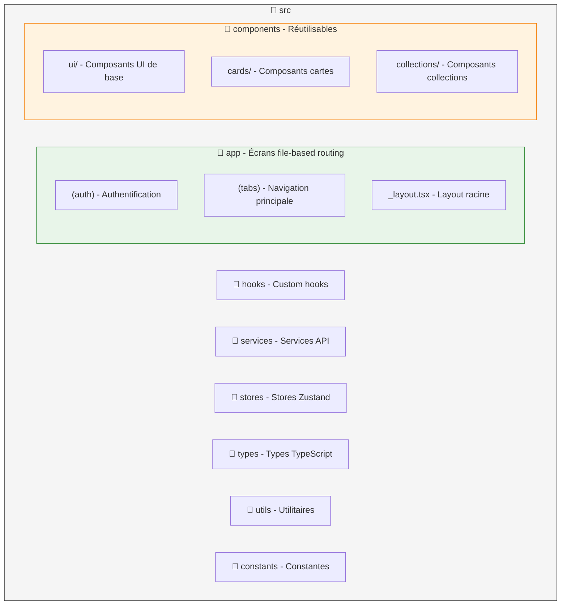
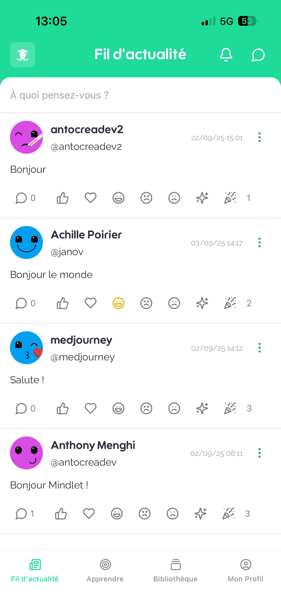
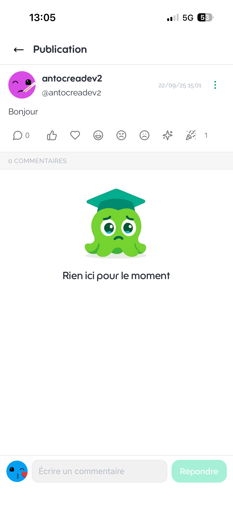
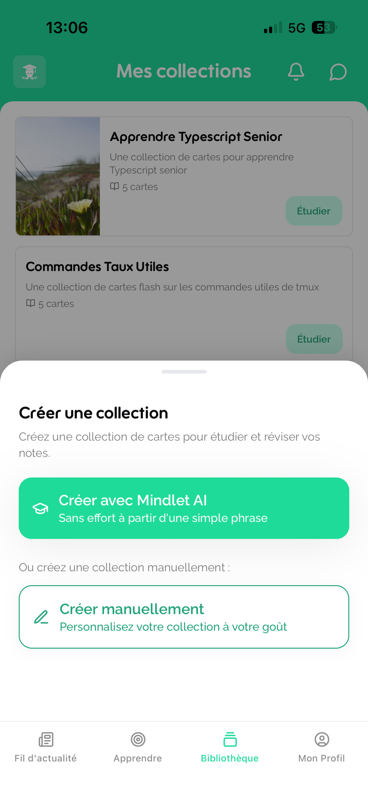
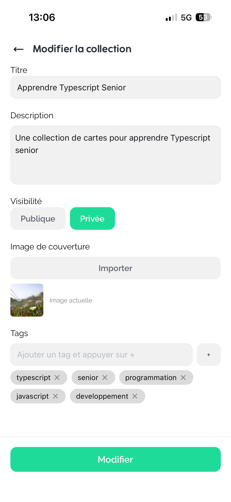

import { Aside, Badge, Card, CardGrid, TabItem, Tabs } from '@astrojs/starlight/components';

# 📱 Frontend React Native

<Badge text="React Native" variant="success" />
<Badge text="Expo" variant="note" />
<Badge text="TypeScript" variant="caution" />

## Présentation

L'application mobile Mindlet est développée avec **React Native** et **Expo**, permettant un déploiement cross-platform sur **iOS** et **Android** à partir d'une base de code unique.

## Stack technique

| Composant | Technologie | Rôle |
|-----------|-------------|------|
| **Framework** | React Native | Base de l'application |
| **Toolchain** | Expo | Build, déploiement, OTA updates |
| **Langage** | TypeScript | Typage statique |
| **État global** | Zustand | Gestion d'état légère |
| **Navigation** | React Navigation | Navigation entre écrans |
| **Styling** | NativeWind | Tailwind CSS pour RN |
| **HTTP Client** | Axios | Requêtes API |
| **Forms** | React Hook Form | Gestion des formulaires |
| **Validation** | Zod | Validation des schémas |

## Architecture du code



## Captures d'écran

<CardGrid>
  <Card title="Accueil">
    
  </Card>
  <Card title="Collections">
    
  </Card>
  <Card title="Révision">
    
  </Card>
  <Card title="Profil">
    
  </Card>
</CardGrid>

## Gestion d'état avec Zustand

<Tabs>
  <TabItem label="Auth Store">
    ```typescript
    interface AuthState {
      user: User | null;
      token: string | null;
      isAuthenticated: boolean;
      login: (email: string, password: string) => Promise<void>;
      logout: () => void;
      refreshToken: () => Promise<void>;
    }

    export const useAuthStore = create<AuthState>()(
      persist(
        (set, get) => ({
          user: null,
          token: null,
          isAuthenticated: false,
          
          login: async (email, password) => {
            const response = await authService.login(email, password);
            set({
              user: response.user,
              token: response.token,
              isAuthenticated: true,
            });
          },
          
          logout: () => {
            set({ user: null, token: null, isAuthenticated: false });
          },
        }),
        { name: 'auth-storage' }
      )
    );
    ```
  </TabItem>
  
  <TabItem label="Collections Store">
    ```typescript
    interface CollectionsState {
      collections: Collection[];
      isLoading: boolean;
      fetchCollections: () => Promise<void>;
      createCollection: (data: CreateCollectionDTO) => Promise<Collection>;
      deleteCollection: (id: number) => Promise<void>;
    }

    export const useCollectionsStore = create<CollectionsState>((set, get) => ({
      collections: [],
      isLoading: false,
      
      fetchCollections: async () => {
        set({ isLoading: true });
        try {
          const collections = await collectionsService.getAll();
          set({ collections, isLoading: false });
        } catch (error) {
          set({ isLoading: false });
          throw error;
        }
      },
      
      createCollection: async (data) => {
        const collection = await collectionsService.create(data);
        set((state) => ({
          collections: [...state.collections, collection],
        }));
        return collection;
      },
    }));
    ```
  </TabItem>
</Tabs>

## Services API

### Configuration Axios

```typescript
import axios from 'axios';
import { useAuthStore } from '@/stores/authStore';

const api = axios.create({
  baseURL: process.env.EXPO_PUBLIC_API_URL,
  timeout: 10000,
  headers: {
    'Content-Type': 'application/json',
  },
});

// Intercepteur pour ajouter le token
api.interceptors.request.use((config) => {
  const token = useAuthStore.getState().token;
  if (token) {
    config.headers.Authorization = `Bearer ${token}`;
  }
  return config;
});

// Intercepteur pour gérer les erreurs
api.interceptors.response.use(
  (response) => response,
  async (error) => {
    if (error.response?.status === 401) {
      useAuthStore.getState().logout();
    }
    return Promise.reject(error);
  }
);

export default api;
```

### Service exemple

```typescript
class CardsService {
  async getAll(collectionId: number): Promise<Card[]> {
    const response = await api.get(`/cards`, {
      params: { collection_id: collectionId },
    });
    return response.data.data;
  }
  
  async create(data: CreateCardDTO): Promise<Card> {
    const response = await api.post('/cards', data);
    return response.data.data;
  }
  
  async generateFromDocument(documentId: number): Promise<Card[]> {
    const response = await api.post('/cards/generate', {
      document_id: documentId,
    });
    return response.data.data;
  }
}

export const cardsService = new CardsService();
```

## Composants UI

### Système de design

Nous utilisons **NativeWind** (Tailwind CSS pour React Native) pour un styling cohérent :

```tsx
import { View, Text, TouchableOpacity } from 'react-native';

interface ButtonProps {
  title: string;
  onPress: () => void;
  variant?: 'primary' | 'secondary' | 'outline';
  disabled?: boolean;
}

export function Button({ 
  title, 
  onPress, 
  variant = 'primary',
  disabled = false 
}: ButtonProps) {
  const variants = {
    primary: 'bg-indigo-600 text-white',
    secondary: 'bg-gray-200 text-gray-800',
    outline: 'border-2 border-indigo-600 text-indigo-600',
  };

  return (
    <TouchableOpacity
      onPress={onPress}
      disabled={disabled}
      className={`
        px-6 py-3 rounded-xl items-center justify-center
        ${variants[variant]}
        ${disabled ? 'opacity-50' : ''}
      `}
    >
      <Text className="font-semibold text-base">{title}</Text>
    </TouchableOpacity>
  );
}
```

### Composant Flashcard

```tsx
import { useState } from 'react';
import { View, Text, Pressable } from 'react-native';
import Animated, { 
  useSharedValue, 
  useAnimatedStyle, 
  withSpring 
} from 'react-native-reanimated';

interface FlashcardProps {
  question: string;
  answer: string;
}

export function Flashcard({ question, answer }: FlashcardProps) {
  const [isFlipped, setIsFlipped] = useState(false);
  const rotation = useSharedValue(0);

  const flipCard = () => {
    rotation.value = withSpring(isFlipped ? 0 : 180);
    setIsFlipped(!isFlipped);
  };

  const frontStyle = useAnimatedStyle(() => ({
    transform: [{ rotateY: `${rotation.value}deg` }],
    backfaceVisibility: 'hidden',
  }));

  const backStyle = useAnimatedStyle(() => ({
    transform: [{ rotateY: `${rotation.value + 180}deg` }],
    backfaceVisibility: 'hidden',
  }));

  return (
    <Pressable onPress={flipCard} className="w-full aspect-[3/4]">
      <Animated.View 
        style={frontStyle}
        className="absolute inset-0 bg-white rounded-2xl p-6 shadow-lg"
      >
        <Text className="text-xl font-semibold text-center">
          {question}
        </Text>
      </Animated.View>
      
      <Animated.View 
        style={backStyle}
        className="absolute inset-0 bg-indigo-600 rounded-2xl p-6 shadow-lg"
      >
        <Text className="text-xl font-semibold text-center text-white">
          {answer}
        </Text>
      </Animated.View>
    </Pressable>
  );
}
```

## Navigation

### Structure de navigation

```tsx
import { Stack, Tabs } from 'expo-router';

// Layout principal avec tabs
export default function TabsLayout() {
  return (
    <Tabs screenOptions={{ headerShown: false }}>
      <Tabs.Screen
        name="home"
        options={{
          title: 'Accueil',
          tabBarIcon: ({ color }) => <HomeIcon color={color} />,
        }}
      />
      <Tabs.Screen
        name="collections"
        options={{
          title: 'Collections',
          tabBarIcon: ({ color }) => <FolderIcon color={color} />,
        }}
      />
      <Tabs.Screen
        name="explore"
        options={{
          title: 'Explorer',
          tabBarIcon: ({ color }) => <SearchIcon color={color} />,
        }}
      />
      <Tabs.Screen
        name="profile"
        options={{
          title: 'Profil',
          tabBarIcon: ({ color }) => <UserIcon color={color} />,
        }}
      />
    </Tabs>
  );
}
```

## Accessibilité

<Aside type="tip">
  Mindlet est conçue pour être **accessible à tous**, y compris les personnes ayant des troubles de l'apprentissage.
</Aside>

### Fonctionnalités d'accessibilité

| Fonctionnalité | Implémentation |
|----------------|----------------|
| **VoiceOver/TalkBack** | Labels accessibles sur tous les éléments interactifs |
| **Police adaptée** | Option de police OpenDyslexic pour la dyslexie |
| **Contraste élevé** | Mode contraste pour malvoyants |
| **Taille de texte** | Respect des préférences système |
| **Animations réduites** | Respect de `prefers-reduced-motion` |

```tsx
<TouchableOpacity
  accessible={true}
  accessibilityLabel="Retourner la carte pour voir la réponse"
  accessibilityRole="button"
  accessibilityHint="Double-tap pour retourner"
  onPress={flipCard}
>
  {/* Contenu */}
</TouchableOpacity>
```

## Performance

### Optimisations appliquées

- **Lazy loading** : Chargement différé des écrans
- **Memoization** : `useMemo` et `useCallback` pour éviter les re-renders
- **FlatList virtualization** : Affichage optimisé des longues listes
- **Image caching** : Cache des images avec expo-image
- **Bundle splitting** : Séparation du code par routes

---

*Application mobile pensée pour l'expérience utilisateur et l'accessibilité.*
