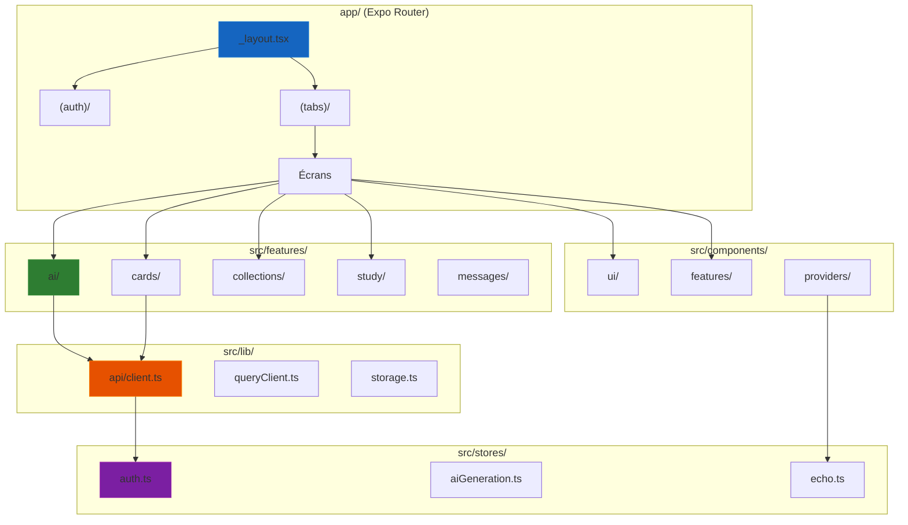
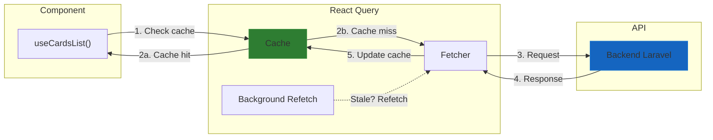
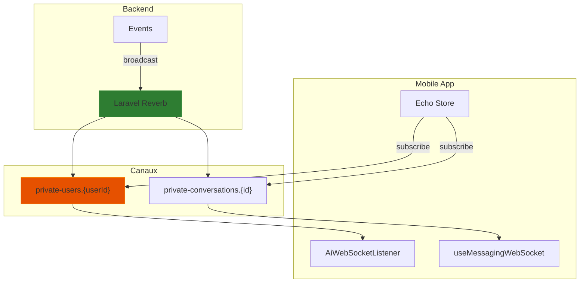
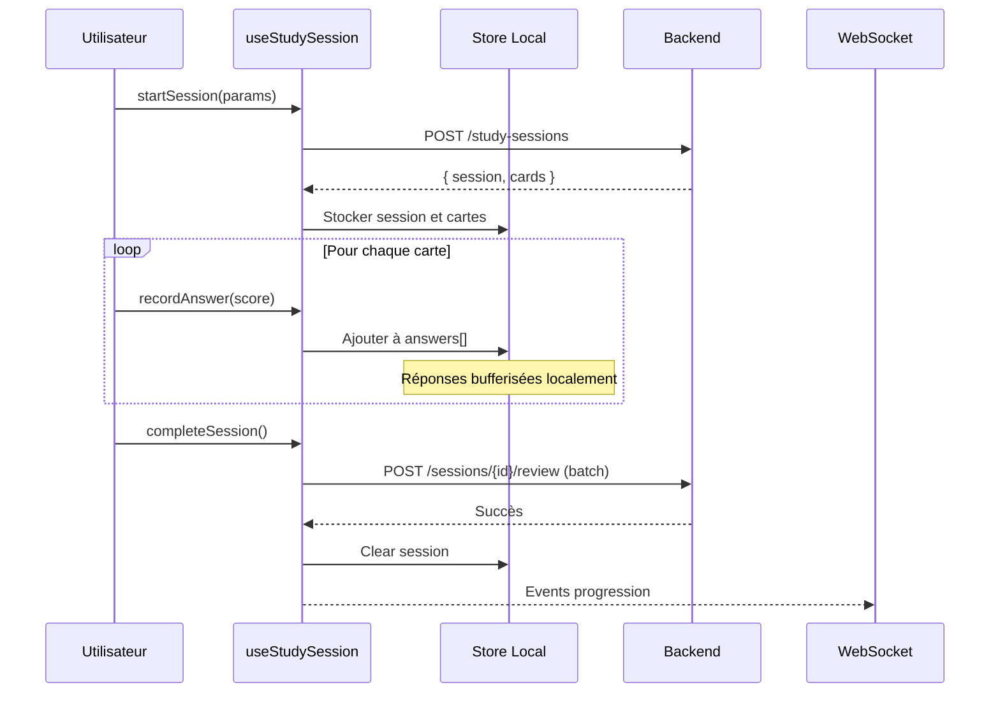

import { Aside, Badge, Card, CardGrid, Steps, TabItem, Tabs } from '@astrojs/starlight/components';
import MermaidDownload from '../../../components/MermaidDownload.astro';

# 📱 Frontend Mobile React Native

<Badge text="React Native 0.81" variant="success" />
<Badge text="Expo SDK 54" variant="note" />
<Badge text="TypeScript" variant="caution" />
<Badge text="Zustand" variant="tip" />

## Vue d'ensemble

L'application mobile Mindlet est développée avec **React Native** et **Expo**, permettant un déploiement cross-platform sur **iOS** et **Android** à partir d'une base de code unique. L'architecture suit le pattern **Feature-based Architecture** avec une séparation claire entre la logique métier et la présentation.

### Ce que fait l'application mobile

- 📚 **Gestion des collections** et cartes d'apprentissage
- 🎴 **Sessions d'étude** avec 9 types de cartes interactives
- 🤖 **Génération IA** de cartes depuis documents, images, audio
- 💬 **Messagerie temps réel** avec notifications push
- 📊 **Suivi de progression** et statistiques d'apprentissage
- 🔐 **Authentification** multi-providers (Email, Google, Apple)

<Aside type="tip" title="Pourquoi React Native avec Expo ?">
  **Expo** simplifie considérablement le développement React Native en offrant :
  - **Expo Router** : Navigation file-based similaire à Next.js
  - **EAS Build** : Builds cloud sans configuration Xcode/Android Studio
  - **OTA Updates** : Mises à jour instantanées sans re-soumission aux stores
  - **SDK riche** : Accès unifié aux APIs natives (notifications, caméra, etc.)
</Aside>

## Stack technique

| Composant | Technologie | Rôle |
|-----------|-------------|------|
| **Framework** | React Native 0.81 | Base cross-platform |
| **Toolchain** | Expo SDK 54 | Build, déploiement, OTA |
| **Langage** | TypeScript 5.9 | Typage statique strict |
| **État serveur** | TanStack Query 5 | Cache, fetching, mutations |
| **État local** | Zustand 5 | État global léger |
| **Navigation** | Expo Router 6 | Routing file-based |
| **Styling** | NativeWind 4 | Tailwind CSS pour RN |
| **Formulaires** | React Hook Form + Zod | Validation type-safe |
| **WebSocket** | Laravel Echo + Pusher | Temps réel |
| **API Client** | openapi-fetch | Client typé depuis OpenAPI |

## Architecture du code

L'application suit une **Feature-based Architecture** où chaque fonctionnalité est encapsulée dans un module autonome :

<MermaidDownload title="Architecture Feature-based">

</MermaidDownload>

### Structure des dossiers

```
mobile/
├── app/                          # Expo Router (file-based routing)
│   ├── _layout.tsx              # Layout racine + providers
│   ├── (root)/                  # Routes avec guards d'auth
│   │   ├── _layout.tsx          # Vérification authentification
│   │   ├── (app)/               # App authentifiée
│   │   │   ├── (tabs)/          # Navigation par onglets
│   │   │   │   ├── feed/        # Fil d'actualité
│   │   │   │   ├── learn/       # Sessions d'étude
│   │   │   │   ├── collections/ # Gestion des collections
│   │   │   │   └── profile/     # Profil utilisateur
│   │   │   └── messages/        # Messagerie
│   │   └── auth/                # Login, Register
│   └── onboarding/              # Onboarding post-inscription
├── src/
│   ├── components/              # Composants réutilisables
│   │   ├── ui/                  # Primitives UI (Button, Input...)
│   │   ├── common/              # Composants partagés
│   │   ├── features/            # Composants par domaine
│   │   ├── providers/           # Providers (WebSocket, Theme)
│   │   └── layout/              # Layouts communs
│   ├── features/                # Modules métier
│   │   ├── ai/                  # Génération IA
│   │   ├── cards/               # CRUD cartes
│   │   ├── collections/         # CRUD collections
│   │   ├── study/               # Sessions d'étude
│   │   ├── messages/            # Messagerie
│   │   ├── posts/               # Réseau social
│   │   ├── progression/         # Suivi progrès
│   │   └── users/               # Profils utilisateurs
│   ├── stores/                  # État global Zustand
│   ├── hooks/                   # Hooks personnalisés
│   ├── lib/                     # Configuration, utilitaires
│   │   └── api/                 # Client API OpenAPI
│   └── types/                   # Types TypeScript globaux
└── assets/                      # Images, polices
```

## Design Patterns utilisés

<Tabs>
  <TabItem label="Feature Modules">
    ### Pattern Feature-based Architecture

    **Objectif** : Organiser le code par domaine métier plutôt que par type technique.

    Chaque feature module est **auto-contenu** et expose une API publique claire :

    ```
    src/features/cards/
    ├── types.ts         # Types TypeScript du domaine
    ├── queries.ts       # React Query hooks (GET)
    ├── mutations.ts     # React Query hooks (POST, PUT, DELETE)
    ├── queryKeys.ts     # Clés de cache standardisées
    ├── schema.ts        # Schémas Zod de validation
    ├── useCardForm.ts   # Hook personnalisé formulaire
    └── index.ts         # Exports publics
    ```

    **Exemple : `src/features/cards/queries.ts`**

    ```typescript
    import { apiClient } from '@/lib/api/client'
    import { getAuthHeader } from '@/lib/api/utils'
    import { cardsQueryKeys } from './queryKeys'

    /**
     * Hook pour récupérer les cartes d'une collection.
     *
     * Utilise React Query pour :
     * - Cache automatique (staleTime: 10min)
     * - Refetch en arrière-plan
     * - Gestion des erreurs
     */
    export const useCardsList = (collectionId: string) => {
      return apiClient.useQuery(
        'get',
        '/v1/collections/{collection}/cards',
        {
          headers: getAuthHeader(),
          params: {
            path: { collection: collectionId },
          },
        },
        {
          queryKey: cardsQueryKeys.list(collectionId),
          enabled: !!collectionId,
        }
      )
    }

    /**
     * Hook pour récupérer les types de cartes disponibles.
     */
    export const useAvailableCardTypes = () => {
      return apiClient.useQuery(
        'get',
        '/v1/cards/types',
        { headers: getAuthHeader() },
        { queryKey: cardsQueryKeys.types() }
      )
    }
    ```

    <Aside type="note">
      Les **queryKeys** sont des factories qui garantissent l'unicité des clés de cache et facilitent l'invalidation ciblée.
    </Aside>

    **Exemple : `src/features/cards/queryKeys.ts`**

    ```typescript
    export const cardsQueryKeys = {
      // Clé de base pour toutes les requêtes cards
      base: () => ['cards'] as const,

      // Liste des cartes d'une collection
      list: (collectionId: string) =>
        [...cardsQueryKeys.base(), 'list', collectionId] as const,

      // Détail d'une carte
      detail: (cardId: string) =>
        [...cardsQueryKeys.base(), 'detail', cardId] as const,

      // Types de cartes disponibles
      types: () =>
        [...cardsQueryKeys.base(), 'types'] as const,
    }
    ```
  </TabItem>

  <TabItem label="API Client typé">
    ### Pattern OpenAPI Code Generation

    **Objectif** : Générer automatiquement un client API **type-safe** depuis la spécification OpenAPI du backend.

    Cette approche garantit :
    - **Synchronisation** : Le client reflète toujours l'API réelle
    - **Typage** : Erreurs de type détectées à la compilation
    - **Autocomplete** : IntelliSense sur les endpoints et paramètres

    ```typescript
    // src/lib/api/client.ts
    import createFetchClient from 'openapi-fetch'
    import { createReactQueryClient } from 'openapi-react-query'
    import type { paths } from './schema' // Types générés

    // 1. Client HTTP de base avec interception
    export const client = createFetchClient<paths>({
      baseUrl: `${API_URL}/api`,
      headers: {
        Accept: 'application/json',
        'Content-Type': 'application/json',
      },
    })

    // 2. Intercepteur pour injection automatique du token
    client.use({
      async onRequest({ request }) {
        const accessToken = useAuthStore.getState().accessToken

        if (accessToken && !request.headers.has('Authorization')) {
          request.headers.set('Authorization', `Bearer ${accessToken}`)
        }

        // FormData : laisser React Native gérer le boundary
        if (request.body instanceof FormData) {
          request.headers.delete('Content-Type')
        }

        return request
      },

      // 3. Intercepteur pour refresh automatique du token
      async onResponse({ response, request }) {
        if (response.status !== 401) return response

        // Éviter boucle infinie sur endpoints d'auth
        if (request.url.includes('/auth/')) return response

        // Refresh du token (dédupliqué)
        const newToken = await useAuthStore.getState().refreshAccessToken()

        if (newToken) {
          const headers = new Headers(request.headers)
          headers.set('Authorization', `Bearer ${newToken}`)
          return fetch(new Request(request, { headers }))
        }

        return response
      },
    })

    // 4. Wrapper React Query pour hooks
    export const apiClient = createReactQueryClient(client)
    ```

    **Génération des types :**

    ```json
    // package.json
    {
      "scripts": {
        "api:generate": "openapi-typescript https://api.mindlet.app/docs/api.json -o src/lib/api/schema.d.ts"
      }
    }
    ```

    **Utilisation dans un composant :**

    ```tsx
    import { useCardsList } from '@/features/cards'

    function CardListScreen({ collectionId }: Props) {
      // Types inférés automatiquement depuis OpenAPI
      const { data, isLoading, error } = useCardsList(collectionId)

      if (isLoading) return <LoadingView />
      if (error) return <ErrorView error={error} />

      return (
        <FlatList
          data={data?.data}
          renderItem={({ item }) => <CardItem card={item} />}
        />
      )
    }
    ```
  </TabItem>

  <TabItem label="Store Pattern">
    ### Pattern State Management avec Zustand

    **Objectif** : Gérer l'état global de l'application avec une API simple et performante.

    **Zustand** offre :
    - **Simplicité** : Pas de boilerplate (vs Redux)
    - **Réactivité** : Re-renders optimisés via selectors
    - **Persistance** : Middleware intégré pour AsyncStorage
    - **Devtools** : Compatible React DevTools

    ```typescript
    // src/stores/auth.ts
    import { create } from 'zustand'
    import { persist, createJSONStorage } from 'zustand/middleware'
    import { storage } from '@/lib/storage'

    interface AuthState {
      // État
      hasHydrated: boolean
      isLoading: boolean
      isAuthenticated: boolean
      accessToken: string | null
      refreshToken: string | null
      user: User | null

      // Actions
      init: () => Promise<void>
      login: (identifier: string, password: string) => Promise<void>
      logout: () => Promise<void>
      refreshAccessToken: () => Promise<string | null>
      signInWithGoogle: () => Promise<void>
      signInWithApple: () => Promise<void>
    }

    export const useAuthStore = create<AuthState>()(
      persist(
        (set, get) => ({
          // État initial
          hasHydrated: false,
          isLoading: false,
          isAuthenticated: false,
          accessToken: null,
          refreshToken: null,
          user: null,

          /**
           * Initialise le store depuis le stockage persisté.
           */
          init: async () => {
            const accessToken = await storage.getItem('accessToken')
            const refreshToken = await storage.getItem('refreshToken')
            const user = await storage.getItem('user')

            set({
              hasHydrated: true,
              isAuthenticated: !!accessToken,
              accessToken,
              refreshToken,
              user: user ? JSON.parse(user) : null,
            })
          },

          /**
           * Connexion avec email/password.
           */
          login: async (identifier, password) => {
            set({ isLoading: true })

            try {
              const response = await client.POST('/auth/login', {
                body: { identifier, password },
              })

              if (response.error) {
                throw new Error(response.error.message)
              }

              const { access_token, refresh_token, user } = response.data!

              // Stockage sécurisé des tokens
              await storage.setItem('accessToken', access_token)
              await storage.setItem('refreshToken', refresh_token)
              await storage.setItem('user', JSON.stringify(user))

              set({
                isAuthenticated: true,
                accessToken: access_token,
                refreshToken: refresh_token,
                user,
              })

              // Tracking Sentry
              Sentry.setUser({ id: user.id, email: user.email })

            } finally {
              set({ isLoading: false })
            }
          },

          /**
           * Refresh automatique du token d'accès.
           */
          refreshAccessToken: async () => {
            const { refreshToken } = get()
            if (!refreshToken) return null

            try {
              const response = await client.POST('/auth/refresh', {
                body: { refresh_token: refreshToken },
              })

              if (response.error) {
                // Token invalide → déconnexion
                get().logout()
                return null
              }

              const { access_token } = response.data!
              await storage.setItem('accessToken', access_token)
              set({ accessToken: access_token })

              return access_token

            } catch {
              get().logout()
              return null
            }
          },

          /**
           * Déconnexion complète.
           */
          logout: async () => {
            await storage.clear()
            Sentry.setUser(null)

            set({
              isAuthenticated: false,
              accessToken: null,
              refreshToken: null,
              user: null,
            })
          },
        }),
        {
          name: 'auth-storage',
          storage: createJSONStorage(() => storage),
          // Ne persister que certains champs
          partialize: (state) => ({
            accessToken: state.accessToken,
            refreshToken: state.refreshToken,
            user: state.user,
          }),
        }
      )
    )
    ```

    **Utilisation avec selectors (optimisation re-renders) :**

    ```tsx
    // ❌ Re-render à chaque changement du store
    const { user, isAuthenticated } = useAuthStore()

    // ✅ Re-render uniquement si user change
    const user = useAuthStore((state) => state.user)
    const isAuthenticated = useAuthStore((state) => state.isAuthenticated)
    ```
  </TabItem>

  <TabItem label="Compound Components">
    ### Pattern Compound Components

    **Objectif** : Créer des composants composables avec une API déclarative.

    Ce pattern permet de construire des interfaces complexes tout en gardant le contrôle sur la structure :

    ```tsx
    // src/components/features/study/ScoreButtons.tsx

    interface ScoreButtonsProps {
      onScore: (score: CardProgressionScore) => void
      disabled?: boolean
    }

    /**
     * Boutons de notation d'une carte.
     *
     * Pattern Compound Component : le parent gère la logique,
     * les enfants gèrent leur présentation.
     */
    export function ScoreButtons({ onScore, disabled }: ScoreButtonsProps) {
      const scores = [
        { value: 'AGAIN', label: 'À revoir', color: 'bg-red-500' },
        { value: 'HARD', label: 'Difficile', color: 'bg-orange-500' },
        { value: 'GOOD', label: 'Bien', color: 'bg-green-500' },
        { value: 'EASY', label: 'Facile', color: 'bg-blue-500' },
      ] as const

      return (
        <View className="flex-row justify-between gap-2">
          {scores.map((score) => (
            <ScoreButton
              key={score.value}
              label={score.label}
              color={score.color}
              disabled={disabled}
              onPress={() => onScore(score.value)}
            />
          ))}
        </View>
      )
    }

    function ScoreButton({ label, color, disabled, onPress }) {
      return (
        <TouchableOpacity
          onPress={onPress}
          disabled={disabled}
          className={`flex-1 py-3 rounded-xl ${color} ${
            disabled ? 'opacity-50' : ''
          }`}
        >
          <Text className="text-white text-center font-semibold">
            {label}
          </Text>
        </TouchableOpacity>
      )
    }
    ```
  </TabItem>
</Tabs>

## Gestion de l'état avec React Query

React Query (TanStack Query) gère l'**état serveur** avec un système de cache intelligent :

<MermaidDownload title="Flux React Query">

</MermaidDownload>

### Configuration globale

```typescript
// src/lib/queryClient.ts
import { QueryClient } from '@tanstack/react-query'

export const queryClient = new QueryClient({
  defaultOptions: {
    queries: {
      // Données considérées fraîches pendant 10 minutes
      staleTime: 1000 * 60 * 10,

      // Cache conservé 60 minutes après unmount
      gcTime: 1000 * 60 * 60,

      // Pas de refetch au mount si données en cache
      refetchOnMount: false,

      // Non applicable sur mobile
      refetchOnWindowFocus: false,

      // Refetch quand réseau revient
      refetchOnReconnect: true,

      // 2 tentatives en cas d'erreur
      retry: 2,
    },
    mutations: {
      retry: 1,
    },
  },
})
```

### Mutations avec invalidation

```typescript
// src/features/cards/mutations.ts

/**
 * Mutation pour créer une carte.
 *
 * Après succès, invalide le cache de la liste des cartes
 * pour forcer un refetch.
 */
export const useCreateCard = () => {
  return apiClient.useMutation(
    'post',
    '/v1/collections/{collection}/cards',
    {
      onSuccess: (_, variables) => {
        // Invalide la liste de cette collection
        queryClient.invalidateQueries({
          queryKey: cardsQueryKeys.list(variables.params.path.collection),
        })

        // Notification de succès
        Toast.show({
          type: 'success',
          text1: 'Carte créée',
        })
      },
      onError: (error) => {
        Toast.show({
          type: 'error',
          text1: 'Erreur',
          text2: getErrorMessage(error),
        })
      },
    }
  )
}

/**
 * Mutation pour archiver une carte.
 *
 * Mise à jour optimiste du cache avant la réponse serveur.
 */
export const useArchiveCard = () => {
  return apiClient.useMutation(
    'post',
    '/v1/cards/{card}/archive',
    {
      // Mise à jour optimiste
      onMutate: async (variables) => {
        const cardId = variables.params.path.card

        // Annuler les requêtes en cours
        await queryClient.cancelQueries({
          queryKey: cardsQueryKeys.detail(cardId),
        })

        // Snapshot pour rollback
        const previousCard = queryClient.getQueryData(
          cardsQueryKeys.detail(cardId)
        )

        // Mise à jour optimiste
        queryClient.setQueryData(
          cardsQueryKeys.detail(cardId),
          (old: Card) => ({ ...old, archived_at: new Date().toISOString() })
        )

        return { previousCard }
      },

      // Rollback en cas d'erreur
      onError: (_, variables, context) => {
        if (context?.previousCard) {
          queryClient.setQueryData(
            cardsQueryKeys.detail(variables.params.path.card),
            context.previousCard
          )
        }
      },

      // Revalidation finale
      onSettled: (_, __, variables) => {
        queryClient.invalidateQueries({
          queryKey: cardsQueryKeys.detail(variables.params.path.card),
        })
      },
    }
  )
}
```

## WebSocket et temps réel

L'application utilise **Laravel Echo** avec **Pusher** pour les fonctionnalités temps réel :

<MermaidDownload title="Architecture WebSocket">

</MermaidDownload>

### Configuration Echo

```typescript
// src/stores/echo.ts
import Echo from 'laravel-echo'
import Pusher from 'pusher-js'

interface EchoState {
  echo: Echo<'reverb'> | null
  isConnected: boolean
  connectionState: 'connecting' | 'connected' | 'disconnected' | 'failed'

  init: () => void
  disconnect: () => void
}

export const useEchoStore = create<EchoState>((set, get) => ({
  echo: null,
  isConnected: false,
  connectionState: 'disconnected',

  init: () => {
    const accessToken = useAuthStore.getState().accessToken
    if (!accessToken || get().echo) return

    // Client Pusher configuré pour Reverb
    const pusherClient = new Pusher(REVERB_APP_KEY, {
      cluster: 'mt1',
      wsHost: REVERB_HOST,
      wsPort: REVERB_PORT,
      forceTLS: REVERB_SCHEME === 'https',
      enabledTransports: ['ws', 'wss'],

      // Authentification des canaux privés
      authEndpoint: `${API_URL}/broadcasting/auth`,
      auth: {
        headers: {
          Accept: 'application/json',
          Authorization: `Bearer ${accessToken}`,
        },
      },

      // Configuration heartbeat
      activityTimeout: 10000,  // Ping si inactif 10s
      pongTimeout: 5000,       // Attente pong 5s
    })

    const echo = new Echo({
      broadcaster: 'reverb',
      key: REVERB_APP_KEY,
      client: pusherClient,
    })

    // Écoute des changements de connexion
    pusherClient.connection.bind('state_change', (states) => {
      set({
        connectionState: states.current,
        isConnected: states.current === 'connected',
      })
    })

    set({ echo })
  },

  disconnect: () => {
    get().echo?.disconnect()
    set({ echo: null, isConnected: false })
  },
}))
```

### Listener de génération IA

```tsx
// src/components/providers/AiWebSocketListener.tsx
import { useEffect, useRef } from 'react'
import { useEchoStore } from '@/stores/echo'
import { useAiGenerationStore } from '@/stores/aiGeneration'
import { collectionsQueryKeys } from '@/features/collections'

/**
 * Composant invisible qui écoute les événements de génération IA.
 *
 * Gère :
 * - Mise à jour du store de génération
 * - Invalidation du cache React Query
 * - Notifications utilisateur
 * - Déduplication des événements
 */
export function AiWebSocketListener() {
  const echo = useEchoStore((s) => s.echo)
  const userId = useAuthStore((s) => s.user?.id)
  const { setGenerationStarted, setGenerationCompleted, setGenerationFailed } =
    useAiGenerationStore()

  // Déduplication des événements (le backend peut envoyer plusieurs fois)
  const processedRef = useRef<Set<string>>(new Set())

  useEffect(() => {
    if (!echo || !userId) return

    const channel = echo.private(`users.${userId}`)

    // Événement : génération démarrée
    channel.listen('.card.generation.started', (event) => {
      if (processedRef.current.has(event.generation_id)) return
      processedRef.current.add(event.generation_id)

      setGenerationStarted(event.generation_id, event.collection_id)
    })

    // Événement : génération terminée
    channel.listen('.card.generation.completed', (event) => {
      if (processedRef.current.has(`${event.generation_id}-completed`)) return
      processedRef.current.add(`${event.generation_id}-completed`)

      setGenerationCompleted(event.generation_id)

      // Invalider le cache des collections
      queryClient.invalidateQueries({
        queryKey: collectionsQueryKeys.list(),
      })

      // Notification locale
      Notifications.scheduleNotificationAsync({
        content: {
          title: 'Cartes générées !',
          body: `${event.total_cards_persisted} cartes ont été créées.`,
        },
        trigger: null, // Immédiat
      })
    })

    // Événement : génération échouée
    channel.listen('.card.generation.failed', (event) => {
      setGenerationFailed(event.generation_id, event.reason)

      Toast.show({
        type: 'error',
        text1: 'Génération échouée',
        text2: event.reason,
      })
    })

    return () => {
      channel.stopListening('.card.generation.started')
      channel.stopListening('.card.generation.completed')
      channel.stopListening('.card.generation.failed')
    }
  }, [echo, userId])

  return null // Composant invisible
}
```

## Sessions d'étude

Le hook `useStudySession` orchestre les sessions d'apprentissage avec gestion locale des réponses :

<MermaidDownload title="Flux session d'étude">

</MermaidDownload>

### Hook de session

```typescript
// src/features/study/useStudySession.ts
import { create } from 'zustand'
import { persist, createJSONStorage } from 'zustand/middleware'

interface StudySessionStore {
  session: StudySession | null
  cards: Card[]
  currentIndex: number
  startedAt: number | null        // Timestamp début
  elapsedMs: number               // Temps total écoulé
  cardStartedAt: number | null    // Timestamp carte courante
  answers: ReviewAnswer[]         // Buffer local des réponses

  startSession: (params: StartSessionParams) => Promise<void>
  resumeSession: (sessionId: string) => Promise<void>
  recordAnswer: (score: CardProgressionScore, userAnswer?: string) => void
  completeSession: () => Promise<SessionSummary>
  abandonSession: () => Promise<void>
}

const useStudySessionStore = create<StudySessionStore>()(
  persist(
    (set, get) => ({
      session: null,
      cards: [],
      currentIndex: 0,
      startedAt: null,
      elapsedMs: 0,
      cardStartedAt: null,
      answers: [],

      /**
       * Démarre une nouvelle session d'étude.
       */
      startSession: async (params) => {
        const response = await client.POST('/v1/study-sessions', {
          body: params,
        })

        if (response.error) throw new Error(response.error.message)

        const { session, cards } = response.data!
        const now = Date.now()

        set({
          session,
          cards,
          currentIndex: 0,
          startedAt: now,
          elapsedMs: 0,
          cardStartedAt: now,
          answers: [],
        })
      },

      /**
       * Enregistre une réponse localement.
       *
       * Les réponses sont bufferisées et envoyées en batch
       * à la fin de la session pour éviter les requêtes multiples.
       */
      recordAnswer: (score, userAnswer) => {
        const { cards, currentIndex, cardStartedAt, answers } = get()
        const currentCard = cards[currentIndex]

        if (!currentCard || !cardStartedAt) return

        // Vérifier si déjà répondu (éviter doublons)
        if (answers.some((a) => a.card_id === currentCard.id)) {
          console.warn('Card already answered')
          return
        }

        const timeSpentMs = Date.now() - cardStartedAt

        const answer: ReviewAnswer = {
          card_id: currentCard.id,
          score,
          user_answer: userAnswer,
          time_spent_ms: timeSpentMs,
        }

        set({
          answers: [...answers, answer],
          currentIndex: currentIndex + 1,
          cardStartedAt: Date.now(), // Reset timer pour prochaine carte
        })
      },

      /**
       * Termine la session et envoie toutes les réponses.
       */
      completeSession: async () => {
        const { session, answers, startedAt, elapsedMs } = get()

        if (!session) throw new Error('No active session')

        // Calcul temps total
        const totalTimeMs = startedAt
          ? elapsedMs + (Date.now() - startedAt)
          : elapsedMs

        // Envoi batch des réponses
        if (answers.length > 0) {
          await client.POST('/v1/study-sessions/{session}/review', {
            params: { path: { session: session.id } },
            body: { cards: answers },
          })
        }

        // Terminer la session
        const response = await client.POST(
          '/v1/study-sessions/{session}/complete',
          {
            params: { path: { session: session.id } },
            body: { total_time_ms: totalTimeMs },
          }
        )

        // Reset du store
        set({
          session: null,
          cards: [],
          currentIndex: 0,
          startedAt: null,
          elapsedMs: 0,
          answers: [],
        })

        // Planifier rappel de révision dans 3h
        await Notifications.scheduleNotificationAsync({
          content: {
            title: 'Temps de réviser !',
            body: 'Continuez votre apprentissage',
          },
          trigger: { seconds: 3 * 60 * 60 },
        })

        return response.data!
      },
    }),
    {
      name: 'study-session',
      storage: createJSONStorage(() => AsyncStorage),
      // Persister pour reprise après crash
      partialize: (state) => ({
        session: state.session,
        cards: state.cards,
        currentIndex: state.currentIndex,
        elapsedMs: state.elapsedMs,
        answers: state.answers,
      }),
    }
  )
)

/**
 * Hook public avec méthodes utilitaires.
 */
export function useStudySession() {
  const store = useStudySessionStore()

  const currentCard = store.cards[store.currentIndex] ?? null
  const progress = store.cards.length
    ? (store.currentIndex / store.cards.length) * 100
    : 0
  const isComplete = store.currentIndex >= store.cards.length

  return {
    ...store,
    currentCard,
    progress,
    isComplete,
  }
}
```

<Aside type="caution" title="Buffer des réponses">
  Les réponses sont **bufferisées localement** et envoyées en batch uniquement à la fin de la session. Cela évite les requêtes réseau répétées et garantit l'atomicité de l'envoi.
</Aside>

## Composants UI avec NativeWind

L'application utilise **NativeWind** (Tailwind CSS pour React Native) avec le pattern **CVA** (Class Variance Authority) :

### Configuration Tailwind

```javascript
// tailwind.config.js
module.exports = {
  content: [
    './app/**/*.{js,jsx,ts,tsx}',
    './src/**/*.{js,jsx,ts,tsx}',
  ],
  presets: [require('nativewind/preset')],
  theme: {
    extend: {
      colors: {
        // Palette Mindlet
        primary: 'hsl(var(--primary))',      // Vert menthe #1FDB99
        secondary: 'hsl(var(--secondary))',  // Violet #9758E4
        accent: 'hsl(var(--accent))',        // Bleu clair #85B8EF
        background: 'hsl(var(--background))',
        foreground: 'hsl(var(--foreground))',
        muted: 'hsl(var(--muted))',
        destructive: 'hsl(var(--destructive))',
      },
      fontFamily: {
        saeada: ['LT Saeada', 'system-ui'],
        raleway: ['Raleway', 'system-ui'],
      },
      borderRadius: {
        DEFAULT: 'var(--radius)',
      },
    },
  },
}
```

### Composant Button avec CVA

```tsx
// src/components/ui/button.tsx
import { cva, type VariantProps } from 'class-variance-authority'
import { TouchableOpacity, Text, type TouchableOpacityProps } from 'react-native'
import { cn } from '@/lib/utils'

/**
 * Variants du bouton définis avec CVA.
 *
 * Permet une API déclarative pour les différents styles :
 * <Button variant="destructive" size="lg" />
 */
const buttonVariants = cva(
  // Classes de base
  'group flex-row items-center justify-center gap-2 rounded-xl',
  {
    variants: {
      variant: {
        default: 'bg-primary active:bg-primary/90',
        destructive: 'bg-destructive active:bg-destructive/90',
        outline: 'border-2 border-primary bg-transparent active:bg-primary/10',
        secondary: 'bg-secondary active:bg-secondary/90',
        ghost: 'bg-transparent active:bg-muted',
        link: 'bg-transparent underline',
      },
      size: {
        default: 'h-12 px-6 py-3',
        sm: 'h-9 px-4 py-2',
        lg: 'h-14 px-8 py-4',
        icon: 'h-12 w-12',
      },
    },
    defaultVariants: {
      variant: 'default',
      size: 'default',
    },
  }
)

const textVariants = cva('font-semibold', {
  variants: {
    variant: {
      default: 'text-primary-foreground',
      destructive: 'text-destructive-foreground',
      outline: 'text-primary',
      secondary: 'text-secondary-foreground',
      ghost: 'text-foreground',
      link: 'text-primary',
    },
    size: {
      default: 'text-base',
      sm: 'text-sm',
      lg: 'text-lg',
      icon: 'text-base',
    },
  },
  defaultVariants: {
    variant: 'default',
    size: 'default',
  },
})

interface ButtonProps
  extends TouchableOpacityProps,
    VariantProps<typeof buttonVariants> {
  title: string
  loading?: boolean
}

export function Button({
  title,
  variant,
  size,
  disabled,
  loading,
  className,
  ...props
}: ButtonProps) {
  return (
    <TouchableOpacity
      disabled={disabled || loading}
      className={cn(
        buttonVariants({ variant, size }),
        (disabled || loading) && 'opacity-50',
        className
      )}
      {...props}
    >
      {loading ? (
        <ActivityIndicator color="currentColor" />
      ) : (
        <Text className={textVariants({ variant, size })}>{title}</Text>
      )}
    </TouchableOpacity>
  )
}
```

## Navigation avec Expo Router

Expo Router utilise un système de **file-based routing** similaire à Next.js :

### Structure de navigation

```
app/
├── _layout.tsx              # Root layout (providers globaux)
├── (root)/
│   ├── _layout.tsx          # Auth guard
│   ├── auth/
│   │   ├── login.tsx        # /auth/login
│   │   └── register.tsx     # /auth/register
│   └── (app)/
│       ├── _layout.tsx      # WebSocket, listeners
│       ├── (tabs)/
│       │   ├── _layout.tsx  # Tab bar configuration
│       │   ├── feed/
│       │   │   └── index.tsx          # /feed
│       │   ├── learn/
│       │   │   ├── index.tsx          # /learn
│       │   │   └── study/
│       │   │       └── session.tsx    # /learn/study/session
│       │   ├── collections/
│       │   │   ├── index.tsx          # /collections
│       │   │   ├── [collectionId]/
│       │   │   │   ├── index.tsx      # /collections/[id]
│       │   │   │   └── cards/
│       │   │   │       └── [cardId]/
│       │   │   │           └── edit.tsx  # /collections/[id]/cards/[cardId]/edit
│       │   └── profile/
│       │       └── index.tsx          # /profile
│       └── messages/
│           ├── index.tsx              # /messages
│           └── [id]/
│               └── index.tsx          # /messages/[id]
└── onboarding/
    └── status.tsx                     # /onboarding/status
```

### Layout avec guard d'authentification

```tsx
// app/(root)/_layout.tsx
import { Redirect, Stack } from 'expo-router'
import { useAuthStore } from '@/stores/auth'

export default function RootLayout() {
  const isAuthenticated = useAuthStore((s) => s.isAuthenticated)
  const hasHydrated = useAuthStore((s) => s.hasHydrated)
  const isLoading = useAuthStore((s) => s.isLoading)

  // Attendre hydratation du store
  if (!hasHydrated || isLoading) {
    return null // Ou splash screen
  }

  // Redirection si non authentifié
  if (!isAuthenticated) {
    return <Redirect href="/auth/login" />
  }

  return (
    <Stack screenOptions={{ headerShown: false }}>
      <Stack.Screen name="(app)" />
    </Stack>
  )
}
```

### Configuration des tabs

```tsx
// app/(root)/(app)/(tabs)/_layout.tsx
import { Tabs } from 'expo-router'
import { Home, BookOpen, FolderOpen, User } from 'lucide-react-native'

export default function TabsLayout() {
  return (
    <Tabs
      screenOptions={{
        headerShown: false,
        tabBarActiveTintColor: '#1FDB99', // Primary color
        tabBarInactiveTintColor: '#9CA3AF',
        tabBarStyle: {
          backgroundColor: '#FFFFFF',
          borderTopWidth: 0,
          elevation: 10,
          height: 60,
          paddingBottom: 8,
        },
      }}
    >
      <Tabs.Screen
        name="feed"
        options={{
          title: 'Fil',
          tabBarIcon: ({ color, size }) => (
            <Home color={color} size={size} />
          ),
        }}
      />
      <Tabs.Screen
        name="learn"
        options={{
          title: 'Apprendre',
          tabBarIcon: ({ color, size }) => (
            <BookOpen color={color} size={size} />
          ),
        }}
      />
      <Tabs.Screen
        name="collections"
        options={{
          title: 'Collections',
          tabBarIcon: ({ color, size }) => (
            <FolderOpen color={color} size={size} />
          ),
        }}
      />
      <Tabs.Screen
        name="profile"
        options={{
          title: 'Profil',
          tabBarIcon: ({ color, size }) => (
            <User color={color} size={size} />
          ),
        }}
      />
    </Tabs>
  )
}
```

## Authentification OAuth

L'application supporte plusieurs méthodes d'authentification :

<Tabs>
  <TabItem label="Google OAuth">
    ```typescript
    // src/stores/auth.ts (extrait)

    signInWithGoogle: async () => {
      // Configuration OAuth avec PKCE
      const request = new AuthRequest({
        clientId: Platform.OS === 'ios'
          ? GOOGLE_IOS_CLIENT_ID
          : GOOGLE_ANDROID_CLIENT_ID,
        scopes: ['openid', 'profile', 'email'],
        redirectUri: makeRedirectUri({
          scheme: 'app.mindlet.mobile',
          preferLocalhost: false,
        }),
        responseType: ResponseType.Code,
        usePKCE: true, // Sécurité : Proof Key for Code Exchange
      })

      // Ouverture du navigateur OAuth
      const result = await request.promptAsync(googleDiscovery)

      if (result.type !== 'success' || !result.params.code) {
        throw new Error('Google sign-in cancelled')
      }

      // Échange du code sur le backend
      const response = await client.POST('/auth/oauth/callback', {
        body: {
          code: result.params.code,
          code_verifier: request.codeVerifier, // PKCE
          provider: 'google',
          platform: Platform.OS,
        },
      })

      if (response.error) throw new Error(response.error.message)

      // Stockage et mise à jour du state
      const { access_token, refresh_token, user } = response.data!
      // ...
    }
    ```
  </TabItem>

  <TabItem label="Apple Sign-In">
    ```typescript
    // src/stores/auth.ts (extrait)

    signInWithApple: async () => {
      // Nonce pour sécurité
      const rawNonce = Crypto.randomUUID()

      // Sign-In natif iOS
      const credential = await AppleAuthentication.signInAsync({
        requestedScopes: [
          AppleAuthentication.AppleAuthenticationScope.FULL_NAME,
          AppleAuthentication.AppleAuthenticationScope.EMAIL,
        ],
        nonce: rawNonce,
      })

      if (!credential.identityToken) {
        throw new Error('No identity token')
      }

      // Vérification côté backend
      const response = await client.POST('/auth/oauth/apple/native', {
        body: {
          identity_token: credential.identityToken,
          raw_nonce: rawNonce,
          // Apple ne fournit le nom qu'à la première connexion
          given_name: credential.fullName?.givenName,
          family_name: credential.fullName?.familyName,
          email: credential.email,
        },
      })

      if (response.error) throw new Error(response.error.message)

      // Stockage et mise à jour du state
      const { access_token, refresh_token, user } = response.data!
      // ...
    }
    ```
  </TabItem>
</Tabs>

## Stockage sécurisé

L'application utilise un système de stockage à deux niveaux :

```typescript
// src/lib/storage.ts
import * as SecureStore from 'expo-secure-store'
import AsyncStorage from '@react-native-async-storage/async-storage'
import { Platform } from 'react-native'

type StorageKey =
  | 'accessToken'
  | 'refreshToken'
  | 'user'
  | 'theme'
  | 'environment'

// Clés sensibles → SecureStore (chiffré)
const SECURE_KEYS: StorageKey[] = ['accessToken', 'refreshToken']

export const storage = {
  /**
   * Récupère une valeur du stockage approprié.
   */
  getItem: async (key: StorageKey): Promise<string | null> => {
    if (Platform.OS === 'web') {
      return localStorage.getItem(key)
    }

    if (SECURE_KEYS.includes(key)) {
      return SecureStore.getItemAsync(key)
    }

    return AsyncStorage.getItem(key)
  },

  /**
   * Stocke une valeur dans le stockage approprié.
   */
  setItem: async (key: StorageKey, value: string): Promise<void> => {
    if (Platform.OS === 'web') {
      localStorage.setItem(key, value)
      return
    }

    if (SECURE_KEYS.includes(key)) {
      await SecureStore.setItemAsync(key, value)
      return
    }

    await AsyncStorage.setItem(key, value)
  },

  /**
   * Supprime une valeur.
   */
  removeItem: async (key: StorageKey): Promise<void> => {
    if (Platform.OS === 'web') {
      localStorage.removeItem(key)
      return
    }

    if (SECURE_KEYS.includes(key)) {
      await SecureStore.deleteItemAsync(key)
      return
    }

    await AsyncStorage.removeItem(key)
  },

  /**
   * Efface tout le stockage (logout).
   */
  clear: async (): Promise<void> => {
    if (Platform.OS === 'web') {
      localStorage.clear()
      return
    }

    await Promise.all([
      SecureStore.deleteItemAsync('accessToken'),
      SecureStore.deleteItemAsync('refreshToken'),
      AsyncStorage.clear(),
    ])
  },
}
```

## Résumé des technologies

| Catégorie | Technologies |
|-----------|--------------|
| **Core** | React Native 0.81, Expo SDK 54, TypeScript 5.9 |
| **State** | Zustand 5 (local), TanStack Query 5 (serveur) |
| **API** | openapi-fetch, openapi-react-query |
| **Navigation** | Expo Router 6 (file-based) |
| **Styling** | NativeWind 4, Tailwind CSS, CVA |
| **Real-time** | Laravel Echo, Pusher, WebSocket |
| **Auth** | OAuth 2.0 (Google, Apple), PKCE |
| **Storage** | SecureStore (tokens), AsyncStorage (données) |
| **Forms** | React Hook Form, Zod |
| **Monitoring** | Sentry |

<CardGrid>
  <Card title="Backend API" icon="setting">
    Découvrez l'API Laravel qui alimente l'application mobile.

    [Voir le Backend →](/architecture/backend/)
  </Card>
  <Card title="Service IA" icon="rocket">
    Explorez le service de génération de cartes par IA.

    [Voir le Service IA →](/architecture/service-ia/)
  </Card>
</CardGrid>

---

*Application mobile conçue pour l'expérience utilisateur et la performance.*
