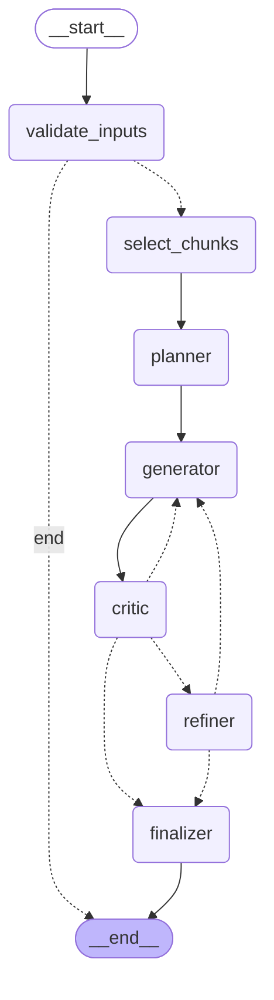
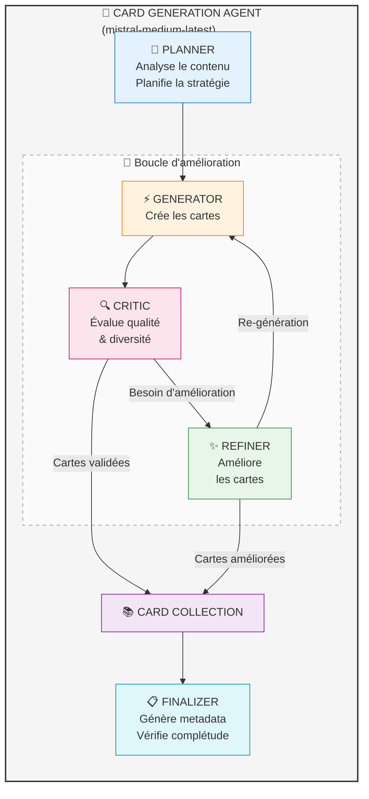
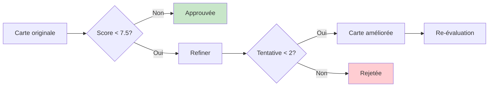

import { Aside, Badge, Card, CardGrid, Steps, TabItem, Tabs, FileTree } from '@astrojs/starlight/components';

# 🎴 Génération de cartes

<Badge text="Agentic" variant="success" />
<Badge text="Mistral AI" variant="note" />
<Badge text="Multi-types" variant="caution" />

Le **Card Generator Graph** est un graphe **agentic** sophistiqué pour la génération intelligente de cartes d'apprentissage à partir des chunks embeddés.

## Vue d'ensemble

Le système utilise une approche **agentic** avec plusieurs agents spécialisés qui collaborent :

- **Planner** : Analyse le contenu et planifie la stratégie de génération
- **Generator** : Crée les cartes selon le plan
- **Critic** : Évalue la qualité et la diversité
- **Refiner** : Améliore les cartes selon le feedback
- **Finalizer** : Génère les métadonnées et valide la collection

<Aside type="note">
  L'approche agentic permet au système de s'auto-corriger et d'optimiser la qualité des cartes générées de manière itérative.
</Aside>

## Diagramme du Card Generator Graph



## Architecture agentic détaillée



---

## Types de cartes supportés

Le système peut générer **9 types de cartes** différents :

```python
class CardType(str, Enum):
    """Types de cartes disponibles pour la génération"""
    FLASHCARD = "flashcard"          # Question/Réponse classique
    MCQ = "mcq"                      # QCM (Questions à Choix Multiples)
    FREE_TEXT = "free_text"          # Réponse libre
    TRUE_OR_FALSE = "true_or_false"  # Vrai ou Faux
    MATCH_PAIR = "match_pair"        # Correspondance
    SLIDER = "slider"                # Curseur numérique
    DRAG_AND_DROP = "drag_and_drop"  # Glisser-déposer
    RANKING = "ranking"              # Classement
    GEO_GUESS = "geo_guess"          # Géolocalisation
```

<CardGrid>
  <Card title="Flashcard" icon="document">
    Question/réponse simple pour la mémorisation rapide.
  </Card>
  <Card title="QCM" icon="list-format">
    Question à choix multiples avec distracteurs intelligents.
  </Card>
  <Card title="Vrai/Faux" icon="approve-check">
    Affirmation à valider avec explication détaillée.
  </Card>
  <Card title="Match Pair" icon="puzzle">
    Relier des éléments correspondants entre eux.
  </Card>
  <Card title="Texte libre" icon="pencil">
    Réponse ouverte pour approfondir la compréhension.
  </Card>
  <Card title="Classement" icon="list-format">
    Ordonner des éléments selon un critère donné.
  </Card>
</CardGrid>

---

## Workflow de génération

<Steps>
1. **Validation des inputs**
   - Vérification des chunks embeddés
   - Validation des types de cartes demandés
   - Vérification du nombre de cartes souhaité

2. **Sélection des chunks**
   - Algorithme K-means pour diversité
   - Sélection des chunks les plus représentatifs
   - Équilibrage du contenu

3. **Planification (Planner)**
   - Analyse du contenu des chunks
   - Répartition des types de cartes
   - Stratégie de couverture du sujet

4. **Génération (Generator)**
   - Création des cartes selon le plan
   - Respect des formats par type
   - Génération des distracteurs (QCM)

5. **Évaluation (Critic)**
   - Score de qualité par carte
   - Détection des doublons
   - Vérification de la diversité

6. **Raffinement (Refiner)**
   - Amélioration des cartes faibles
   - Suppression des doublons
   - Ajustement du niveau de difficulté

7. **Finalisation**
   - Génération des métadonnées
   - Calcul des statistiques
   - Validation finale de la collection
</Steps>

---

## Agents du système

### Planner Agent

Le Planner analyse le contenu et crée un plan de génération :

```python
class GenerationPlan(BaseModel):
    """Plan de génération des cartes"""
    card_distribution: Dict[CardType, int]  # Répartition par type
    focus_topics: List[str]                  # Sujets prioritaires
    difficulty_curve: List[int]              # Progression difficulté
    reasoning: str                           # Explication du plan
```

### Generator Agent

Le Generator crée les cartes selon le plan :

<Tabs>
  <TabItem label="Flashcard">
    ```python
    {
        "type": "flashcard",
        "question": "Qu'est-ce que la photosynthèse ?",
        "answer": "La photosynthèse est le processus par lequel...",
        "difficulty": 2,
        "tags": ["biologie", "plantes"]
    }
    ```
  </TabItem>
  
  <TabItem label="QCM">
    ```python
    {
        "type": "mcq",
        "question": "Quel organite réalise la photosynthèse ?",
        "correct_answer": "Chloroplaste",
        "options": [
            "Chloroplaste",
            "Mitochondrie",
            "Ribosome",
            "Noyau"
        ],
        "explanation": "Les chloroplastes contiennent...",
        "difficulty": 3
    }
    ```
  </TabItem>
  
  <TabItem label="Vrai/Faux">
    ```python
    {
        "type": "true_or_false",
        "statement": "La photosynthèse produit de l'oxygène.",
        "is_true": True,
        "explanation": "La photosynthèse libère de l'O2...",
        "difficulty": 1
    }
    ```
  </TabItem>
</Tabs>

### Critic Agent

Le Critic évalue chaque carte selon plusieurs critères :

```python
class CardQualityScore(BaseModel):
    """Score de qualité d'une carte"""
    clarity: float         # Clarté de la question (0-1)
    relevance: float       # Pertinence pédagogique (0-1)
    difficulty_fit: float  # Adéquation difficulté (0-1)
    uniqueness: float      # Originalité vs doublons (0-1)
    overall: float         # Score global (0-10)
    suggestions: List[str] # Suggestions d'amélioration
```

**Seuils de qualité :**

| Critère | Seuil |
|---------|-------|
| Score minimum pour approbation | **7.5/10** |
| Seuil de similarité (doublons) | **75%** |
| Max tentatives de raffinement | **2** |

### Refiner Agent

Le Refiner améliore les cartes selon le feedback du Critic :



---

## Types Agent

### Actions de l'Agent

```python
class AgentActionType(str, Enum):
    """Types d'actions disponibles pour l'agent"""
    GENERATE = "generate"        # Générer de nouvelles cartes
    EVALUATE = "evaluate"        # Évaluer les cartes existantes
    REFINE = "refine"           # Améliorer une carte
    REMOVE_DUPLICATE = "remove"  # Supprimer un doublon
    FINALIZE = "finalize"       # Finaliser la collection
```

### Décisions de l'Agent

```python
class AgentDecision(str, Enum):
    """Décisions possibles après évaluation"""
    APPROVE = "approve"          # Carte approuvée
    REFINE = "refine"           # Nécessite amélioration
    REGENERATE = "regenerate"   # Regénérer complètement
    REJECT = "reject"           # Rejeter la carte
    FINISH = "finish"           # Terminer la génération
```

### Résultat du Critic

```python
class CritiqueResult(BaseModel):
    """Résultat de l'évaluation par le Critic"""
    cards_approved: List[str]        # IDs des cartes approuvées
    cards_to_refine: List[str]       # IDs à améliorer
    cards_to_reject: List[str]       # IDs à rejeter
    duplicate_pairs: List[Tuple]     # Paires de doublons
    diversity_score: float           # Score de diversité
    needs_more_generation: bool      # Si plus de cartes nécessaires
```

---

## Optimisation des batches

Le module `batch_optimizer.py` calcule dynamiquement la taille des batches pour optimiser les appels LLM :

```python
@dataclass(frozen=True)
class BatchConfig:
    """Configuration de batch optimisée"""
    batch_size: int              # Nombre de cartes par batch
    estimated_input_tokens: int  # Tokens d'entrée estimés
    estimated_output_tokens: int # Tokens de sortie estimés
    total_batches: int           # Nombre total de batches
```

### Estimation des tokens par type

| Type de carte | Tokens output estimés |
|---------------|----------------------|
| Flashcard | 150 |
| QCM | 250 |
| Vrai/Faux | 120 |
| Match Pair | 200 |
| Texte libre | 180 |
| Classement | 220 |
| Drag & Drop | 280 |
| Slider | 100 |
| Geo Guess | 150 |

---

## Exemple d'utilisation

```python
from src.graphs.card_generator import card_generator_graph
from src.models.card_types import CardType, CardTypeRequest

# Configuration des types de cartes souhaités
card_requests = [
    CardTypeRequest(card_type=CardType.FLASHCARD, count=5),
    CardTypeRequest(card_type=CardType.MCQ, count=3),
    CardTypeRequest(card_type=CardType.TRUE_OR_FALSE, count=2)
]

# Invocation du graphe
result = await card_generator_graph.ainvoke({
    "embedded_chunks": embedded_chunks,  # Depuis le graphe d'embedding
    "card_type_requests": card_requests,
    "language": "fr",
    "user_context": "Sujet: Biologie - La photosynthèse"
})

# Récupération des résultats
generated_cards = result["generated_cards"]
metadata = result["collection_metadata"]

print(f"Cartes générées: {len(generated_cards)}")
print(f"Score moyen: {metadata['average_quality_score']}")
```

---

## Prompts YAML

Les prompts des agents sont stockés dans `src/prompts/` au format YAML avec support multi-langue :

```yaml
# src/prompts/generator.yaml
system:
  fr: |
    Tu es un expert en création de contenu pédagogique.
    Tu génères des cartes d'apprentissage de haute qualité.
    
  en: |
    You are an expert in educational content creation.
    You generate high-quality learning cards.

user:
  fr: |
    Génère {count} cartes de type {card_type} à partir du contenu suivant:
    {content}
    
    Niveau de difficulté: {difficulty}
```

### Prompts disponibles

| Fichier | Agent | Rôle |
|---------|-------|------|
| `planner.yaml` | Planner | Planification de la génération |
| `generator.yaml` | Generator | Création des cartes |
| `critic.yaml` | Critic | Évaluation de qualité |
| `refiner.yaml` | Refiner | Amélioration des cartes |

---

## Métriques de qualité

| Métrique | Description | Cible |
|----------|-------------|-------|
| **Score moyen** | Qualité moyenne des cartes | > 8.0/10 |
| **Taux d'approbation** | Cartes approuvées du premier coup | > 70% |
| **Doublons détectés** | Cartes similaires identifiées | < 5% |
| **Couverture sujet** | % du contenu couvert | > 85% |
| **Diversité types** | Équilibre entre les types | Selon config |

---

## Structure du code

<FileTree>
- src/
  - graphs/
    - **card_generator.py** 🎴 Graph principal
  - nodes/
    - card_generation/
      - validate_inputs.py
      - select_chunks.py
      - planner.py
      - generator.py
      - critic.py
      - refiner.py
      - finalizer.py
  - models/
    - **card_types.py** Types de cartes
    - **agent_types.py** Types agent
  - prompts/
    - planner.yaml
    - generator.yaml
    - critic.yaml
    - refiner.yaml
</FileTree>

---

*Génération intelligente de cartes d'apprentissage grâce à une architecture agentic.*
