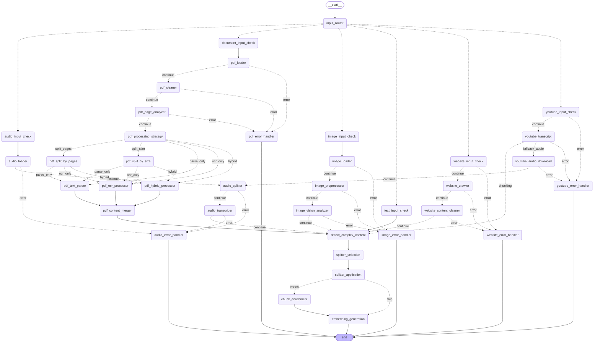
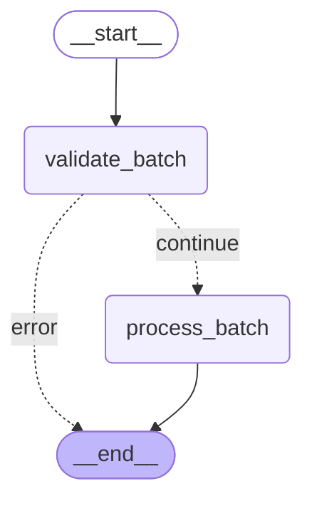
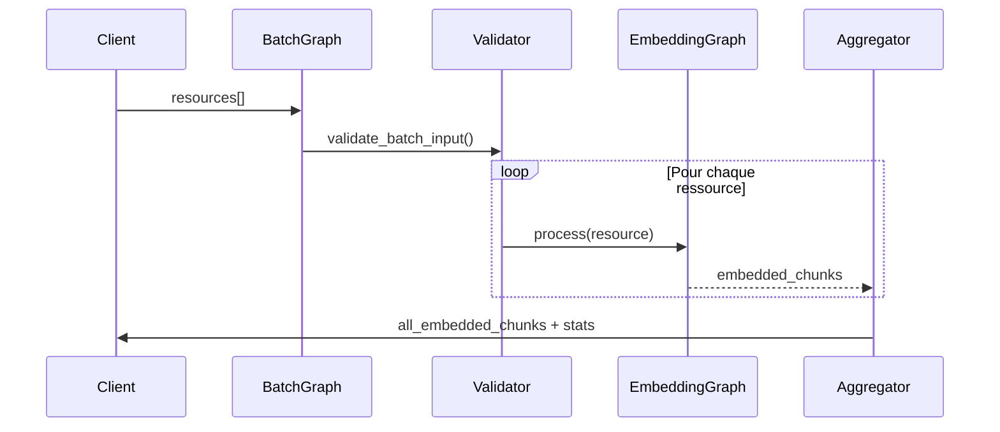

import { Aside, Badge, Card, CardGrid, Steps, TabItem, Tabs } from '@astrojs/starlight/components';

# 📊 Graphes LangGraph

<Badge text="LangGraph" variant="success" />
<Badge text="StateGraph" variant="note" />
<Badge text="Async" variant="caution" />

Mindlet AI utilise **LangGraph** pour orchestrer le traitement des contenus. Cette page détaille l'architecture des graphes d'embedding.

## Qu'est-ce que LangGraph ?

**LangGraph** est un framework de LangChain pour construire des applications basées sur des **graphes d'états**. Il permet de :

- Définir des **nœuds** (nodes) qui effectuent des opérations
- Connecter les nœuds par des **arêtes** (edges) conditionnelles ou non
- Gérer un **état partagé** qui traverse le graphe
- Implémenter des **boucles** et de la **récursivité**

<Aside type="tip">
  Contrairement aux chaînes LangChain classiques qui sont linéaires, LangGraph permet de créer des workflows complexes avec des branchements et des boucles.
</Aside>

---

## Embedding Graph

Le graphe principal pour le traitement d'une **ressource unique**. Il détecte automatiquement le type d'input et route vers le pipeline approprié.

### Diagramme complet



### État du graphe (EmbeddingState)

```python
class EmbeddingState(TypedDict):
    """État principal qui traverse le graphe d'embedding"""
    
    # === Input ===
    input_type: InputType              # Type d'input détecté
    sentences: List[str]               # Pour TEXT
    url_resource: str                  # Pour DOCUMENT, IMAGE, etc.
    language: str                      # Langue du contenu
    
    # === Processing ===
    extracted_content: str             # Contenu extrait
    chunks: List[str]                  # Chunks après découpage
    has_complex_content: bool          # Contenu complexe détecté
    
    # === PDF Specific ===
    pdf_pages: List[Dict]              # Pages du PDF
    processing_strategy: str           # Stratégie choisie
    
    # === Output ===
    embedded_chunks: List[Dict]        # Chunks avec embeddings
    error: Optional[str]               # Erreur éventuelle
    
    # === Metadata ===
    total_tokens: int                  # Tokens traités
    processing_time: float             # Temps de traitement
    embedding_dimension: int           # Dimension (1024)
```

### Construction du graphe

```python
from langgraph.graph import StateGraph, END

def create_embedding_graph():
    """Construit le graphe d'embedding"""
    
    workflow = StateGraph(EmbeddingState)
    
    # === Nœuds principaux ===
    workflow.add_node("input_router", input_router)
    workflow.add_node("text_input_check", text_input_check)
    workflow.add_node("detect_complex_content", detect_complex_content)
    workflow.add_node("splitter_selection", splitter_selection)
    workflow.add_node("splitter_application", splitter_application)
    workflow.add_node("chunk_enrichment", chunk_enrichment)
    workflow.add_node("embedding_generation", embedding_generation)
    
    # === Nœuds PDF ===
    workflow.add_node("document_input_check", document_input_check)
    workflow.add_node("pdf_loader", pdf_loader)
    workflow.add_node("pdf_cleaner", pdf_cleaner)
    # ... autres nœuds PDF
    
    # === Arêtes ===
    workflow.add_edge("__start__", "input_router")
    
    # Routage conditionnel selon le type d'input
    workflow.add_conditional_edges(
        "input_router",
        route_by_input_type,
        {
            "text": "text_input_check",
            "document": "document_input_check",
            "image": "image_input_check",
            "audio": "audio_input_check",
            "youtube": "youtube_input_check",
            "website": "website_input_check",
        }
    )
    
    # Arête conditionnelle pour l'enrichissement
    workflow.add_conditional_edges(
        "splitter_application",
        should_enrich,
        {
            "enrich": "chunk_enrichment",
            "skip": "embedding_generation"
        }
    )
    
    workflow.add_edge("embedding_generation", END)
    
    return workflow.compile()

# Export du graphe compilé
graph = create_embedding_graph()
```

---

## Batch Embedding Graph

Permet de traiter **plusieurs ressources** en une seule invocation. Chaque ressource est traitée via le graphe d'embedding individuel puis les résultats sont agrégés.

### Diagramme



### Flux de traitement



### État du graphe batch

```python
class ResourceInput(TypedDict):
    """Définition d'une ressource à traiter"""
    input_type: InputType
    sentences: NotRequired[List[str]]  # Pour TEXT
    url_resource: NotRequired[str]     # Pour DOCUMENT, IMAGE, etc.

class BatchEmbeddingState(TypedDict):
    """State pour le traitement par batch"""
    resources: List[ResourceInput]           # Liste des ressources
    processing_results: List[Dict]           # Résultats par ressource
    all_embedded_chunks: List[Dict]          # Tous les chunks embeddés
    total_chunks: int                        # Nombre total de chunks
    processing_stats: Dict                   # Stats globales
```

### Construction du graphe batch

```python
def create_batch_embedding_graph():
    """Construit le graphe de traitement batch"""
    
    workflow = StateGraph(BatchEmbeddingState)
    
    workflow.add_node("validate_batch", validate_batch_input)
    workflow.add_node("process_batch", process_batch_resources)
    
    workflow.add_edge("__start__", "validate_batch")
    workflow.add_conditional_edges(
        "validate_batch",
        check_validation,
        {
            "continue": "process_batch",
            "error": END
        }
    )
    workflow.add_edge("process_batch", END)
    
    return workflow.compile()

batch_graph = create_batch_embedding_graph()
```

### Traitement parallèle

Le nœud `process_batch` utilise `asyncio.gather` pour traiter les ressources en parallèle :

```python
async def process_batch_resources(state: BatchEmbeddingState) -> BatchEmbeddingState:
    """Traite toutes les ressources en parallèle"""
    
    # Import du graphe d'embedding
    from src.graphs.embedding import graph
    
    tasks = []
    for resource in state["resources"]:
        task = asyncio.create_task(
            graph.ainvoke({
                "input_type": resource["input_type"],
                "sentences": resource.get("sentences"),
                "url_resource": resource.get("url_resource"),
                "language": state.get("language", "fr")
            })
        )
        tasks.append(task)
    
    results = await asyncio.gather(*tasks, return_exceptions=True)
    
    # Agrégation des résultats
    all_chunks = []
    processing_results = []
    
    for i, result in enumerate(results):
        if isinstance(result, Exception):
            processing_results.append({
                "resource_index": i,
                "status": "error",
                "error": str(result)
            })
        else:
            chunks = result.get("embedded_chunks", [])
            all_chunks.extend(chunks)
            processing_results.append({
                "resource_index": i,
                "status": "success",
                "chunks_count": len(chunks)
            })
    
    return {
        **state,
        "all_embedded_chunks": all_chunks,
        "total_chunks": len(all_chunks),
        "processing_results": processing_results,
        "processing_stats": {
            "total_resources": len(state["resources"]),
            "successful": sum(1 for r in processing_results if r["status"] == "success"),
            "failed": sum(1 for r in processing_results if r["status"] == "error")
        }
    }
```

---

## Exemple d'utilisation

<Tabs>
  <TabItem label="Single Resource">
    ```python
    from src.graphs.embedding import graph
    from src.models.input_type import InputType

    # Traitement d'un texte
    result = await graph.ainvoke({
        "input_type": InputType.TEXT,
        "sentences": [
            "La photosynthèse est le processus...",
            "Les plantes utilisent la lumière..."
        ],
        "language": "fr"
    })

    embedded_chunks = result["embedded_chunks"]
    print(f"Chunks générés: {len(embedded_chunks)}")
    ```
  </TabItem>
  
  <TabItem label="Batch Resources">
    ```python
    from src.graphs.batch_embedding import batch_graph
    from src.models.input_type import InputType

    # Traitement de plusieurs ressources
    result = await batch_graph.ainvoke({
        "resources": [
            {
                "input_type": InputType.TEXT,
                "sentences": ["Premier texte..."]
            },
            {
                "input_type": InputType.DOCUMENT,
                "url_resource": "s3://bucket/document.pdf"
            },
            {
                "input_type": InputType.YOUTUBE,
                "url_resource": "https://youtube.com/watch?v=xxx"
            }
        ],
        "language": "fr"
    })

    all_chunks = result["all_embedded_chunks"]
    stats = result["processing_stats"]
    print(f"Total chunks: {len(all_chunks)}")
    print(f"Succès: {stats['successful']}/{stats['total_resources']}")
    ```
  </TabItem>
</Tabs>

---

## Structure du code

```
src/graphs/
├── embedding.py         # 🎯 Graph principal (export: graph)
├── batch_embedding.py   # 📦 Graph batch (export: batch_graph)
└── states/
    └── embedding_state.py  # États TypedDict
```

---

## Avantages de LangGraph

<CardGrid>
  <Card title="Modularité" icon="puzzle">
    Chaque nœud est une fonction indépendante, facile à tester et à maintenir.
  </Card>
  <Card title="Visibilité" icon="magnifier">
    Les graphes sont visualisables, facilitant le debugging et la documentation.
  </Card>
  <Card title="Flexibilité" icon="random">
    Les arêtes conditionnelles permettent des workflows complexes et adaptatifs.
  </Card>
  <Card title="Traçabilité" icon="list-format">
    Chaque étape du traitement est loggée et peut être inspectée.
  </Card>
</CardGrid>

---

*Architecture LangGraph pour un traitement de contenu robuste et scalable.*
