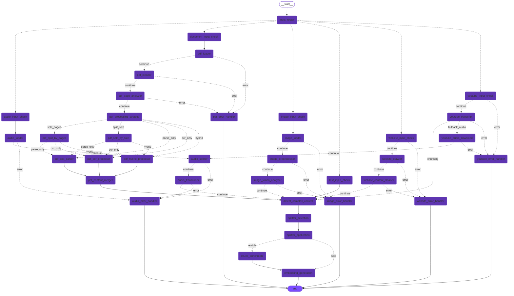
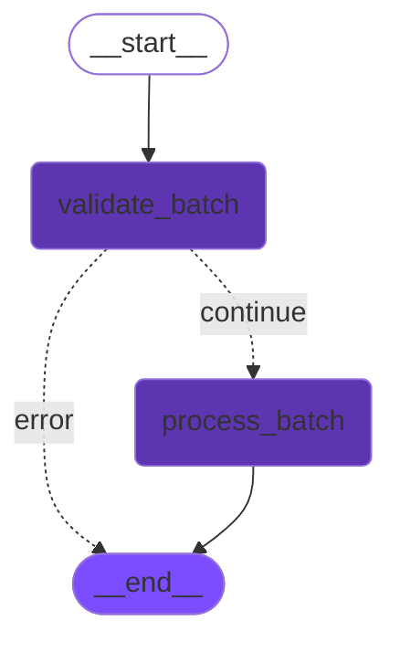

import { Aside, Badge, Card, CardGrid, Steps, TabItem, Tabs } from '@astrojs/starlight/components';
import MermaidDownload from '../../../components/MermaidDownload.astro';

# 📊 Graphes LangGraph

<Badge text="LangGraph" variant="success" />
<Badge text="StateGraph" variant="note" />
<Badge text="Async" variant="caution" />

## Introduction

Cette page détaille l'architecture technique des **graphes d'embedding** — le cœur du système qui transforme n'importe quel contenu en vecteurs exploitables. Si vous n'êtes pas familier avec LangGraph, lisez d'abord la section explicative ci-dessous.

## Qu'est-ce que LangGraph ?

**LangGraph** est un framework Python développé par l'équipe LangChain pour construire des applications IA basées sur des **graphes d'états**. Pensez-y comme une machine à états augmentée pour l'IA.

### Les concepts clés

| Concept | Description | Analogie |
|---------|-------------|----------|
| **Node** | Une fonction Python qui transforme l'état | Une étape dans une recette de cuisine |
| **Edge** | La connexion entre deux nodes | "Après l'étape A, faire l'étape B" |
| **Conditional Edge** | Une connexion qui dépend de l'état | "Si le gâteau est cuit, sortir du four, sinon continuer" |
| **State** | Un dictionnaire typé qui traverse le graphe | Les ingrédients qui évoluent à chaque étape |

### Pourquoi LangGraph plutôt que des chaînes linéaires ?

<Aside type="tip" title="L'avantage du graphe">
  Une chaîne linéaire (A → B → C) ne permet pas de :
  - **Brancher** : "Si le PDF est scanné, faire OCR, sinon parser le texte"
  - **Boucler** : "Tant que la qualité est insuffisante, améliorer la carte"
  - **Paralléliser** : "Traiter les 6 pipelines simultanément"
  
  LangGraph résout ces limitations avec une approche basée sur les graphes.
</Aside>

```python
# Exemple conceptuel : un graphe LangGraph
workflow = StateGraph(EmbeddingState)

# Chaque node est une fonction pure qui prend l'état et le retourne modifié
workflow.add_node("input_router", detect_input_type)
workflow.add_node("text_pipeline", process_text)
workflow.add_node("pdf_pipeline", process_pdf)

# Les edges conditionnels permettent le branchement dynamique
workflow.add_conditional_edges(
    "input_router",
    lambda state: state["input_type"],  # La fonction de routage
    {"text": "text_pipeline", "document": "pdf_pipeline"}
)

graph = workflow.compile()  # Prêt à être invoqué !
```

---

## Embedding Graph

Le graphe principal pour le traitement d'une **ressource unique**. C'est le graphe que vous invoquez quand vous uploadez un fichier ou collez du texte.

### Ce que fait ce graphe

1. **Détecte** automatiquement le type d'input (PDF, image, audio, etc.)
2. **Route** vers le pipeline spécialisé approprié
3. **Extrait** le contenu textuel de la source
4. **Découpe** le texte en chunks de taille optimale
5. **Enrichit** les chunks complexes (optionnel, via LLM)
6. **Génère** les embeddings vectoriels avec Mistral

### Diagramme complet

Ce diagramme montre tous les nodes et leurs connexions. Les lignes pointillées indiquent des **edges conditionnels** (le chemin dépend de l'état) :

<MermaidDownload title="Embedding Graph complet">


</MermaidDownload>

### Comprendre le flux du graphe

Le graphe ci-dessus peut sembler complexe, mais il suit une logique simple :

1. **Entrée** (`__start__`) → **Routeur** : Le graphe commence et détecte le type d'input
2. **Routeur** → **Pipeline spécialisé** : Selon le type (text, document, image...), on branche
3. **Pipeline** → **Traitement commun** : Après extraction, on rejoint le flux commun
4. **Traitement commun** → **Sortie** : Chunking, enrichissement optionnel, embedding, fin

<Aside type="note" title="Les lignes pointillées">
  Dans le diagramme, les lignes pointillées (`-.->`) représentent des **edges conditionnels**. Par exemple, `splitter_application -. enrich .-> chunk_enrichment` signifie "si le contenu est complexe, aller vers l'enrichissement".
</Aside>

### État du graphe (EmbeddingState)

L'état est un **TypedDict** Python qui contient toutes les données qui traversent le graphe. Chaque node lit l'état, le modifie, et le retourne. Voici la structure complète avec des explications :

```python
class EmbeddingState(TypedDict):
    """État principal qui traverse le graphe d'embedding.
    
    Cet état est passé de node en node. Chaque node peut lire et modifier
    les champs dont il a besoin. LangGraph gère automatiquement la fusion
    des modifications.
    """
    
    # === Input (défini au départ) ===
    input_type: InputType              # Type détecté par input_router
    sentences: List[str]               # Si TEXT : les phrases à traiter
    url_resource: str                  # Si DOCUMENT/IMAGE/etc : URL S3 de la ressource
    language: str                      # Langue pour les prompts ("fr", "en"...)
    
    # === Processing (modifié pendant le traitement) ===
    extracted_content: str             # Texte extrait de la source (rempli par le pipeline)
    chunks: List[str]                  # Texte découpé en segments (après chunking)
    has_complex_content: bool          # True si tables/code/formules détectés
    
    # === PDF Specific (uniquement pour les PDFs) ===
    pdf_pages: List[Dict]              # Métadonnées de chaque page
    processing_strategy: str           # "parse_only", "ocr_only", "hybrid"
    
    # === Output (résultat final) ===
    embedded_chunks: List[Dict]        # Les chunks avec leurs embeddings
    error: Optional[str]               # Message d'erreur si échec
    
    # === Metadata (statistiques) ===
    total_tokens: int                  # Tokens traités
    processing_time: float             # Temps de traitement
    embedding_dimension: int           # Dimension (1024)
```

### Construction du graphe

```python
from langgraph.graph import StateGraph, END

def create_embedding_graph():
    """Construit le graphe d'embedding"""
    
    workflow = StateGraph(EmbeddingState)
    
    # === Nœuds principaux ===
    workflow.add_node("input_router", input_router)
    workflow.add_node("text_input_check", text_input_check)
    workflow.add_node("detect_complex_content", detect_complex_content)
    workflow.add_node("splitter_selection", splitter_selection)
    workflow.add_node("splitter_application", splitter_application)
    workflow.add_node("chunk_enrichment", chunk_enrichment)
    workflow.add_node("embedding_generation", embedding_generation)
    
    # === Nœuds PDF ===
    workflow.add_node("document_input_check", document_input_check)
    workflow.add_node("pdf_loader", pdf_loader)
    workflow.add_node("pdf_cleaner", pdf_cleaner)
    # ... autres nœuds PDF
    
    # === Arêtes ===
    workflow.add_edge("__start__", "input_router")
    
    # Routage conditionnel selon le type d'input
    workflow.add_conditional_edges(
        "input_router",
        route_by_input_type,
        {
            "text": "text_input_check",
            "document": "document_input_check",
            "image": "image_input_check",
            "audio": "audio_input_check",
            "youtube": "youtube_input_check",
            "website": "website_input_check",
        }
    )
    
    # Arête conditionnelle pour l'enrichissement
    workflow.add_conditional_edges(
        "splitter_application",
        should_enrich,
        {
            "enrich": "chunk_enrichment",
            "skip": "embedding_generation"
        }
    )
    
    workflow.add_edge("embedding_generation", END)
    
    return workflow.compile()

# Export du graphe compilé
graph = create_embedding_graph()
```

---

## Batch Embedding Graph

Permet de traiter **plusieurs ressources** en une seule invocation. Chaque ressource est traitée via le graphe d'embedding individuel puis les résultats sont agrégés.

### Diagramme

<MermaidDownload title="Batch Embedding Graph">

</MermaidDownload>

### Flux de traitement

<MermaidDownload title="Flux Batch Sequence">

</MermaidDownload>

### État du graphe batch

```python
class ResourceInput(TypedDict):
    """Définition d'une ressource à traiter"""
    input_type: InputType
    sentences: NotRequired[List[str]]  # Pour TEXT
    url_resource: NotRequired[str]     # Pour DOCUMENT, IMAGE, etc.

class BatchEmbeddingState(TypedDict):
    """State pour le traitement par batch"""
    resources: List[ResourceInput]           # Liste des ressources
    processing_results: List[Dict]           # Résultats par ressource
    all_embedded_chunks: List[Dict]          # Tous les chunks embeddés
    total_chunks: int                        # Nombre total de chunks
    processing_stats: Dict                   # Stats globales
```

### Construction du graphe batch

```python
def create_batch_embedding_graph():
    """Construit le graphe de traitement batch"""
    
    workflow = StateGraph(BatchEmbeddingState)
    
    workflow.add_node("validate_batch", validate_batch_input)
    workflow.add_node("process_batch", process_batch_resources)
    
    workflow.add_edge("__start__", "validate_batch")
    workflow.add_conditional_edges(
        "validate_batch",
        check_validation,
        {
            "continue": "process_batch",
            "error": END
        }
    )
    workflow.add_edge("process_batch", END)
    
    return workflow.compile()

batch_graph = create_batch_embedding_graph()
```

### Traitement parallèle

Le nœud `process_batch` utilise `asyncio.gather` pour traiter les ressources en parallèle :

```python
async def process_batch_resources(state: BatchEmbeddingState) -> BatchEmbeddingState:
    """Traite toutes les ressources en parallèle"""
    
    # Import du graphe d'embedding
    from src.graphs.embedding import graph
    
    tasks = []
    for resource in state["resources"]:
        task = asyncio.create_task(
            graph.ainvoke({
                "input_type": resource["input_type"],
                "sentences": resource.get("sentences"),
                "url_resource": resource.get("url_resource"),
                "language": state.get("language", "fr")
            })
        )
        tasks.append(task)
    
    results = await asyncio.gather(*tasks, return_exceptions=True)
    
    # Agrégation des résultats
    all_chunks = []
    processing_results = []
    
    for i, result in enumerate(results):
        if isinstance(result, Exception):
            processing_results.append({
                "resource_index": i,
                "status": "error",
                "error": str(result)
            })
        else:
            chunks = result.get("embedded_chunks", [])
            all_chunks.extend(chunks)
            processing_results.append({
                "resource_index": i,
                "status": "success",
                "chunks_count": len(chunks)
            })
    
    return {
        **state,
        "all_embedded_chunks": all_chunks,
        "total_chunks": len(all_chunks),
        "processing_results": processing_results,
        "processing_stats": {
            "total_resources": len(state["resources"]),
            "successful": sum(1 for r in processing_results if r["status"] == "success"),
            "failed": sum(1 for r in processing_results if r["status"] == "error")
        }
    }
```

---

## Exemple d'utilisation

<Tabs>
  <TabItem label="Single Resource">
    ```python
    from src.graphs.embedding import graph
    from src.models.input_type import InputType

    # Traitement d'un texte
    result = await graph.ainvoke({
        "input_type": InputType.TEXT,
        "sentences": [
            "La photosynthèse est le processus...",
            "Les plantes utilisent la lumière..."
        ],
        "language": "fr"
    })

    embedded_chunks = result["embedded_chunks"]
    print(f"Chunks générés: {len(embedded_chunks)}")
    ```
  </TabItem>
  
  <TabItem label="Batch Resources">
    ```python
    from src.graphs.batch_embedding import batch_graph
    from src.models.input_type import InputType

    # Traitement de plusieurs ressources
    result = await batch_graph.ainvoke({
        "resources": [
            {
                "input_type": InputType.TEXT,
                "sentences": ["Premier texte..."]
            },
            {
                "input_type": InputType.DOCUMENT,
                "url_resource": "s3://bucket/document.pdf"
            },
            {
                "input_type": InputType.YOUTUBE,
                "url_resource": "https://youtube.com/watch?v=xxx"
            }
        ],
        "language": "fr"
    })

    all_chunks = result["all_embedded_chunks"]
    stats = result["processing_stats"]
    print(f"Total chunks: {len(all_chunks)}")
    print(f"Succès: {stats['successful']}/{stats['total_resources']}")
    ```
  </TabItem>
</Tabs>

---

## Structure du code

```
src/graphs/
├── embedding.py         # 🎯 Graph principal (export: graph)
├── batch_embedding.py   # 📦 Graph batch (export: batch_graph)
└── states/
    └── embedding_state.py  # États TypedDict
```

---

## Avantages de LangGraph

<CardGrid>
  <Card title="Modularité" icon="puzzle">
    Chaque nœud est une fonction indépendante, facile à tester et à maintenir.
  </Card>
  <Card title="Visibilité" icon="magnifier">
    Les graphes sont visualisables, facilitant le debugging et la documentation.
  </Card>
  <Card title="Flexibilité" icon="random">
    Les arêtes conditionnelles permettent des workflows complexes et adaptatifs.
  </Card>
  <Card title="Traçabilité" icon="list-format">
    Chaque étape du traitement est loggée et peut être inspectée.
  </Card>
</CardGrid>

---

*Architecture LangGraph pour un traitement de contenu robuste et scalable.*
