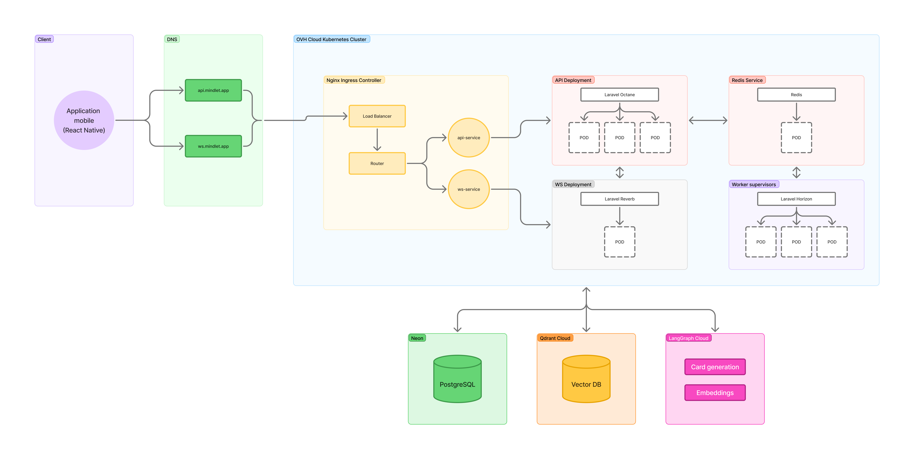
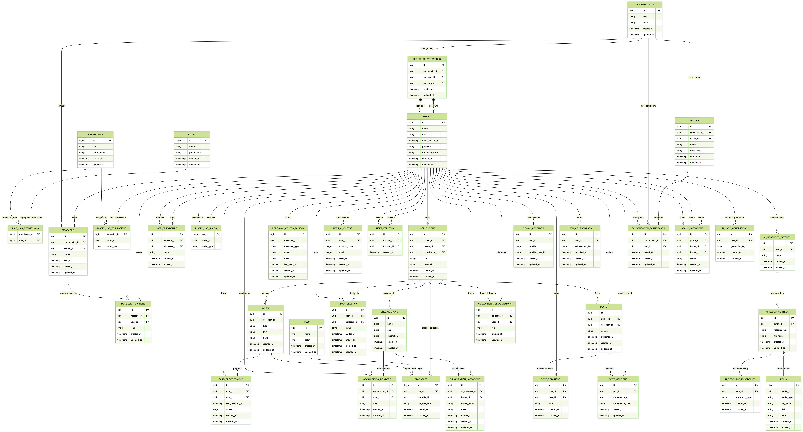
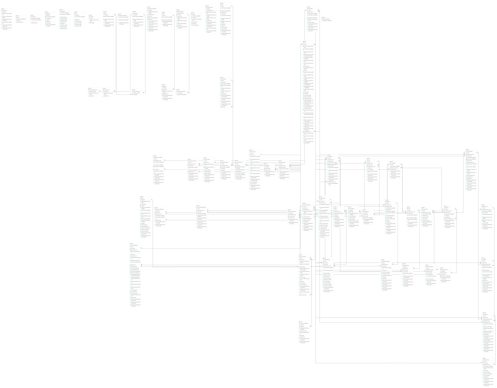

import { Aside, Card, CardGrid, TabItem, Tabs } from '@astrojs/starlight/components';

# 🏗️ Architecture technique

<Aside type="note">
  Mindlet repose sur une **architecture n-tiers** moderne, séparant clairement le stockage des données, leur présentation et leur traitement.
</Aside>

## Vue d'ensemble

Notre architecture est composée de trois couches principales :

```
┌─────────────────────────────────────────────────────────────┐
│                    COUCHE PRÉSENTATION                       │
│                  (React Native Mobile App)                   │
└─────────────────────────────────────────────────────────────┘
                              │
                              │ HTTPS / REST API
                              ▼
┌─────────────────────────────────────────────────────────────┐
│                    COUCHE MÉTIER                            │
│              (Laravel API + Service IA)                      │
└─────────────────────────────────────────────────────────────┘
                              │
                              │
                              ▼
┌─────────────────────────────────────────────────────────────┐
│                    COUCHE DONNÉES                           │
│        (PostgreSQL + Qdrant + MinIO)                        │
└─────────────────────────────────────────────────────────────┘
```

## Composants principaux

<CardGrid>
  <Card title="Frontend" icon="laptop">
    **React Native** - Application mobile cross-platform (iOS & Android)
  </Card>
  <Card title="Backend API" icon="setting">
    **Laravel** - API RESTful robuste et scalable
  </Card>
  <Card title="Service IA" icon="rocket">
    **LangChain/LangGraph** - Orchestration des modèles de langage
  </Card>
  <Card title="Données" icon="document">
    **PostgreSQL + Qdrant + MinIO** - Stockage relationnel, vectoriel et objets
  </Card>
</CardGrid>

## Architecture cloud

Notre infrastructure est déployée sur des services cloud européens pour garantir la conformité RGPD :



### Composants cloud

| Composant | Service | Fournisseur |
|-----------|---------|-------------|
| **Orchestration** | Kubernetes | OVHcloud |
| **Base de données** | PostgreSQL Managed | OVHcloud |
| **Load Balancer** | Cloud Load Balancer | OVHcloud |
| **Serveurs** | VPS | Hetzner |
| **CDN** | - | Europe |

## Architecture n-tiers détaillée

<Tabs>
  <TabItem label="Présentation">
    ### Couche Présentation (Frontend)
    
    La couche présentation est responsable de l'interface utilisateur :
    
    - **Technologie** : React Native avec Expo
    - **État global** : Zustand
    - **Navigation** : React Navigation
    - **UI Components** : NativeWind (Tailwind CSS)
    - **Requêtes API** : Axios avec intercepteurs
    
    Cette couche ne contient **aucune logique métier** et se contente de :
    - Afficher les données reçues de l'API
    - Capturer les interactions utilisateur
    - Envoyer les requêtes au backend
  </TabItem>
  
  <TabItem label="Métier">
    ### Couche Métier (Backend)
    
    La couche métier implémente toute la logique applicative :
    
    **API Laravel :**
    - Authentification et autorisation
    - Validation des données
    - Logique métier
    - Orchestration des services
    
    **Service IA :**
    - Génération de contenu pédagogique
    - Analyse sémantique des documents
    - Création de questions/réponses
    - Embeddings et recherche vectorielle
  </TabItem>
  
  <TabItem label="Données">
    ### Couche Données
    
    La couche données gère la persistance :
    
    | Type | Technologie | Usage |
    |------|-------------|-------|
    | **Relationnel** | PostgreSQL | Données structurées (users, collections, cards) |
    | **Vectoriel** | Qdrant | Embeddings pour la recherche sémantique |
    | **Objets** | MinIO | Fichiers (images, PDFs, médias) |
    | **Cache** | Redis | Sessions, cache applicatif |
  </TabItem>
</Tabs>

## Communication inter-services

### Frontend ↔ Backend

```
┌──────────────┐         HTTPS/TLS          ┌──────────────┐
│   Mobile     │ ◄──────────────────────► │   Laravel    │
│   React      │      REST API JSON        │   API        │
│   Native     │                           │              │
└──────────────┘                           └──────────────┘
```

**Caractéristiques :**
- Communication via **HTTPS** exclusivement
- Format d'échange : **JSON**
- Authentification : **JWT (Bearer Token)**
- Versioning API : **Préfixe /api/v1/**

### Backend ↔ Service IA

```
┌──────────────┐       HTTP interne         ┌──────────────┐
│   Laravel    │ ◄──────────────────────► │   Service    │
│   API        │       REST/gRPC           │   IA         │
└──────────────┘                           └──────────────┘
```

**Caractéristiques :**
- Communication interne au cluster Kubernetes
- Appels synchrones pour les opérations rapides
- Jobs asynchrones pour les traitements longs (génération de contenu)

## Scalabilité

Notre architecture est conçue pour supporter une **montée en charge** :

### Scalabilité horizontale

- **Kubernetes HPA** : Auto-scaling des pods selon la charge CPU/mémoire
- **Load Balancer** : Distribution de charge entre les instances
- **Stateless API** : Chaque instance peut traiter n'importe quelle requête

### Scalabilité verticale

- **Workers dédiés** : Pods spécialisés pour les traitements IA lourds
- **Queues** : Gestion asynchrone des tâches longues
- **Base de données managed** : Scaling automatique par le provider

### Projections de charge

| Utilisateurs | Instances API | Instances IA | DB Connections |
|--------------|---------------|--------------|----------------|
| 100 | 2 | 1 | 10 |
| 1 000 | 4 | 2 | 50 |
| 10 000 | 8 | 4 | 100 |
| 100 000 | 16+ | 8+ | 200+ |

<Aside type="tip">
  L'architecture Kubernetes permet de **scaler automatiquement** en fonction de la demande, garantissant une disponibilité optimale même en cas de pics d'utilisation.
</Aside>

## Diagrammes

### Modèle Conceptuel de Données (MCD)



### Modèle Physique de Données (MPD)



---

*Architecture conçue pour la performance, la scalabilité et la maintenabilité.*
