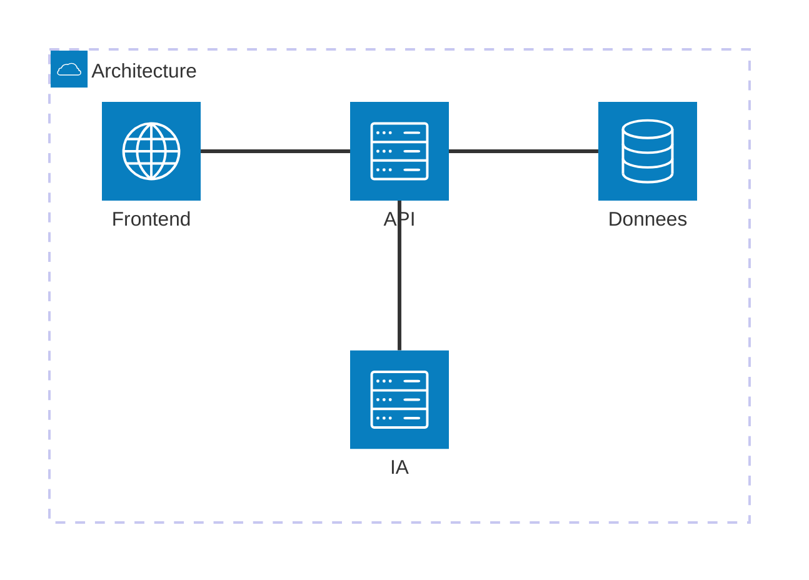
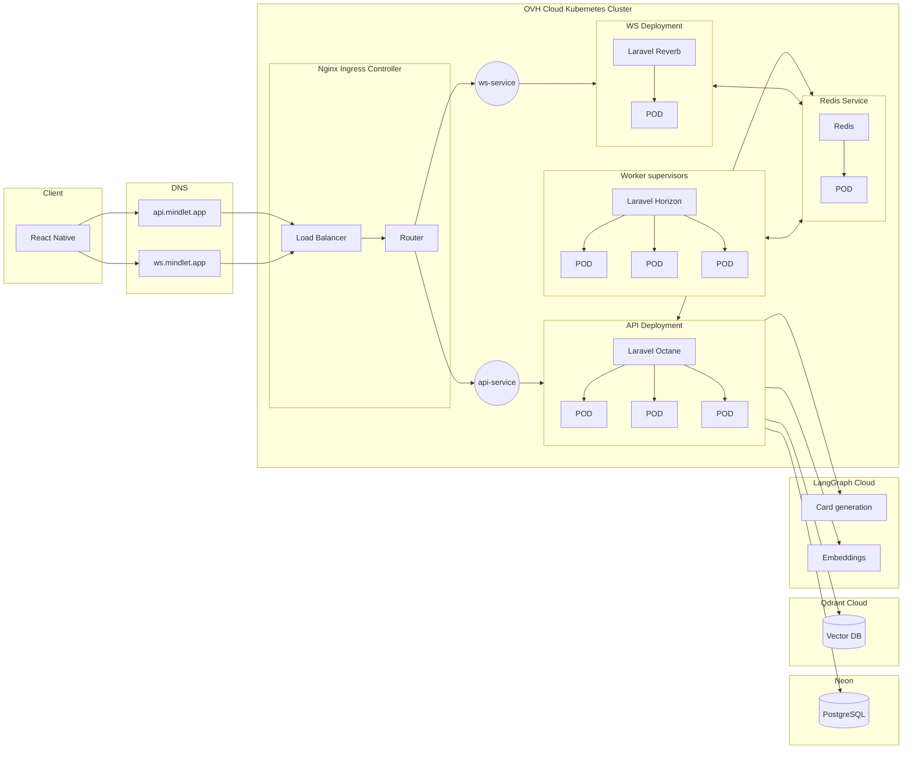
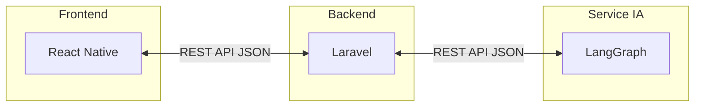

import { Aside, Card, CardGrid, TabItem, Tabs } from '@astrojs/starlight/components';
import MermaidDownload from '../../../components/MermaidDownload.astro';

# 🏗️ Architecture technique

<Aside type="note">
  Mindlet repose sur une **architecture n-tiers** moderne, séparant clairement le stockage des données, leur présentation et leur traitement.
</Aside>

## Vue d'ensemble

Notre architecture est composée de trois couches principales :

<MermaidDownload title="Vue d'ensemble">

</MermaidDownload>

## Composants principaux

<CardGrid>
  <Card title="Frontend" icon="laptop">
    **React Native** - Application mobile cross-platform (iOS & Android)
    
    [Voir la documentation →](/architecture/frontend/)
  </Card>
  <Card title="Backend API" icon="setting">
    **Laravel** - API RESTful robuste et scalable
    
    [Voir la documentation →](/architecture/backend/)
  </Card>
  <Card title="Service IA" icon="rocket">
    **LangGraph + Mistral AI** - Traitement multimodal et génération de cartes
    
    [Voir la documentation →](/architecture/service-ia/)
  </Card>
  <Card title="Données" icon="document">
    **PostgreSQL + S3** - Stockage relationnel et objets
  </Card>
</CardGrid>

## Architecture cloud

Notre infrastructure est déployée sur des services cloud européens pour garantir la conformité RGPD :

<MermaidDownload title="Architecture Cloud">

</MermaidDownload>

### Composants cloud

| Composant | Service | Fournisseur |
|-----------|---------|-------------|
| **Orchestration** | Kubernetes | OVHcloud |
| **Load Balancer** | Cloud Load Balancer | OVHcloud |
| **Base de données** | PostgreSQL Managed | Neon |
| **Base vectorielle** | Qdrant Managed | Qdrant Cloud |
| **Stockage objets** | VPS | Hetzner |

## Architecture n-tiers détaillée

<Tabs>
  <TabItem label="Présentation">
    ### Couche Présentation (Frontend)
    
    La couche présentation est responsable de l'interface utilisateur :
    
    - **Technologie** : React Native avec Expo
    - **État global** : Zustand
    - **Navigation** : Expo Router
    - **UI Components** : NativeWind (Tailwind CSS)
    - **Requêtes API** : React Query
    
    Cette couche ne contient **aucune logique métier** et se contente de :
    - Afficher les données reçues de l'API
    - Capturer les interactions utilisateur
    - Envoyer les requêtes au backend
  </TabItem>
  
  <TabItem label="Métier">
    ### Couche Métier (Backend)
    
    La couche métier implémente toute la logique applicative :
    
    **API Laravel :**
    - Authentification et autorisation
    - Validation des données
    - Logique métier
    - Orchestration des services
    
    **Service IA :**
    - Traitement multimodal (texte, PDF, image, audio, YouTube, web)
    - Génération d'embeddings via Mistral AI
    - Génération de cartes d'apprentissage (flashcards, QCM, etc.)
    - Architecture agentic avec LangGraph
  </TabItem>
  
  <TabItem label="Données">
    ### Couche Données
    
    La couche données gère la persistance :
    
    | Type | Technologie | Usage |
    |------|-------------|-------|
    | **Relationnel** | PostgreSQL | Données structurées (users, collections, cards) |
    | **Vectoriel** | Qdrant | Embeddings pour la recherche sémantique |
    | **Objets** | MinIO | Fichiers (images, PDFs, médias) |
    | **Cache** | Redis | Sessions, workers, cache applicatif |
  </TabItem>
</Tabs>

## Communication inter-services

### Frontend ↔ Backend ↔ Service IA

<MermaidDownload title="Frontend to Backend">

</MermaidDownload>

**Caractéristiques :**
- Communication via **HTTPS** exclusivement
- Format d'échange : **JSON**
- Authentification : **JWT (Bearer Token)**

## Scalabilité

Notre architecture est conçue pour supporter une **montée en charge** :

### Scalabilité horizontale

- **Kubernetes HPA** : Auto-scaling des pods selon la charge CPU/mémoire
- **Load Balancer** : Distribution de charge entre les instances
- **Stateless API** : Chaque instance peut traiter n'importe quelle requête

### Scalabilité verticale

- **Workers dédiés** : Pods spécialisés pour les traitements IA lourds
- **Queues** : Gestion asynchrone des tâches longues
- **Base de données managed** : Scaling automatique par le provider

### Projections de charge

| Utilisateurs | Instances API | Instances IA | DB Connections |
|--------------|---------------|--------------|----------------|
| 100 | 1 | 2 | 10 |
| 5 000 | 2 | 4 | 50 |
| 50 000+ | 4+ | 8+ | 200+ |

<Aside type="tip">
  L'architecture Kubernetes permet de **scaler automatiquement** en fonction de la demande, garantissant une disponibilité optimale même en cas de pics d'utilisation.
</Aside>

## Modélisation des données

La base de données de Mindlet suit une modélisation rigoureuse qui distingue le niveau **conceptuel** (abstrait, indépendant de l'implémentation) du niveau **physique** (concret, spécifique à PostgreSQL).

### MCD vs MPD : définitions

<Tabs>
  <TabItem label="MCD">
    #### Modèle Conceptuel de Données (MCD)

    Le **MCD** représente les **entités métier** et leurs **associations** de manière abstraite, sans se soucier des détails techniques d'implémentation.

    **Caractéristiques :**
    - Représente le **"quoi"** : quelles données et quelles relations
    - Indépendant du SGBD (PostgreSQL, MySQL, etc.)
    - Utilise des concepts de haut niveau (entités, associations, cardinalités)
    - Sert de base de discussion avec les parties prenantes non-techniques

    **Notation utilisée :**
    - **Entité** : Rectangle (ex: USERS, CARDS)
    - **Attribut** : Propriété d'une entité (ex: name, email)
    - **Association** : Ligne reliant deux entités avec cardinalités

    **Cardinalités :**
    - `||--o{` : Un à plusieurs (1,N)
    - `||--||` : Un à un (1,1)
    - `}o--o{` : Plusieurs à plusieurs (N,M)
  </TabItem>

  <TabItem label="MPD">
    #### Modèle Physique de Données (MPD)

    Le **MPD** traduit le MCD en une **structure de base de données réelle** avec les spécificités du SGBD choisi (PostgreSQL).

    **Caractéristiques :**
    - Représente le **"comment"** : implémentation concrète
    - Spécifique au SGBD (types PostgreSQL, index, contraintes)
    - Inclut les clés primaires, étrangères, index
    - Définit les types de données précis (UUID, JSONB, TIMESTAMPTZ)

    **Éléments spécifiques au MPD :**
    - **Types PostgreSQL** : `uuid`, `jsonb`, `timestamptz`, `text`
    - **Contraintes** : `NOT NULL`, `UNIQUE`, `CHECK`
    - **Index** : Index composites, partiels, GIN pour JSONB
    - **Soft deletes** : Colonne `deleted_at` pour suppression logique
  </TabItem>
</Tabs>

### Tables principales

Le schéma de données de Mindlet comprend **35+ tables** organisées en domaines fonctionnels :

| Domaine | Tables principales | Description |
|---------|-------------------|-------------|
| **Utilisateurs** | `users`, `user_follows`, `user_friendships`, `user_achievements` | Gestion des comptes, relations sociales et gamification |
| **Collections** | `collections`, `collection_collaborators`, `tags`, `taggables` | Organisation hiérarchique du contenu avec collaboration |
| **Cartes** | `cards`, `card_progressions` | Cartes d'apprentissage (9 types) et suivi de progression |
| **Étude** | `study_sessions` | Sessions de révision avec métriques |
| **IA** | `ai_resource_batches`, `ai_resource_items`, `ai_resource_embeddings`, `ai_card_generations`, `user_ai_quotas` | Pipeline de génération IA et gestion des quotas |
| **Messagerie** | `conversations`, `messages`, `groups`, `conversation_participants` | Système de messagerie temps réel |
| **Social** | `posts`, `post_reactions`, `post_mentions` | Fil d'actualité et interactions |
| **Organisations** | `organizations`, `organization_members`, `organization_invitations` | Gestion des établissements |
| **Auth** | `personal_access_tokens`, `social_accounts`, `roles`, `permissions` | Authentification et autorisations |

<Aside type="note" title="Clés primaires UUID">
  Toutes les tables utilisent des **UUID** comme clés primaires plutôt que des entiers auto-incrémentés. Cela facilite la génération côté client, les migrations de données et évite les collisions lors de fusions de bases.
</Aside>

### Modèle Conceptuel de Données (MCD)

Le diagramme ci-dessous présente les **entités principales** et leurs **relations** :

```mermaid
erDiagram
	direction TB
	USERS {
		uuid id PK ""
		string name  ""
		string email  ""
		timestamp email_verified_at  ""
		string password  ""
		string remember_token  ""
		timestamp created_at  ""
		timestamp updated_at  ""
	}

	ORGANIZATIONS {
		uuid id PK ""
		string name  ""
		string slug  ""
		string description  ""
		timestamp created_at  ""
		timestamp updated_at  ""
	}

	ORGANIZATION_MEMBERS {
		uuid id PK ""
		uuid organization_id FK ""
		uuid user_id FK ""
		string role  ""
		timestamp created_at  ""
		timestamp updated_at  ""
	}

	ORGANIZATION_INVITATIONS {
		uuid id PK ""
		uuid organization_id FK ""
		uuid inviter_id FK ""
		string invitee_email  ""
		string token  ""
		timestamp expires_at  ""
		timestamp created_at  ""
		timestamp updated_at  ""
	}

	COLLECTIONS {
		uuid id PK ""
		uuid owner_id FK ""
		uuid parent_id FK ""
		uuid organization_id FK ""
		string title  ""
		string description  ""
		timestamp created_at  ""
		timestamp updated_at  ""
	}

	COLLECTION_COLLABORATORS {
		uuid id PK ""
		uuid collection_id FK ""
		uuid user_id FK ""
		string role  ""
		timestamp created_at  ""
		timestamp updated_at  ""
	}

	CARDS {
		uuid id PK ""
		uuid collection_id FK ""
		string type  ""
		string front  ""
		string back  ""
		timestamp created_at  ""
		timestamp updated_at  ""
	}

	CARD_PROGRESSIONS {
		uuid id PK ""
		uuid user_id FK ""
		uuid card_id FK ""
		timestamp last_reviewed_at  ""
		integer streak  ""
		timestamp created_at  ""
		timestamp updated_at  ""
	}

	STUDY_SESSIONS {
		uuid id PK ""
		uuid user_id FK ""
		uuid collection_id FK ""
		string status  ""
		timestamp started_at  ""
		timestamp ended_at  ""
		timestamp created_at  ""
		timestamp updated_at  ""
	}

	TAGS {
		uuid id PK ""
		string name  ""
		string color  ""
		timestamp created_at  ""
		timestamp updated_at  ""
	}

	TAGGABLES {
		bigint id PK ""
		uuid tag_id FK ""
		uuid taggable_id  ""
		string taggable_type  ""
		timestamp created_at  ""
		timestamp updated_at  ""
	}

	USER_ACHIEVEMENTS {
		uuid id PK ""
		uuid user_id FK ""
		string achievement_key  ""
		timestamp unlocked_at  ""
		timestamp created_at  ""
		timestamp updated_at  ""
	}

	USER_FOLLOWS {
		uuid id PK ""
		uuid follower_id FK ""
		uuid followed_id FK ""
		timestamp created_at  ""
	}

	USER_FRIENDSHIPS {
		uuid id PK ""
		uuid requester_id FK ""
		uuid addressee_id FK ""
		string status  ""
		timestamp created_at  ""
		timestamp updated_at  ""
	}

	POSTS {
		uuid id PK ""
		uuid author_id FK ""
		uuid collection_id FK ""
		string content  ""
		timestamp published_at  ""
		timestamp created_at  ""
		timestamp updated_at  ""
	}

	POST_MENTIONS {
		uuid id PK ""
		uuid post_id FK ""
		uuid mentionable_id  ""
		string mentionable_type  ""
		timestamp created_at  ""
		timestamp updated_at  ""
	}

	POST_REACTIONS {
		uuid id PK ""
		uuid post_id FK ""
		uuid user_id FK ""
		string kind  ""
		timestamp created_at  ""
		timestamp updated_at  ""
	}

	CONVERSATIONS {
		uuid id PK ""
		string type  ""
		string topic  ""
		timestamp created_at  ""
		timestamp updated_at  ""
	}

	DIRECT_CONVERSATIONS {
		uuid id PK ""
		uuid conversation_id FK ""
		uuid user_one_id FK ""
		uuid user_two_id FK ""
		timestamp created_at  ""
		timestamp updated_at  ""
	}

	GROUPS {
		uuid id PK ""
		uuid conversation_id FK ""
		uuid owner_id FK ""
		string name  ""
		string description  ""
		timestamp created_at  ""
		timestamp updated_at  ""
	}

	CONVERSATION_PARTICIPANTS {
		uuid id PK ""
		uuid conversation_id FK ""
		uuid user_id FK ""
		timestamp joined_at  ""
		timestamp created_at  ""
		timestamp updated_at  ""
	}

	MESSAGES {
		uuid id PK ""
		uuid conversation_id FK ""
		uuid sender_id FK ""
		string content  ""
		timestamp sent_at  ""
		timestamp created_at  ""
		timestamp updated_at  ""
	}

	MESSAGE_REACTIONS {
		uuid id PK ""
		uuid message_id FK ""
		uuid user_id FK ""
		string kind  ""
		timestamp created_at  ""
		timestamp updated_at  ""
	}

	GROUP_INVITATIONS {
		uuid id PK ""
		uuid group_id FK ""
		uuid inviter_id FK ""
		uuid invitee_id FK ""
		string status  ""
		timestamp created_at  ""
		timestamp updated_at  ""
	}

	AI_RESOURCE_BATCHES {
		uuid id PK ""
		uuid user_id FK ""
		string status  ""
		timestamp created_at  ""
		timestamp updated_at  ""
	}

	AI_RESOURCE_ITEMS {
		uuid id PK ""
		uuid batch_id FK ""
		string resource_type  ""
		string file_hash  ""
		timestamp created_at  ""
		timestamp updated_at  ""
	}

	AI_RESOURCE_EMBEDDINGS {
		uuid id PK ""
		uuid item_id FK ""
		string embedding_type  ""
		timestamp created_at  ""
		timestamp updated_at  ""
	}

	AI_CARD_GENERATIONS {
		uuid id PK ""
		uuid user_id FK ""
		string generation_key  ""
		timestamp created_at  ""
		timestamp updated_at  ""
	}

	USER_AI_QUOTAS {
		uuid id PK ""
		uuid user_id FK ""
		integer monthly_quota  ""
		integer used  ""
		timestamp reset_at  ""
		timestamp created_at  ""
		timestamp updated_at  ""
	}

	MEDIA {
		bigint id PK ""
		uuid model_id  ""
		string model_type  ""
		string file_name  ""
		string disk  ""
		string path  ""
		timestamp created_at  ""
		timestamp updated_at  ""
	}

	SOCIAL_ACCOUNTS {
		uuid id PK ""
		uuid user_id FK ""
		string provider  ""
		string provider_user_id  ""
		timestamp created_at  ""
		timestamp updated_at  ""
	}

	PERSONAL_ACCESS_TOKENS {
		bigint id PK ""
		uuid tokenable_id  ""
		string tokenable_type  ""
		string name  ""
		string token  ""
		timestamp last_used_at  ""
		timestamp created_at  ""
		timestamp updated_at  ""
	}

	PERMISSIONS {
		bigint id PK ""
		string name  ""
		string guard_name  ""
		timestamp created_at  ""
		timestamp updated_at  ""
	}

	ROLES {
		bigint id PK ""
		string name  ""
		string guard_name  ""
		timestamp created_at  ""
		timestamp updated_at  ""
	}

	MODEL_HAS_PERMISSIONS {
		bigint permission_id FK ""
		uuid model_id  ""
		string model_type  ""
	}

	MODEL_HAS_ROLES {
		bigint role_id FK ""
		uuid model_id  ""
		string model_type  ""
	}

	ROLE_HAS_PERMISSIONS {
		bigint permission_id FK ""
		bigint role_id FK ""
	}

	USERS||--o{COLLECTIONS:"owns"
	COLLECTIONS|o--o{ORGANIZATIONS:"assigned_to"
	USERS||--o{COLLECTION_COLLABORATORS:"collaborates"
	COLLECTIONS||--o{COLLECTION_COLLABORATORS:"has_collaborator"
	COLLECTIONS||--o{CARDS:"contains"
	USERS||--o{CARD_PROGRESSIONS:"tracks"
	CARDS||--o{CARD_PROGRESSIONS:"progress"
	USERS||--o{STUDY_SESSIONS:"runs"
	COLLECTIONS||--o{STUDY_SESSIONS:"studied_in"
	TAGS||--o{TAGGABLES:"links"
	COLLECTIONS|o--o{TAGGABLES:"tagged_collection"
	CARDS|o--o{TAGGABLES:"tagged_card"
	USERS||--o{USER_ACHIEVEMENTS:"earns"
	USERS||--o{USER_FOLLOWS:"follower"
	USER_FOLLOWS}o--||USERS:"followed"
	USERS||--o{USER_FRIENDSHIPS:"requests"
	USER_FRIENDSHIPS}o--||USERS:"friend"
	USERS||--o{POSTS:"authors"
	COLLECTIONS|o--o{POSTS:"feeds"
	POSTS||--o{POST_REACTIONS:"receives_reaction"
	USERS||--o{POST_REACTIONS:"reacts"
	POSTS||--o{POST_MENTIONS:"mentions"
	POST_MENTIONS}o--||USERS:"mention_target"
	CONVERSATIONS||--o{MESSAGES:"contains"
	USERS||--o{MESSAGES:"sends"
	CONVERSATIONS||--o{CONVERSATION_PARTICIPANTS:"has_participant"
	USERS||--o{CONVERSATION_PARTICIPANTS:"participates"
	CONVERSATIONS||--||DIRECT_CONVERSATIONS:"direct_thread"
	DIRECT_CONVERSATIONS||--o{USERS:"user_one"
	DIRECT_CONVERSATIONS||--o{USERS:"user_two"
	CONVERSATIONS||--||GROUPS:"group_thread"
	GROUPS||--o{GROUP_INVITATIONS:"issues"
	USERS||--o{GROUP_INVITATIONS:"invites"
	GROUP_INVITATIONS}o--||USERS:"invited"
	GROUPS||--o{CONVERSATION_PARTICIPANTS:"members"
	MESSAGES||--o{MESSAGE_REACTIONS:"receives_reaction"
	USERS||--o{MESSAGE_REACTIONS:"reacts"
	USERS||--o{AI_RESOURCE_BATCHES:"submits_batch"
	AI_RESOURCE_BATCHES||--o{AI_RESOURCE_ITEMS:"includes_item"
	AI_RESOURCE_ITEMS||--o{AI_RESOURCE_EMBEDDINGS:"has_embedding"
	USERS||--o{AI_CARD_GENERATIONS:"requests_generation"
	USERS||--o{USER_AI_QUOTAS:"quota_records"
	AI_RESOURCE_ITEMS}o--||MEDIA:"stored_media"
	USERS||--o{SOCIAL_ACCOUNTS:"links_account"
	USERS||--o{PERSONAL_ACCESS_TOKENS:"tokens"
	PERMISSIONS||--o{ROLE_HAS_PERMISSIONS:"granted_to_role"
	ROLES||--o{ROLE_HAS_PERMISSIONS:"aggregates_permission"
	ROLES||--o{MODEL_HAS_ROLES:"assigned_to"
	USERS||--o{MODEL_HAS_ROLES:"user_role"
	PERMISSIONS||--o{MODEL_HAS_PERMISSIONS:"assigned_to"
	USERS||--o{MODEL_HAS_PERMISSIONS:"user_permission"
	ORGANIZATIONS||--o{ORGANIZATION_MEMBERS:"has_member"
	USERS||--o{ORGANIZATION_MEMBERS:"membership"
	ORGANIZATIONS||--o{ORGANIZATION_INVITATIONS:"issues_invite"
	USERS||--o{ORGANIZATION_INVITATIONS:"invites"
```

<MermaidDownload title="MCD">

</MermaidDownload>

### Modèle Physique de Données (MPD)

Le MPD ci-dessous montre l'implémentation **PostgreSQL** avec les types de données, contraintes et index :


#### Particularités techniques du MPD

<Tabs>
  <TabItem label="Types PostgreSQL">
    **Types utilisés dans le schéma :**

    | Type | Usage | Exemple |
    |------|-------|---------|
    | `uuid` | Clés primaires et étrangères | `id`, `user_id`, `collection_id` |
    | `jsonb` | Données flexibles indexables | `cards.data`, `cards.config` |
    | `timestamptz` | Horodatages avec timezone | `created_at`, `updated_at` |
    | `text` | Chaînes de longueur variable | `title`, `description`, `content` |
    | `varchar(n)` | Chaînes limitées | `email`, `type`, `status` |
    | `boolean` | Valeurs binaires | `is_unlimited`, `exclude_from_embedding` |
    | `integer` | Compteurs et quotas | `daily_generations_used` |

    <Aside type="tip" title="Pourquoi JSONB ?">
      PostgreSQL **JSONB** permet de stocker des données semi-structurées avec indexation et requêtes SQL natives. C'est idéal pour les cartes qui ont des structures différentes selon leur type (flashcard, QCM, etc.).
    </Aside>
  </TabItem>

  <TabItem label="Index">
    **Stratégie d'indexation :**

    ```sql
    -- Index sur les clés étrangères fréquemment requêtées
    CREATE INDEX idx_cards_collection_id ON cards(collection_id);
    CREATE INDEX idx_cards_type ON cards(type);

    -- Index composite pour les requêtes combinées
    CREATE INDEX idx_cards_collection_type ON cards(collection_id, type);

    -- Index GIN pour les recherches JSONB
    CREATE INDEX idx_cards_data ON cards USING GIN (data);

    -- Index partiel pour les enregistrements non supprimés
    CREATE INDEX idx_cards_active ON cards(collection_id)
        WHERE deleted_at IS NULL;
    ```
  </TabItem>

  <TabItem label="Contraintes">
    **Contraintes d'intégrité :**

    ```sql
    -- Clé primaire UUID
    PRIMARY KEY (id)

    -- Clé étrangère avec cascade
    FOREIGN KEY (collection_id)
        REFERENCES collections(id)
        ON DELETE CASCADE

    -- Unicité
    UNIQUE (user_id, card_id) -- Une progression par carte par user

    -- Vérification
    CHECK (daily_generations_used >= 0)
    CHECK (visibility IN ('private', 'public', 'draft'))
    ```
  </TabItem>
</Tabs>

#### Relations clés du système

| Relation | Type | Description |
|----------|------|-------------|
| `User → Collections` | 1:N | Un utilisateur possède plusieurs collections |
| `Collection → Cards` | 1:N | Une collection contient plusieurs cartes |
| `User ↔ Collections` | N:M | Collaboration via `collection_collaborators` |
| `Card → CardProgressions` | 1:N | Progression par utilisateur et par carte |
| `User → AiCardGenerations` | 1:N | Historique des générations IA |
| `AiResourceBatch → Items → Embeddings` | 1:N:N | Pipeline d'ingestion des ressources |

---

*Architecture conçue pour la performance, la scalabilité et la maintenabilité.*
