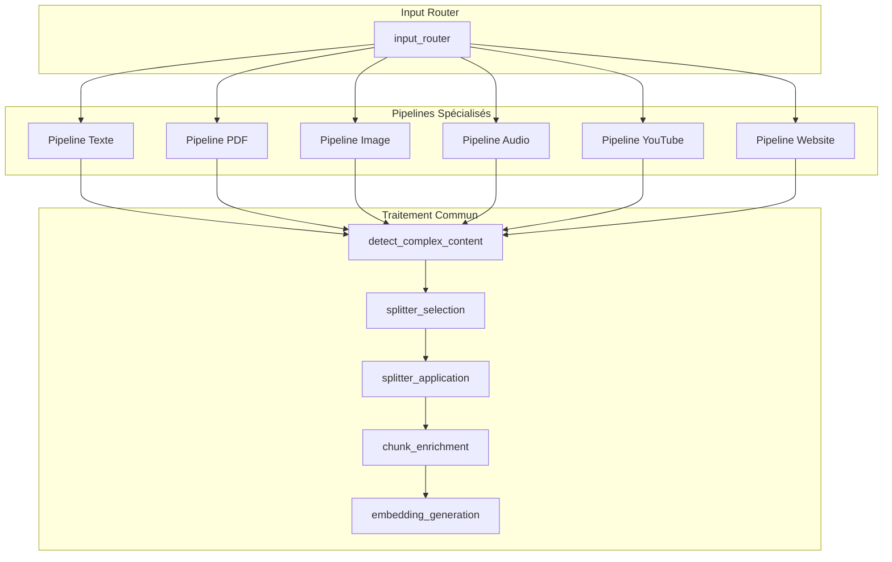
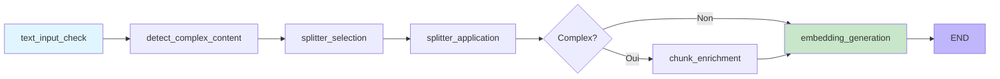
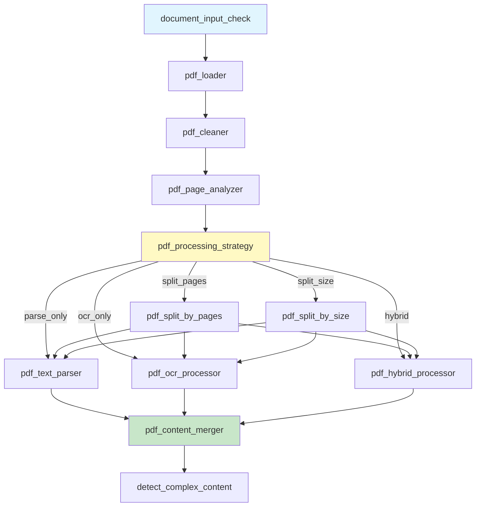
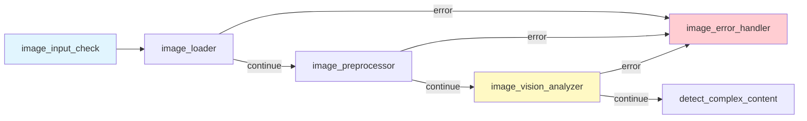
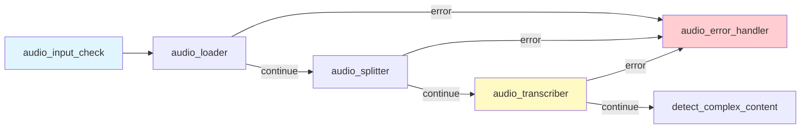
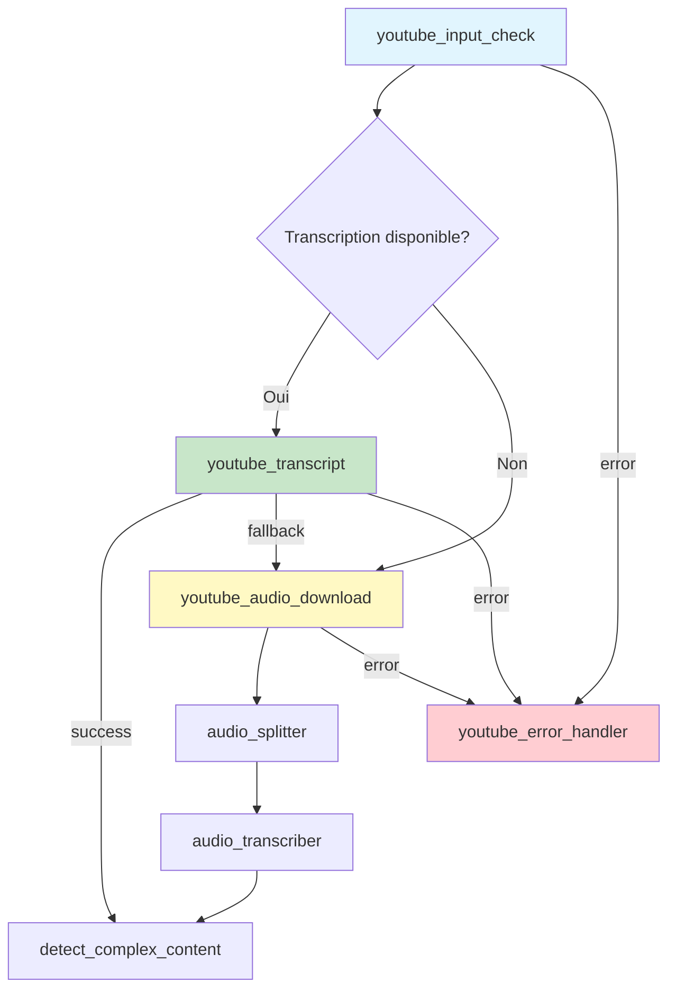
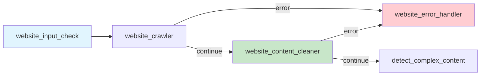

import { Aside, Badge, Card, CardGrid, Steps, TabItem, Tabs } from '@astrojs/starlight/components';

# 🔄 Pipelines de traitement

<Badge text="Multimodal" variant="success" />
<Badge text="Mistral AI" variant="note" />

## Introduction

Les **pipelines de traitement** sont le premier maillon de la chaîne de transformation du contenu. Leur rôle est d'extraire du texte exploitable à partir de n'importe quelle source — que ce soit un PDF scanné, une image, un podcast audio, une vidéo YouTube ou une page web.

<Aside type="tip" title="Pourquoi des pipelines spécialisés ?">
  Chaque type de contenu présente des défis uniques :
  - Un **PDF** peut être natif (texte sélectionnable) ou scanné (nécessite OCR)
  - Une **image** ne contient pas de texte : il faut la décrire avec une IA vision
  - Un **audio** doit être transcrit en respectant les limites de durée de l'API
  - Une **vidéo YouTube** peut avoir ou non une transcription disponible
  
  Nos pipelines gèrent automatiquement ces cas de figure.
</Aside>

## Vue d'ensemble des pipelines

Le diagramme ci-dessous montre comment l'**input router** dirige chaque ressource vers son pipeline spécialisé, puis comment tous les contenus extraits convergent vers le **traitement commun** (chunking + embedding) :



### Comprendre le flux

1. **Input Router** : Analyse l'input et détermine son type (extension de fichier, URL pattern...)
2. **Pipeline spécialisé** : Extrait le contenu textuel selon les spécificités du format
3. **Traitement commun** : Découpe le texte en chunks optimaux et génère les embeddings

---

## Pipeline Texte

Le pipeline le plus simple, pour le traitement de texte brut. C'est aussi le **pipeline de base** vers lequel tous les autres convergent après avoir extrait leur contenu.

<Aside type="note">
  Ce pipeline est utilisé directement quand l'utilisateur colle du texte, mais il est aussi appelé indirectement par tous les autres pipelines une fois qu'ils ont extrait le contenu de leur source (PDF converti en texte, audio transcrit, etc.).
</Aside>



### Rôle de chaque node

| Node | Responsabilité | Explication |
|------|----------------|-------------|
| `text_input_check` | Valide le texte d'entrée | Vérifie que le texte n'est pas vide et respecte les limites |
| `detect_complex_content` | Détecte tables, code, formules | Analyse les patterns pour identifier le contenu structuré |
| `splitter_selection` | Choisit le splitter approprié | Sélectionne `MarkdownSplitter`, `CodeSplitter` ou `RecursiveSplitter` |
| `splitter_application` | Applique le chunking | Découpe en segments de 512 tokens avec 15% de chevauchement |
| `chunk_enrichment` | Enrichit les chunks complexes via LLM | Ajoute du contexte aux chunks contenant du code ou des formules |
| `embedding_generation` | Génère les embeddings Mistral | Convertit chaque chunk en vecteur de 1024 dimensions |

### Détection de contenu complexe

Le module `ContentComplexityDetector` analyse le texte pour identifier les éléments qui nécessitent un traitement spécial :

```python
class ContentComplexityDetector:
    """Détecte le contenu qui nécessite un traitement particulier.
    
    Pourquoi ? Un tableau ou une formule mathématique perdent leur sens
    si on les coupe au milieu lors du chunking. Cette détection permet
    d'adapter la stratégie de découpage.
    """
    
    def detect(self, text: str) -> ComplexityResult:
        return ComplexityResult(
            has_tables=self._detect_tables(text),      # Markdown/HTML tables
            has_code=self._detect_code(text),          # Blocs de code indentés
            has_formulas=self._detect_formulas(text),  # LaTeX/MathML
            has_lists=self._detect_structured_lists(text)  # Listes hiérarchiques
        )
```

---

## Pipeline PDF

Le pipeline PDF est le plus **sophistiqué** de tous car les PDFs présentent une grande variabilité : certains contiennent du texte sélectionnable, d'autres sont des images scannées, et beaucoup sont un mélange des deux.

<Aside type="tip" title="Comment le système choisit-il la stratégie ?">
  Le `pdf_page_analyzer` examine chaque page pour déterminer :
  - Si elle contient du texte extractible (ratio texte/image)
  - Si elle contient des éléments complexes (tableaux, graphiques)
  - La qualité du texte extrait (caractères illisibles, espaces anormaux)
  
  Selon ces métriques, il choisit automatiquement entre parsing texte, OCR ou mode hybride.
</Aside>



### Stratégies de traitement PDF

Le système sélectionne automatiquement la meilleure stratégie selon l'analyse de chaque page :

```python
class ProcessingStrategy(str, Enum):
    """Stratégies de traitement PDF.
    
    Le choix est automatique basé sur l'analyse de chaque page.
    """
    PARSE_ONLY = "parse_only"           # PDF natif avec texte sélectionnable
    OCR_ONLY = "ocr_only"               # OCR uniquement (scans)
    HYBRID = "hybrid"                   # Parsing + OCR selon les pages
    SPLIT_THEN_PARSE = "split_then_parse"
    SPLIT_THEN_OCR = "split_then_ocr"

class SplitStrategy(str, Enum):
    """Stratégies de découpage"""
    BY_PAGES = "by_pages"   # Découpage par nombre de pages
    BY_SIZE = "by_size"     # Découpage par taille
```

### Nodes du Pipeline PDF

<Tabs>
  <TabItem label="Chargement">
    | Node | Responsabilité |
    |------|----------------|
    | `pdf_loader` | Chargement depuis S3 |
    | `pdf_cleaner` | Nettoyage et normalisation |
    | `pdf_page_analyzer` | Analyse de chaque page |
  </TabItem>
  
  <TabItem label="Traitement">
    | Node | Responsabilité |
    |------|----------------|
    | `pdf_processing_strategy` | Choix de la stratégie |
    | `pdf_split_by_pages` | Découpage par pages |
    | `pdf_split_by_size` | Découpage par taille |
  </TabItem>
  
  <TabItem label="Extraction">
    | Node | Responsabilité |
    |------|----------------|
    | `pdf_text_parser` | Parsing texte natif |
    | `pdf_ocr_processor` | OCR avec Mistral |
    | `pdf_hybrid_processor` | Combinaison parsing + OCR |
    | `pdf_content_merger` | Fusion du contenu extrait |
  </TabItem>
</Tabs>

### Limites PDF

| Paramètre | Valeur |
|-----------|--------|
| Taille max | 50 MB |
| Pages max | 1000 |
| Modèle OCR | mistral-ocr-latest |

---

## Pipeline Image

Utilise **Mistral Vision** pour générer une description textuelle de l'image.



### Nodes du Pipeline Image

| Node | Responsabilité |
|------|----------------|
| `image_loader` | Chargement depuis S3 |
| `image_preprocessor` | Redimensionnement et optimisation |
| `image_vision_analyzer` | Analyse avec Mistral Vision |
| `image_error_handler` | Gestion des erreurs |

### Caractéristiques Image

| Paramètre | Valeur |
|-----------|--------|
| Modèle Vision | mistral-small-latest |
| Taille max | 10 MB |
| Résolution max | 1540x1540 |
| Formats supportés | jpg, jpeg, png, webp, gif |

<Aside type="tip">
  Le préprocesseur redimensionne automatiquement les images trop grandes pour respecter les limites de l'API Mistral Vision.
</Aside>

---

## Pipeline Audio

Transcription audio via **Voxtral** avec découpage automatique pour les fichiers longs.



### Nodes du Pipeline Audio

| Node | Responsabilité |
|------|----------------|
| `audio_loader` | Chargement depuis S3 |
| `audio_splitter` | Découpage en segments ≤ 15 min |
| `audio_transcriber` | Transcription avec Voxtral |
| `audio_error_handler` | Gestion des erreurs |

### Caractéristiques Audio

| Paramètre | Valeur |
|-----------|--------|
| Modèle | voxtral-mini-latest |
| Durée max par segment | 15 minutes |
| Formats supportés | wav, mp3, m4a, flac, ogg |
| Découpage automatique | Si > 15 min |

<Aside type="note">
  Les fichiers audio de plus de 15 minutes sont automatiquement découpés en segments pour respecter les limites de l'API Voxtral.
</Aside>

---

## Pipeline YouTube

Récupère la transcription via l'API YouTube, avec **fallback** sur le téléchargement audio si indisponible.



### Stratégie YouTube

<Steps>
1. **Tentative API**
   - Récupération de la transcription via YouTubeTranscriptApi
   - Utilisation de proxy Webshare (IPs résidentielles)

2. **Fallback Audio** (si transcription indisponible)
   - Téléchargement de l'audio de la vidéo
   - Routage vers le pipeline audio standard
</Steps>

### Nodes du Pipeline YouTube

| Node | Responsabilité |
|------|----------------|
| `youtube_input_check` | Validation de l'URL YouTube |
| `youtube_transcript` | Récupération via API |
| `youtube_audio_download` | Téléchargement audio (fallback) |
| `youtube_error_handler` | Gestion des erreurs |

<Aside type="caution">
  Certaines vidéos YouTube n'ont pas de transcription disponible. Dans ce cas, le système télécharge automatiquement l'audio et le transcrit avec Voxtral.
</Aside>

---

## Pipeline Website

Crawl de sites web avec conversion en Markdown via **httpx** + **BeautifulSoup**.



### Nodes du Pipeline Website

| Node | Responsabilité |
|------|----------------|
| `website_input_check` | Validation de l'URL |
| `website_crawler` | Crawl avec httpx |
| `website_content_cleaner` | Nettoyage HTML → Markdown |
| `website_error_handler` | Gestion des erreurs |

### Caractéristiques Website

| Caractéristique | Détail |
|-----------------|--------|
| **Compatible serverless** | Pas de navigateur requis |
| **Proxy Webshare** | IPs résidentielles pour éviter les blocages |
| **Conversion Markdown** | html2text pour un texte structuré |
| **User-Agent rotatif** | Plusieurs UA réalistes |

<Aside type="tip">
  Le pipeline website est optimisé pour les environnements serverless et n'utilise pas de navigateur headless (Puppeteer, Playwright) pour des raisons de performance et de compatibilité.
</Aside>

---

## Traitement commun

Après l'extraction du contenu par chaque pipeline, le traitement commun s'applique :

### 1. Détection de complexité

```python
class ContentComplexityDetector:
    """Détecte le contenu complexe nécessitant un traitement spécial"""
    
    def detect(self, text: str) -> ComplexityResult:
        return ComplexityResult(
            has_tables=self._detect_tables(text),
            has_code=self._detect_code(text),
            has_formulas=self._detect_formulas(text),
            has_lists=self._detect_structured_lists(text)
        )
```

### 2. Sélection du splitter

Le système choisit automatiquement le meilleur splitter :

| Type de contenu | Splitter utilisé |
|-----------------|------------------|
| Texte simple | RecursiveCharacterTextSplitter |
| Code | CodeTextSplitter |
| Markdown | MarkdownTextSplitter |
| Contenu mixte | Combinaison intelligente |

### 3. Chunking

```python
CHUNK_SIZE = 512              # Taille cible en tokens
CHUNK_OVERLAP_PERCENT = 0.15  # 15% de chevauchement
CHUNK_OVERLAP = 77            # ~77 tokens
```

### 4. Enrichissement (optionnel)

Pour les chunks contenant du contenu complexe, un enrichissement LLM est appliqué pour préserver le contexte sémantique.

### 5. Génération d'embeddings

```python
EMBEDDING_MODEL = "mistral-embed"
EMBEDDING_DIMENSION = 1024
EMBEDDING_BATCH_SIZE = 50
```

---

## Gestion des erreurs

Chaque pipeline dispose d'un **error handler** dédié qui :

- Capture les exceptions spécifiques au type de contenu
- Génère des messages d'erreur explicites
- Permet la continuation du traitement des autres ressources en mode batch

```python
class PipelineError(Exception):
    """Erreur générique de pipeline"""
    def __init__(self, message: str, pipeline: str, details: dict = None):
        self.message = message
        self.pipeline = pipeline
        self.details = details or {}
```

---

*Pipelines de traitement multimodal pour une extraction de contenu optimale.*
