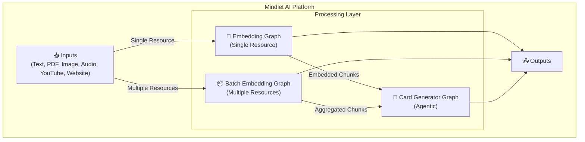
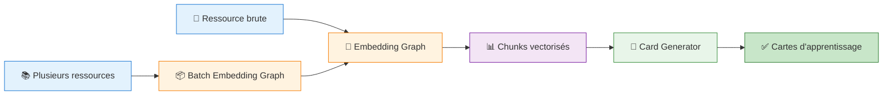

import { Aside, Badge, Card, CardGrid, Steps, TabItem, Tabs } from '@astrojs/starlight/components';

# 🤖 Service Intelligence Artificielle

<Badge text="LangGraph" variant="success" />
<Badge text="Mistral AI" variant="note" />
<Badge text="Python" variant="caution" />

## Vue d'ensemble

Le service IA est le **cœur du traitement intelligent** de Mindlet. Son rôle principal est de transformer n'importe quel type de contenu (texte, PDF, images, audio, vidéos YouTube, sites web) en cartes d'apprentissage personnalisées et efficaces.

### Ce que fait le service IA

- 📝 **Extraire** du contenu depuis différentes sources (texte, PDF, images, audio, vidéos YouTube, sites web)
- 🔢 **Générer des embeddings** vectoriels via Mistral AI
- 🎴 **Créer des cartes d'apprentissage** intelligentes (flashcards, QCM, etc.)

<Aside type="tip" title="Pourquoi un service IA dédié ?">
  Plutôt que d'intégrer l'IA directement dans le backend principal, nous avons choisi de créer un **microservice indépendant**. Cette architecture permet :
  - Une **scalabilité horizontale** : le service IA peut être répliqué indépendamment selon la charge
  - Une **isolation des dépendances** : les librairies ML lourdes ne polluent pas le backend principal
  - Une **évolutivité** : on peut changer de modèle ou de provider sans impacter le reste du système
</Aside>

### Qu'est-ce que LangGraph ?

**LangGraph** est un framework Python développé par LangChain pour créer des **workflows IA orchestrés sous forme de graphes**. Contrairement à une simple chaîne linéaire de prompts, LangGraph permet :

- Des **branchements conditionnels** : le flux de traitement s'adapte dynamiquement au contenu
- Des **boucles de feedback** : un agent peut critiquer et améliorer itérativement son travail
- Une **gestion d'état explicite** : chaque étape reçoit et modifie un état typé (TypedDict)
- Une **visualisation native** : les graphes sont exportables en Mermaid pour la documentation

```python
# Exemple simplifié : un graphe LangGraph se construit comme un DAG
workflow = StateGraph(MyState)           # On définit l'état qui traverse le graphe
workflow.add_node("etape1", fonction_1)  # Chaque node est une fonction Python
workflow.add_node("etape2", fonction_2)
workflow.add_edge("etape1", "etape2")    # Les edges connectent les nodes
graph = workflow.compile()               # Le graphe compilé est invocable
```

### Pourquoi Mistral AI ?

Nous avons choisi **Mistral AI** comme provider principal pour plusieurs raisons stratégiques :

1. **Souveraineté européenne** : Mistral est une entreprise française, ce qui simplifie la conformité RGPD
2. **Rapport qualité/prix** : Performances comparables à GPT-4 pour un coût significativement inférieur
3. **Suite complète** : Un seul provider pour LLM, embeddings, OCR, vision et transcription audio
4. **API consistante** : Toutes les APIs suivent le même pattern, simplifiant l'intégration

## Stack technique

| Composant | Technologie | Rôle |
|-----------|-------------|------|
| **Orchestration** | LangGraph | Graphes d'agents intelligents |
| **LLM Principal** | Mistral AI (mistral-medium-latest) | Génération de texte |
| **Embeddings** | mistral-embed (1024 dimensions) | Vectorisation des contenus |
| **Vision** | mistral-small-latest | Analyse d'images |
| **OCR** | mistral-ocr-latest | Reconnaissance de texte |
| **Transcription** | voxtral-mini-latest | Audio vers texte |
| **Stockage** | AWS S3 | Fichiers et médias |
| **Framework** | LangChain | Chaînes de traitement |

## Architecture globale

Le système est composé de **3 graphes LangGraph** principaux qui orchestrent le traitement :



## Les 3 graphes principaux

Le système est organisé autour de **3 graphes LangGraph** qui collaborent pour transformer du contenu brut en cartes d'apprentissage. Comprendre leurs responsabilités est essentiel pour appréhender l'architecture :

<CardGrid>
  <Card title="1. Embedding Graph" icon="document">
    **Le transformateur de contenu.** Ce graphe prend une ressource unique (un PDF, une image, un audio...) et la convertit en "chunks" vectorisés. Il détecte automatiquement le type d'input et route vers le pipeline de traitement approprié.
  </Card>
  <Card title="2. Batch Embedding Graph" icon="list-format">
    **L'orchestrateur de masse.** Quand un utilisateur importe plusieurs ressources à la fois, ce graphe les traite en parallèle via asyncio puis agrège les résultats. Il utilise le graphe d'embedding individuel en interne.
  </Card>
  <Card title="3. Card Generator Graph" icon="rocket">
    **Le créateur pédagogique.** C'est un graphe "agentic" sophistiqué composé de 5 agents (Planner, Generator, Critic, Refiner, Finalizer) qui collaborent pour produire des cartes d'apprentissage de haute qualité à partir des chunks vectorisés.
  </Card>
</CardGrid>

### Flux de données entre les graphes



<Aside type="note" title="Qu'est-ce qu'un chunk ?">
  Un **chunk** est un segment de texte de taille contrôlée (512 tokens dans notre cas) accompagné de son **embedding** (vecteur de 1024 dimensions). Le chunking permet de traiter de longs documents tout en préservant le contexte sémantique.
</Aside>

## Types d'input supportés

Le système détecte automatiquement le type de contenu et applique le traitement approprié :

```python
class InputType(str, Enum):
    """Types d'input pour le graph embedding.
    
    Chaque type déclenche un pipeline de traitement spécifique
    optimisé pour extraire le contenu de manière optimale.
    """
    TEXT = "text"         # Texte brut → chunking direct
    DOCUMENT = "document" # PDFs → parsing texte ou OCR
    IMAGE = "image"       # Images → description par vision IA
    AUDIO = "audio"       # Fichiers audio → transcription
    YOUTUBE = "youtube"   # URLs YouTube → récup transcription ou fallback audio
    WEBSITE = "website"   # URLs web → crawl et conversion markdown
    VIDEO = "video"       # Fichiers vidéo → extraction audio puis transcription
```

## Pipeline de traitement unifié

Quelle que soit la source, le contenu suit toujours ces étapes. Ce pipeline unifié garantit une **qualité constante** des embeddings produits :

<Steps>
1. **Détection du type d'input**
   - Analyse automatique de la ressource
   - Routage vers le pipeline approprié

2. **Extraction du contenu**
   - PDF : Parsing texte ou OCR selon la complexité
   - Image : Analyse vision avec Mistral
   - Audio : Transcription avec Voxtral
   - Vidéo YouTube : API transcription ou fallback audio
   - Site web : Crawl et conversion Markdown

3. **Détection de contenu complexe**
   - Identification des tables, code, formules
   - Sélection du splitter approprié

4. **Chunking intelligent**
   - Découpage en segments de 512 tokens
   - Chevauchement de 15% pour la cohérence

5. **Enrichissement (si nécessaire)**
   - Enrichissement LLM des chunks complexes
   - Préservation de la structure sémantique

6. **Génération des embeddings**
   - Vectorisation via mistral-embed
   - Dimension : 1024
   - Batch de 50 textes par appel
</Steps>

## Diagramme du Embedding Graph


## Configuration et constantes

<Tabs>
  <TabItem label="Chunking">
    ```python
    # === Chunking ===
    CHUNK_SIZE = 512              # Taille des chunks en tokens
    CHUNK_OVERLAP_PERCENT = 0.15  # 15% de chevauchement
    CHUNK_OVERLAP = 77            # ~77 tokens de chevauchement
    ```
  </TabItem>
  
  <TabItem label="Embeddings">
    ```python
    # === Embeddings Mistral ===
    EMBEDDING_MODEL = "mistral-embed"
    EMBEDDING_DIMENSION = 1024
    EMBEDDING_BATCH_SIZE = 50     # Textes par appel API
    ```
  </TabItem>
  
  <TabItem label="Limites">
    ```python
    # === Limites ===
    MAX_PDF_SIZE_MB = 50
    MAX_PDF_PAGES = 1000
    MAX_AUDIO_DURATION_SECONDS = 900  # 15 minutes
    ```
  </TabItem>
  
  <TabItem label="Modèles">
    ```python
    # === Modèles Mistral ===
    OCR_MODEL = "mistral-ocr-latest"
    TRANSCRIPTION_MODEL = "voxtral-mini-latest"
    VISION_MODEL = "mistral-small-latest"
    LLM_MODEL = "mistral-medium-latest"
    ```
  </TabItem>
</Tabs>

## Structure d'un chunk embeddé

```python
{
    "id": "chunk_001",
    "text": "Contenu du chunk...",
    "embedding": [0.123, 0.456, ...],  # 1024 dimensions
    "metadata": {
        "source": "document.pdf",
        "page": 1,
        "chunk_index": 0,
        "has_complex_content": False
    }
}
```

## Extensions supportées

| Type | Extensions |
|------|------------|
| **PDF** | `.pdf` |
| **Images** | `.jpg`, `.jpeg`, `.png`, `.webp`, `.gif` |
| **Audio** | `.wav`, `.mp3`, `.m4a`, `.flac`, `.ogg` |
| **Vidéo** | `.mp4`, `.avi`, `.mov`, `.mkv`, `.webm` |

## Métriques et performance

| Métrique | Description | Cible |
|----------|-------------|-------|
| **Latence embedding** | Temps pour générer les embeddings | < 5s / chunk |
| **Qualité extraction** | Précision de l'extraction de contenu | > 95% |
| **Taux de succès** | Ressources traitées sans erreur | > 98% |
| **Throughput batch** | Ressources traitées par minute | > 20 |

## Architecture détaillée

Pour plus de détails sur chaque composant :

<CardGrid>
  <Card title="Pipelines de traitement" icon="setting">
    Détails des pipelines PDF, Image, Audio, YouTube et Website.
    
    [Voir les pipelines →](/architecture/pipelines-traitement/)
  </Card>
  <Card title="Graphes LangGraph" icon="rocket">
    Architecture détaillée des graphes d'embedding et batch.
    
    [Voir les graphes →](/architecture/graphes-langgraph/)
  </Card>
  <Card title="Génération de cartes" icon="star">
    Architecture agentic du Card Generator Graph.
    
    [Voir la génération →](/architecture/generation-cartes/)
  </Card>
</CardGrid>

---

*Intelligence artificielle multimodale au service de l'apprentissage personnalisé.*
