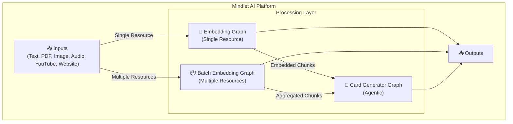
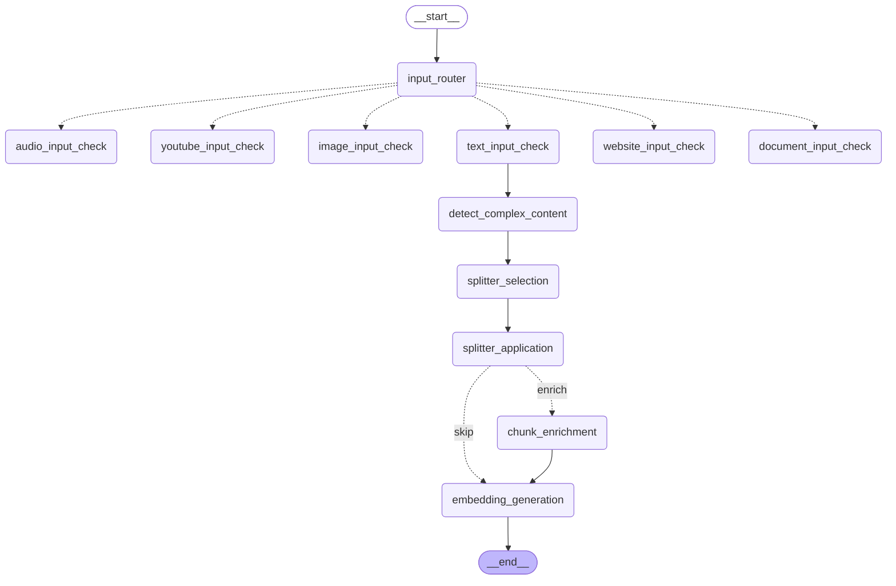

import { Aside, Badge, Card, CardGrid, Steps, TabItem, Tabs } from '@astrojs/starlight/components';

# 🤖 Service Intelligence Artificielle

<Badge text="LangGraph" variant="success" />
<Badge text="Mistral AI" variant="note" />
<Badge text="Python" variant="caution" />

## Vue d'ensemble

Le service IA est le cœur de Mindlet, une plateforme de traitement de contenu **multimodal** basée sur **LangGraph**. Elle permet de :

- 📝 **Extraire** du contenu depuis différentes sources (texte, PDF, images, audio, vidéos YouTube, sites web)
- 🔢 **Générer des embeddings** vectoriels via Mistral AI
- 🎴 **Créer des cartes d'apprentissage** intelligentes (flashcards, QCM, etc.)

<Aside type="note">
  Notre technologie d'IA propriétaire est capable d'analyser, comprendre et transformer n'importe quel contenu multimodal en outils d'apprentissage interactifs.
</Aside>

## Stack technique

| Composant | Technologie | Rôle |
|-----------|-------------|------|
| **Orchestration** | LangGraph | Graphes d'agents intelligents |
| **LLM Principal** | Mistral AI (mistral-medium-latest) | Génération de texte |
| **Embeddings** | mistral-embed (1024 dimensions) | Vectorisation des contenus |
| **Vision** | mistral-small-latest | Analyse d'images |
| **OCR** | mistral-ocr-latest | Reconnaissance de texte |
| **Transcription** | voxtral-mini-latest | Audio vers texte |
| **Stockage** | AWS S3 | Fichiers et médias |
| **Framework** | LangChain | Chaînes de traitement |

## Architecture globale

Le système est composé de **3 graphes LangGraph** principaux qui orchestrent le traitement :



## Les 3 graphes principaux

<CardGrid>
  <Card title="Embedding Graph" icon="document">
    Traitement d'une ressource unique avec détection automatique du type d'input et routage vers le pipeline approprié.
  </Card>
  <Card title="Batch Embedding Graph" icon="list-format">
    Traitement de plusieurs ressources en une seule invocation avec agrégation des résultats.
  </Card>
  <Card title="Card Generator Graph" icon="rocket">
    Graphe agentic sophistiqué pour la génération intelligente de cartes d'apprentissage.
  </Card>
</CardGrid>

## Types d'input supportés

```python
class InputType(str, Enum):
    """Types d'input pour le graph embedding"""
    AUDIO = "audio"       # Fichiers audio (mp3, wav, m4a, flac, ogg)
    YOUTUBE = "youtube"   # URLs YouTube
    DOCUMENT = "document" # PDFs
    IMAGE = "image"       # Images (jpg, png, webp, gif)
    WEBSITE = "website"   # URLs de sites web
    TEXT = "text"         # Texte brut
    VIDEO = "video"       # Fichiers vidéo (mp4, avi, mov, mkv, webm)
```

## Pipeline de traitement unifié

<Steps>
1. **Détection du type d'input**
   - Analyse automatique de la ressource
   - Routage vers le pipeline approprié

2. **Extraction du contenu**
   - PDF : Parsing texte ou OCR selon la complexité
   - Image : Analyse vision avec Mistral
   - Audio : Transcription avec Voxtral
   - Vidéo YouTube : API transcription ou fallback audio
   - Site web : Crawl et conversion Markdown

3. **Détection de contenu complexe**
   - Identification des tables, code, formules
   - Sélection du splitter approprié

4. **Chunking intelligent**
   - Découpage en segments de 512 tokens
   - Chevauchement de 15% pour la cohérence

5. **Enrichissement (si nécessaire)**
   - Enrichissement LLM des chunks complexes
   - Préservation de la structure sémantique

6. **Génération des embeddings**
   - Vectorisation via mistral-embed
   - Dimension : 1024
   - Batch de 50 textes par appel
</Steps>

## Diagramme du Embedding Graph



## Configuration et constantes

<Tabs>
  <TabItem label="Chunking">
    ```python
    # === Chunking ===
    CHUNK_SIZE = 512              # Taille des chunks en tokens
    CHUNK_OVERLAP_PERCENT = 0.15  # 15% de chevauchement
    CHUNK_OVERLAP = 77            # ~77 tokens de chevauchement
    ```
  </TabItem>
  
  <TabItem label="Embeddings">
    ```python
    # === Embeddings Mistral ===
    EMBEDDING_MODEL = "mistral-embed"
    EMBEDDING_DIMENSION = 1024
    EMBEDDING_BATCH_SIZE = 50     # Textes par appel API
    ```
  </TabItem>
  
  <TabItem label="Limites">
    ```python
    # === Limites ===
    MAX_PDF_SIZE_MB = 50
    MAX_PDF_PAGES = 1000
    MAX_AUDIO_DURATION_SECONDS = 900  # 15 minutes
    ```
  </TabItem>
  
  <TabItem label="Modèles">
    ```python
    # === Modèles Mistral ===
    OCR_MODEL = "mistral-ocr-latest"
    TRANSCRIPTION_MODEL = "voxtral-mini-latest"
    VISION_MODEL = "mistral-small-latest"
    LLM_MODEL = "mistral-medium-latest"
    ```
  </TabItem>
</Tabs>

## Structure d'un chunk embeddé

```python
{
    "id": "chunk_001",
    "text": "Contenu du chunk...",
    "embedding": [0.123, 0.456, ...],  # 1024 dimensions
    "metadata": {
        "source": "document.pdf",
        "page": 1,
        "chunk_index": 0,
        "has_complex_content": False
    }
}
```

## Extensions supportées

| Type | Extensions |
|------|------------|
| **PDF** | `.pdf` |
| **Images** | `.jpg`, `.jpeg`, `.png`, `.webp`, `.gif` |
| **Audio** | `.wav`, `.mp3`, `.m4a`, `.flac`, `.ogg` |
| **Vidéo** | `.mp4`, `.avi`, `.mov`, `.mkv`, `.webm` |

## Métriques et performance

| Métrique | Description | Cible |
|----------|-------------|-------|
| **Latence embedding** | Temps pour générer les embeddings | < 5s / chunk |
| **Qualité extraction** | Précision de l'extraction de contenu | > 95% |
| **Taux de succès** | Ressources traitées sans erreur | > 98% |
| **Throughput batch** | Ressources traitées par minute | > 20 |

## Architecture détaillée

Pour plus de détails sur chaque composant :

<CardGrid>
  <Card title="Pipelines de traitement" icon="setting">
    Détails des pipelines PDF, Image, Audio, YouTube et Website.
    
    [Voir les pipelines →](/architecture/pipelines-traitement/)
  </Card>
  <Card title="Graphes LangGraph" icon="rocket">
    Architecture détaillée des graphes d'embedding et batch.
    
    [Voir les graphes →](/architecture/graphes-langgraph/)
  </Card>
  <Card title="Génération de cartes" icon="star">
    Architecture agentic du Card Generator Graph.
    
    [Voir la génération →](/architecture/generation-cartes/)
  </Card>
</CardGrid>

---

*Intelligence artificielle multimodale au service de l'apprentissage personnalisé.*
