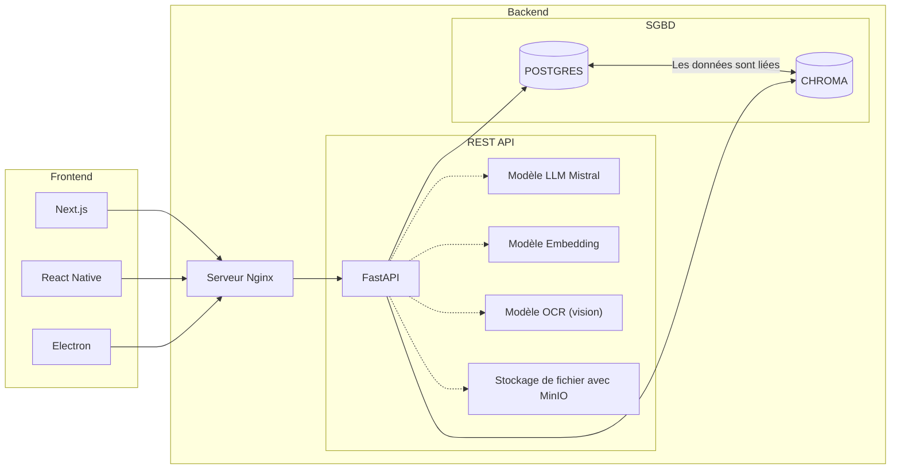
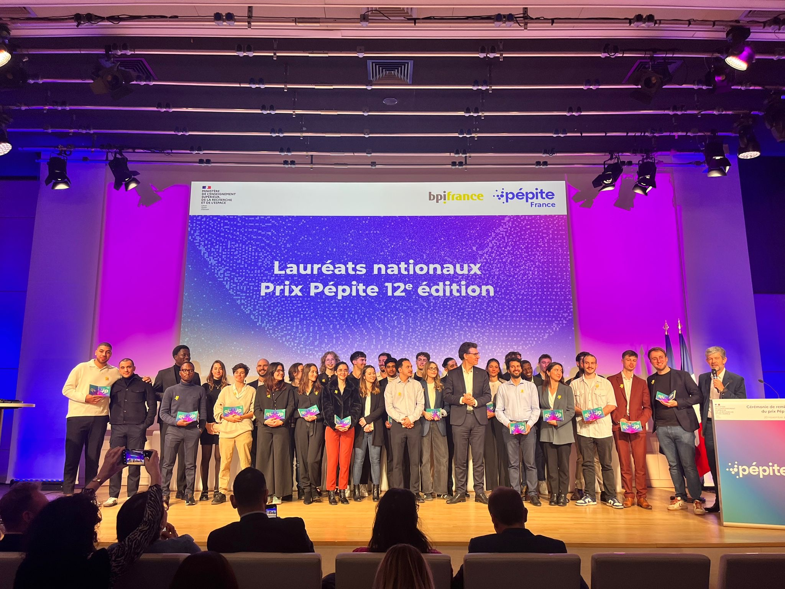

import { Aside, Badge, Steps } from '@astrojs/starlight/components';
import MermaidDownload from '../../../components/MermaidDownload.astro';

# 📖 Notre histoire

<Aside type="note">
  Ce document retrace le parcours du projet Mindlet, durant ce semestre de Master 2. Un véritable journal de bord de notre aventure entrepreneuriale étudiante.
</Aside>

## 🌱 Point de départ (Septembre 2025)

En septembre 2025, nous disposions d'un **prototype fonctionnel** de notre application Mindlet, développé tout au long de notre année de **Master 1**.

### Architecture initiale du prototype

Notre première architecture était entièrement **open source** et indépendante de tout service tiers :

| Composant | Technologie |
|-----------|-------------|
| **Frontend** | Application mobile React Native |
| **Backend** | API FastAPI (Python) |
| **Service IA** | Génération de contenu, embeddings, analyse sémantique |
| **Base de données** | PostgreSQL |
| **Base vectorielle** | ChromaDB |
| **Stockage objets** | MinIO |

<MermaidDownload title="Architecture initiale">

</MermaidDownload>

## 🔄 La migration vers l'hybride

<Aside type="caution">
  Au départ, Mindlet se projetait comme un projet complètement opensource, indépendant de tout service tiers.
</Aside>

Au fil du temps, nous avons réalisé que pour garantir une **expérience utilisateur fluide et performante**, il était nécessaire d'intégrer certains services tiers, notamment pour :

- L'hébergement et la scalabilité de l'application
- La fiabilité des services en production
- La performance des traitements IA

Nous avons donc pris l'initiative de migrer le projet petit à petit vers une **architecture hybride**, combinant le meilleur des deux mondes :

<Steps>
1. **Open Source** : Transparence et personnalisation de l'application
2. **Services Cloud** : Performance, scalabilité et fiabilité
3. **Approche hybride** : Le meilleur des deux mondes
</Steps>

### Architecture cible

Notre nouvelle architecture cible intègre des technologies modernes et scalables :

| Composant | Technologie |
|-----------|-------------|
| **Frontend** | Application mobile React Native |
| **Backend** | API Laravel (hébergée sur Kubernetes) |
| **Service IA** | LangChain, LangGraph, services cloud |
| **Base de données** | PostgreSQL (cloud managed) |
| **Base vectorielle** | Qdrant Cloud |
| **Stockage objets** | Hetzner Cloud storage (S3 compatible) |

## 🏆 Concours PEPITE France

Notre statut d'**étudiant entrepreneur** nous a permis de participer au **concours PEPITE France**.

<Badge text="30 lauréats nationaux" variant="success" size="large" />

Cette distinction a été une expérience incroyablement enrichissante et motivante pour toute l'équipe. Elle a validé notre vision et nous a permis de rencontrer d'autres entrepreneurs inspirants.

## 🤔 Les défis et questionnements

En parallèle de notre développement, de nombreuses questions se sont posées :

### Défis techniques
- Déploiement sur les stores mobiles (App Store, Google Play)
- Scalabilité de l'infrastructure
- Performance des traitements IA en temps réel

### Défis organisationnels
- Communication au sein de l'Université de Corse
- Gestion de la propriété intellectuelle
- Organisation de l'équipe

### Défis éthiques et légaux
- Utilisation de l'intelligence artificielle
- Protection des données utilisateurs (RGPD)
- Éthique de l'IA dans l'éducation

<Aside type="tip">
  Nous avons décidé de consulter des **experts juridiques** et de nous entourer de **mentors** pour nous guider dans ces aspects complexes.
</Aside>

## 📈 Évolution de notre vision

Tous ces défis nous ont fait grandement réfléchir et ont fait énormément évoluer notre vision du projet Mindlet.

> "Nous avons réalisé que pour réussir, il ne suffisait pas d'avoir une bonne idée, mais qu'il fallait aussi savoir **s'adapter**, **apprendre de ses erreurs**, et être **ouvert aux conseils et aux critiques**."

## 🚀 Lancement Beta (Décembre 2025)

Nous avons tant bien que mal réussi à lancer une **version beta** de notre application à la fin de l'année universitaire.

### Le syndrome de l'imposteur

En parallèle, nous avons produit énormément de code et de fonctionnalités, par peur de ne pas être à la hauteur des attentes en termes de performance.

### L'échec technique

<Aside type="danger">
  Ce lancement beta a été un moment fort pour toute l'équipe, mais s'est révélé être un **échec technique important**.
</Aside>

Nous avons reçu de nombreux retours d'utilisateurs, mettant en lumière :
- Des **bugs critiques** en production
- Des **problèmes techniques majeurs** de performance
- Des **difficultés d'utilisation** non anticipées

### Les leçons tirées

Cette expérience nous a poussés à revoir complètement notre approche du développement :

<Steps>
1. Mettre l'accent sur la **qualité du code**
2. Développer une **suite de tests complète**
3. Assurer la **fiabilité** avant d'ajouter des fonctionnalités
4. **Ralentir le rythme** pour mieux construire
</Steps>

## 🤝 Rencontres et pivots (Fin décembre 2025)

Fin décembre 2025, nous avons eu l'occasion de présenter notre projet à un **entrepreneur local**, ce qui nous a permis :

- D'obtenir des **conseils précieux**
- De nouer des **contacts importants** pour l'avenir
- De revoir notre **stratégie de communication**

### Pivot vers le B2B

<Badge text="Nouveau positionnement" variant="note" />

Suite à ces échanges, nous avons décidé de revoir notre stratégie :

- **Cible** : Entreprises et institutions éducatives
- **Focus** : Valeur ajoutée pour les professionnels de l'éducation
- **Fonctionnalités** : Personnalisation, création de contenu, parcours d'apprentissage, suivi des performances

## 💭 Bilan

> "Au final, cette première année de Master 2 a été une expérience incroyablement enrichissante, pleine d'apprentissages et de découvertes."

### Ce que nous avons appris

| Domaine | Apprentissage |
|---------|---------------|
| **Technique** | L'importance des tests et de la qualité |
| **Business** | Savoir pivoter et s'adapter au marché |
| **Équipe** | La communication et la répartition des rôles |
| **Personnel** | La résilience face à l'échec |

---

*Le voyage continue...*
