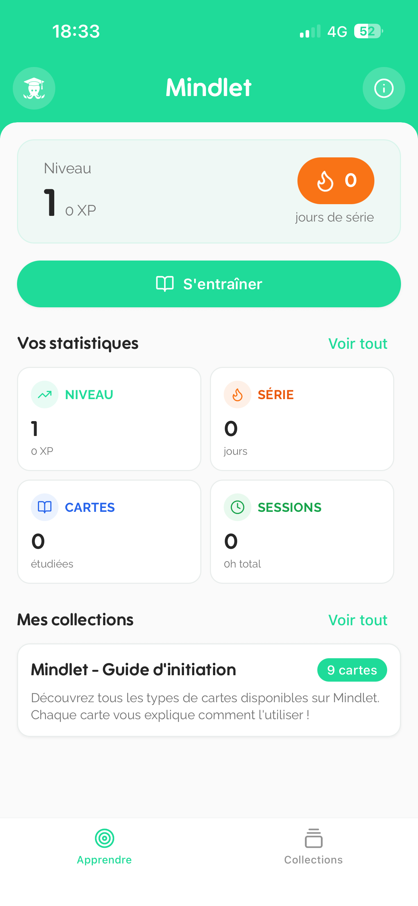
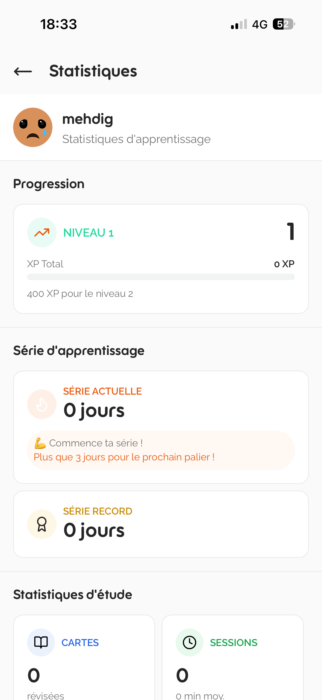
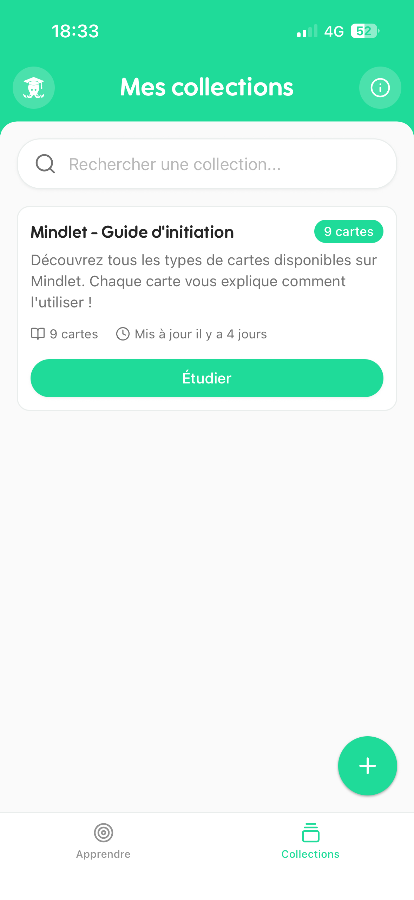
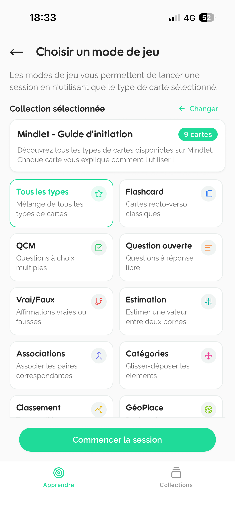
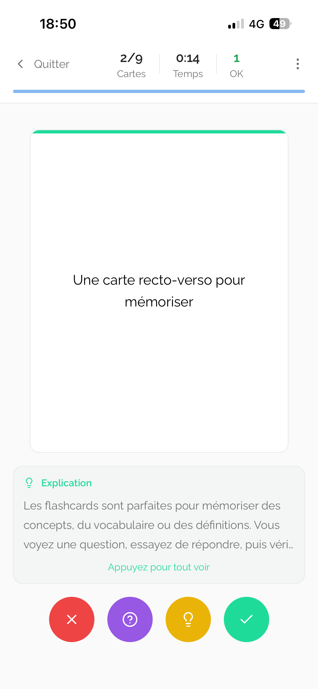
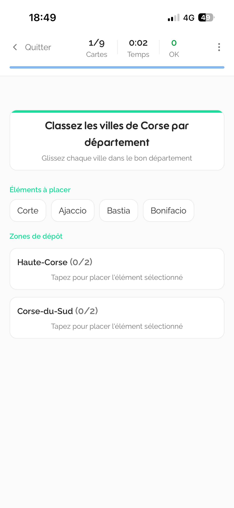

import { Aside, Badge, Card, CardGrid } from '@astrojs/starlight/components';

# 🚀 Qu'est-ce que Mindlet ?

<Aside type="tip">
  Visitez notre site web : [www.mindlet.app](https://www.mindlet.app)
</Aside>

**Mindlet** est une application d'apprentissage intelligent et collaboratif qui transforme vos cours, vidéos, sites web ou documents en supports interactifs pour apprendre plus vite et durablement.

Grâce à l'intelligence artificielle, Mindlet analyse vos contenus, en extrait les notions essentielles et les convertit automatiquement en **flashcards**, **QCM**, **jeux**, **cartes mentales** et plus encore !

## ✨ Une nouvelle façon d'apprendre

Mindlet ne se contente pas de vous aider à réviser : elle **crée vos outils pédagogiques sur mesure**.

<CardGrid>
  <Card title="📄 Importation multi-format" icon="document">
    Importez vos documents : PDF, PowerPoint, texte, audio, vidéo, et bien plus encore.
  </Card>
  <Card title="🤖 IA générative" icon="rocket">
    L'IA génère des exercices interactifs adaptés à votre niveau et à votre rythme.
  </Card>
  <Card title="🎮 Gamification" icon="star">
    Jouez, révisez et progressez grâce à des mécaniques de jeu engageantes.
  </Card>
  <Card title="🧩 10+ formats" icon="puzzle">
    Explorez plus de 10 formats d'apprentissage : flashcards, quiz, associations, glisser-déposer, vrai/faux, cartes mentales...
  </Card>
</CardGrid>

## 👥 Une communauté pour apprendre ensemble

Mindlet est **collaborative et sociale** :

- **Créez et partagez** vos collections de cartes avec la communauté
- **Rejoignez des groupes d'étude** et relevez des défis collectifs
- **Échangez avec d'autres apprenants** via la messagerie intégrée
- **Découvrez chaque jour** de nouveaux contenus éducatifs créés par la communauté

## 💡 Une IA au service de la pédagogie

Mindlet repose sur une technologie d'intelligence artificielle propriétaire, capable de :

| Fonctionnalité | Description |
|----------------|-------------|
| **Résumé intelligent** | Synthétise et reformule des contenus complexes |
| **Génération de questions** | Crée automatiquement des questions pertinentes à partir de n'importe quel contenu |
| **Adaptation personnalisée** | Ajuste les exercices à vos besoins et à votre rythme d'apprentissage |
| **Analyse sémantique** | Comprend le sens profond des contenus pour une extraction optimale |

## 🧏‍♂️ Inclusive et accessible à tous

<Aside type="note">
  Mindlet est pensée pour **tous les profils d'apprenants**, y compris ceux ayant des troubles de l'apprentissage.
</Aside>

En collaboration avec des spécialistes, nous développons des outils d'aide pour :

- **Dyslexie** : Police adaptée, espacement optimisé, lecture assistée
- **TDA/TDAH** : Sessions courtes, gamification, rappels personnalisés
- **Troubles cognitifs** : Interface simplifiée, contenu progressif, feedback immédiat

## 🎯 Formats d'apprentissage disponibles

Mindlet propose une variété de formats pour s'adapter à tous les styles d'apprentissage :

1. **Flashcards** - Mémorisation par répétition espacée
2. **Quiz à choix multiples (QCM)** - Évaluation des connaissances
3. **Vrai/Faux** - Validation rapide des concepts
4. **Associations** - Relier des éléments correspondants
5. **Glisser-déposer** - Interaction tactile pour la classification
6. **Textes à trous** - Complétion et mémorisation active
7. **Cartes mentales** - Visualisation des concepts et leurs relations
8. **Définitions** - Apprentissage du vocabulaire
9. **Chronologies** - Ordre séquentiel des événements
10. **Jeux interactifs** - Apprentissage ludique et engageant

## 📱 Captures d'écran de l'application

Voici un aperçu de l'interface de Mindlet :

---

*Mindlet - Apprenez autrement, progressez ensemble.*
