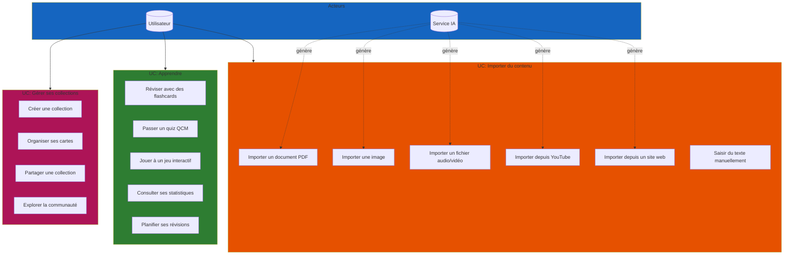
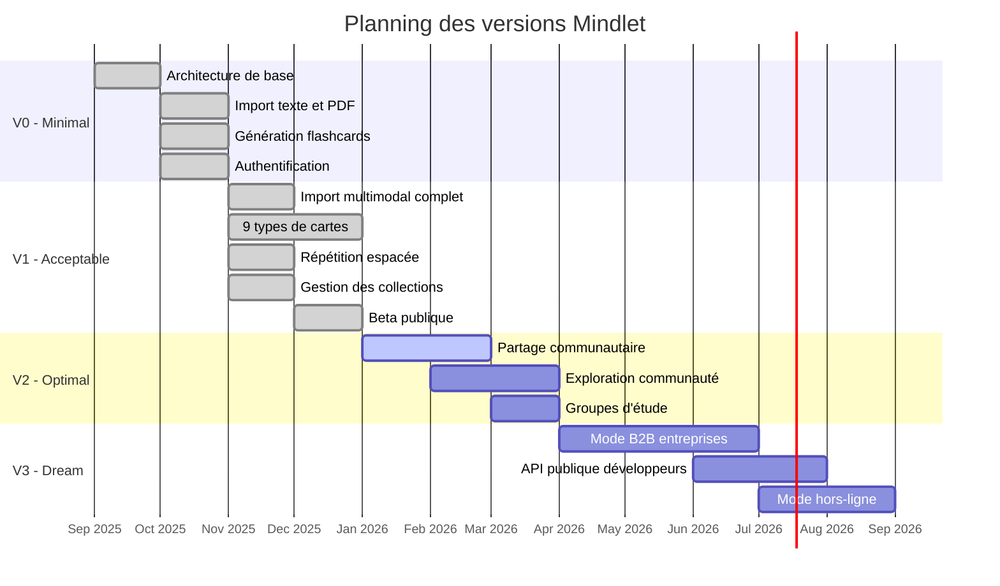
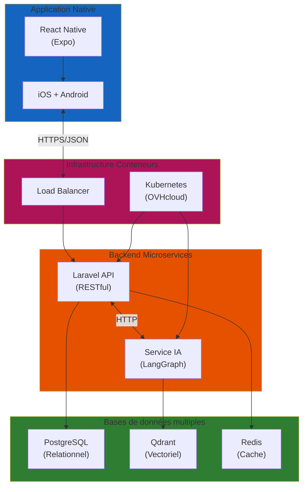

import { Aside, Badge, Card, CardGrid, TabItem, Tabs, Steps } from '@astrojs/starlight/components';
import MermaidDownload from '../../../components/MermaidDownload.astro';

# Cahier des charges

<Aside type="note">
  Ce document présente les spécifications fonctionnelles et techniques du projet Mindlet, développé dans le cadre du Master 2 Informatique - Parcours Développement Full Stack à l'Université de Corse Pasquale Paoli.
</Aside>

---

## 1. Contexte du projet

### Problématique

L'apprentissage moderne fait face à plusieurs défis majeurs :

- **Surcharge informationnelle** : les apprenants sont submergés par la quantité de contenus disponibles
- **Manque de temps** : créer des supports d'apprentissage efficaces demande un investissement conséquent
- **Méthodes inadaptées** : les techniques d'apprentissage traditionnelles ne tirent pas parti des avancées en sciences cognitives
- **Accessibilité limitée** : peu d'outils prennent en compte les troubles d'apprentissage (dyslexie, etc.)

### Origine du projet

**Mindlet** est né d'un constat simple : transformer n'importe quel contenu pédagogique en exercices interactifs devrait être automatique et instantané.

| Élément | Détail |
|---------|--------|
| **Formation** | Master 2 Informatique - Développement Full Stack |
| **Université** | Université de Corse Pasquale Paoli |
| **Année** | 2025-2026 |
| **Équipe** | Mehdi Ghoulam, Anthony Menghi |

### Projets similaires et concurrence

#### Analyse des concurrents directs

| Application | Type | Points forts | Points faibles | IA générative | Prix |
|-------------|------|--------------|----------------|---------------|------|
| **Anki** | Open source | Puissant, répétition espacée, personnalisable | Interface datée, courbe d'apprentissage élevée | Non | Gratuit |
| **Quizlet** | SaaS | Large communauté, multiplateforme | IA limitée, pas de génération automatique | Basique | Freemium |
| **Brainscape** | SaaS | Flashcards basées sur les sciences cognitives | Contenus limités, payant | Non | 9.99€/mois |
| **Kahoot** | SaaS | Gamification, mode classe engageant | Orienté enseignant uniquement | Non | Freemium |
| **Notion** | SaaS | Flexible, wiki personnel | Pas de fonctions d'apprentissage actif | Oui | Freemium |
| **ChatGPT** | SaaS | Puissant, polyvalent | Pas spécialisé éducation, pas de suivi | Oui | Freemium |

#### Positionnement de Mindlet

<CardGrid>
  <Card title="Génération IA automatique" icon="star">
    Transformation instantanée de n'importe quel contenu (PDF, audio, vidéo, web) en exercices interactifs grâce à l'IA
  </Card>
  <Card title="10+ formats d'apprentissage" icon="puzzle">
    Flashcards, QCM, vrai/faux, associations, textes à trous, mind maps, timelines, jeux interactifs...
  </Card>
  <Card title="Accessibilité native" icon="heart">
    Support des troubles d'apprentissage : police OpenDyslexic, mode contraste élevé, lecteur d'écran
  </Card>
  <Card title="Import multimodal" icon="add-document">
    PDF, images, audio, vidéo, YouTube, sites web - tout devient source d'apprentissage
  </Card>
</CardGrid>

---

## 2. Définition du besoin

### Utilisateurs cibles

<CardGrid>
  <Card title="Étudiants" icon="open-book">
    **Besoin principal** : Réviser efficacement pour les examens

    - Transformer leurs cours en exercices
    - Suivre leur progression
    - Apprendre n'importe où (mobile)
  </Card>
  <Card title="Professionnels" icon="laptop">
    **Besoin principal** : Formation continue

    - Mémoriser des procédures
    - Préparer des certifications
    - Partager des connaissances
  </Card>
  <Card title="Enseignants" icon="pencil">
    **Besoin principal** : Créer du contenu pédagogique

    - Générer des exercices rapidement
    - Partager avec leurs élèves
    - Suivre la progression de classe
  </Card>
</CardGrid>

### Diagramme des cas d'utilisation

<MermaidDownload title="Cas d'utilisation - Mindlet">

</MermaidDownload>

### Flux de génération IA

```mermaid
flowchart LR
    subgraph Input["Entrée"]
        I1["PDF"]
        I2["Image"]
        I3["Audio"]
        I4["Vidéo"]
        I5["YouTube"]
        I6["Site web"]
    end

    subgraph Process["Traitement IA"]
        P1["Extraction\ndu contenu"]
        P2["Analyse\nsémantique"]
        P3["Génération\nembeddings"]
        P4["Création\ndes cartes"]
    end

    subgraph Output["Sortie"]
        O1["Flashcards"]
        O2["QCM"]
        O3["Vrai/Faux"]
        O4["Associations"]
        O5["etc."]
    end

    Input --> P1
    P1 --> P2
    P2 --> P3
    P3 --> P4
    P4 --> Output

    style Input fill:#ff8f00
    style Process fill:#388e3c
    style Output fill:#1976d2
```

<MermaidDownload title="Pipeline de génération des cartes">

</MermaidDownload>

### Exigences fonctionnelles

#### Import de contenus

| ID | Exigence | Priorité | Statut |
|----|----------|----------|--------|
| **EF01** | Importer des documents PDF et en extraire le texte | Haute | Fait |
| **EF02** | Importer des images et appliquer l'OCR (mistral-ocr-latest) | Haute | Fait |
| **EF03** | Importer des fichiers audio et les transcrire (voxtral-mini-latest) | Haute | Fait |
| **EF04** | Importer des vidéos YouTube et extraire la transcription | Moyenne | Fait |
| **EF05** | Importer depuis un site web (crawling + conversion markdown) | Moyenne | Fait |
| **EF06** | Importer des fichiers vidéo (extraction audio puis transcription) | Moyenne | Fait |
| **EF07** | Saisir du texte manuellement | Haute | Fait |

#### Génération de cartes (9 types)

| ID | Exigence | Priorité | Statut |
|----|----------|----------|--------|
| **EF08** | Générer automatiquement des flashcards (question/réponse) | Haute | Fait |
| **EF09** | Générer automatiquement des QCM avec distracteurs intelligents | Haute | Fait |
| **EF10** | Générer automatiquement des vrai/faux avec explication | Haute | Fait |
| **EF11** | Générer des associations (match pair terme/définition) | Haute | Fait |
| **EF12** | Générer des cartes texte libre (réponse ouverte) | Moyenne | Fait |
| **EF13** | Générer des cartes slider (estimation numérique) | Moyenne | Fait |
| **EF14** | Générer des cartes drag & drop (catégorisation) | Moyenne | Fait |
| **EF15** | Générer des cartes ranking (classement par ordre) | Moyenne | Fait |
| **EF16** | Générer des cartes geo guess (localisation sur carte) | Basse | Fait |

#### Apprentissage et révision

| ID | Exigence | Priorité | Statut |
|----|----------|----------|--------|
| **EF17** | Système de répétition espacée pour les flashcards | Haute | Fait |
| **EF18** | Sessions de révision interactives | Haute | Fait |
| **EF19** | Jeux interactifs et gamification | Moyenne | Fait |
| **EF20** | Statistiques d'apprentissage (progression, scores) | Moyenne | Fait |

#### Gestion des contenus

| ID | Exigence | Priorité | Statut |
|----|----------|----------|--------|
| **EF21** | Créer et organiser des collections | Haute | Fait |
| **EF22** | Éditer et supprimer des cartes manuellement | Haute | Fait |
| **EF23** | Recherche sémantique dans les contenus (embeddings Qdrant) | Moyenne | Fait |

#### Collaboration et communauté

| ID | Exigence | Priorité | Statut |
|----|----------|----------|--------|
| **EF24** | Partager des collections avec la communauté | Moyenne | En cours |
| **EF25** | Explorer les collections publiques | Moyenne | Planifié |
| **EF26** | Rejoindre des groupes d'étude | Basse | Planifié |
| **EF27** | Messagerie entre apprenants | Basse | Planifié |

#### Accessibilité

| ID | Exigence | Priorité | Statut |
|----|----------|----------|--------|
| **EF28** | Support VoiceOver/TalkBack (lecteurs d'écran) | Haute | Fait |
| **EF29** | Police OpenDyslexic pour la dyslexie | Haute | Fait |
| **EF30** | Mode contraste élevé pour malvoyants | Moyenne | Fait |
| **EF31** | Respect des préférences système (taille texte, animations réduites) | Moyenne | Fait |

#### Authentification et sécurité

| ID | Exigence | Priorité | Statut |
|----|----------|----------|--------|
| **EF32** | Authentification JWT (Laravel Sanctum) | Haute | Fait |
| **EF33** | Vérification email obligatoire | Haute | Fait |
| **EF34** | Chiffrement des données sensibles (AES-256) | Haute | Fait |
| **EF35** | Rate limiting API (60 req/min) | Haute | Planifié |

---

## 3. Résultats attendus

### Planning des versions

<MermaidDownload title="Gantt - Planning des versions Mindlet">

</MermaidDownload>

### Détail des versions

<Tabs>
  <TabItem label="V0 - Minimal">
    <Badge text="Terminé" variant="success" />

    **Objectif** : Prouver la faisabilité technique du concept

    | Fonctionnalité | Responsable | Statut |
    |----------------|-------------|--------|
    | Architecture microservices | Mehdi | Fait |
    | Import texte brut | Anthony | Fait |
    | Import PDF avec extraction | Anthony | Fait |
    | Génération flashcards basique | Anthony | Fait |
    | Interface mobile basique | Mehdi | Fait |
    | Authentification JWT | Mehdi | Fait |

    **Livrable** : Prototype fonctionnel démontrant la génération de flashcards à partir d'un PDF
  </TabItem>

  <TabItem label="V1 - Acceptable">
    <Badge text="Terminé" variant="success" />

    **Objectif** : Application utilisable en conditions réelles (beta)

    | Fonctionnalité | Responsable | Statut |
    |----------------|-------------|--------|
    | Import images avec OCR (mistral-ocr) | Anthony | Fait |
    | Import audio (transcription voxtral) | Anthony | Fait |
    | Import vidéo/YouTube | Anthony | Fait |
    | Import site web (crawling) | Anthony | Fait |
    | 9 types de cartes (flashcard, QCM, vrai/faux, associations, texte libre, slider, drag&drop, ranking, geo guess) | Anthony | Fait |
    | Architecture agentic 5 agents (Planner, Generator, Critic, Refiner, Finalizer) | Anthony | Fait |
    | Système de répétition espacée | Anthony | Fait |
    | Gestion des collections | Mehdi | Fait |
    | Statistiques d'apprentissage | Mehdi | Fait |
    | Gamification et jeux interactifs | Mehdi | Fait |
    | Mode accessibilité (dyslexie, contraste, VoiceOver) | Mehdi | Fait |
    | UI/UX complète React Native | Mehdi | Fait |

    **Livrable** : Beta publique avec import multimodal, 9 formats de cartes et répétition espacée
  </TabItem>

  <TabItem label="V2 - Optimal">
    <Badge text="En cours" variant="note" />

    **Objectif** : Application complète avec fonctionnalités communautaires

    | Fonctionnalité | Responsable | Statut |
    |----------------|-------------|--------|
    | Partage de collections publiques | Mehdi | En cours |
    | Exploration des collections communauté | Mehdi | Planifié |
    | Groupes d'étude et défis collectifs | Mehdi | Planifié |
    | Messagerie entre apprenants | Mehdi | Planifié |
    | Optimisation performances et scalabilité | Équipe | En cours |

    **Livrable** : Application complète avec fonctionnalités communautaires et sociales
  </TabItem>

  <TabItem label="V3 - Dream">
    <Badge text="Vision" variant="caution" />

    **Objectif** : Vision long terme et expansion

    | Fonctionnalité | Responsable | Statut |
    |----------------|-------------|--------|
    | Mode B2B (entreprises, écoles) | À définir | Vision |
    | API publique pour développeurs | À définir | Vision |
    | Mode hors-ligne complet | À définir | Vision |
    | Accessibilité avancée | À définir | Vision |
    | Applications desktop | À définir | Vision |
    | Intégrations LMS | À définir | Vision |

    **Livrable** : Plateforme complète B2B/B2C avec écosystème ouvert
  </TabItem>
</Tabs>

### Répartition des responsabilités

| Domaine | Mehdi Ghoulam | Anthony Menghi |
|---------|---------------|----------------|
| **Frontend React Native** | Principal | Support |
| **Backend Laravel** | Principal | Support |
| **Service IA** | Support | Principal |
| **DevOps / Kubernetes** | Principal | Support |
| **Base de données** | Principal | Support |
| **Tests** | Partagé | Partagé |
| **Documentation** | Partagé | Partagé |

---

## 4. Contraintes du projet

### Contraintes techniques imposées

<Aside type="caution">
  Les contraintes suivantes sont imposées par le cadre académique du projet.
</Aside>

| Contrainte académique | Solution Mindlet | Conformité |
|----------------------|------------------|------------|
| Infrastructure à base de conteneurs | Kubernetes managé (OVHcloud) | Conforme |
| Backend en microservices ou API | Laravel API + Service IA séparé | Conforme |
| Une ou plusieurs bases de données | PostgreSQL + Qdrant + Redis | Conforme |
| Frontend responsive ou application native | React Native (iOS + Android) | Conforme |
| Service basé sur l'IA (optionnel) | LangGraph + Mistral AI | Conforme |

### Architecture répondant aux contraintes

<MermaidDownload title="Architecture - Contraintes techniques">

</MermaidDownload>

### Détail des contraintes techniques

<Tabs>
  <TabItem label="Infrastructure">
    **Contrainte** : Infrastructure à base de conteneurs

    **Solution** :
    - **Orchestration** : Kubernetes managé (OVHcloud)
    - **Containerisation** : Docker pour tous les services
    - **CI/CD** : GitHub Actions
    - **Monitoring** : Prometheus + Grafana
    - **Load Balancing** : OVHcloud Cloud Load Balancer

    **Avantages** :
    - Scalabilité horizontale automatique
    - Haute disponibilité
    - Déploiements sans interruption
  </TabItem>

  <TabItem label="Backend">
    **Contrainte** : Backend en microservices ou API

    **Solution** :
    - **API principale** : Laravel 12 (PHP 8.4)
    - **Service IA** : LangGraph (Python)
    - **Communication** : REST (JSON) et HTTP interne
    - **Documentation** : OpenAPI/Swagger (Scramble)

    **Architecture** :
    - Pattern Repository pour l'abstraction des données
    - Service Layer pour la logique métier
    - Jobs asynchrones via Laravel Horizon
  </TabItem>

  <TabItem label="Bases de données">
    **Contrainte** : Une ou plusieurs bases de données

    **Solution** :

    | Base | Type | Usage |
    |------|------|-------|
    | **PostgreSQL** | Relationnelle | Utilisateurs, collections, cartes, métadonnées |
    | **Qdrant** | Vectorielle | Embeddings pour recherche sémantique |
    | **Redis** | Clé-valeur | Cache, sessions, queues de jobs |

    **Hébergement** :
    - PostgreSQL : Neon (managed)
    - Qdrant : Qdrant Cloud (managed)
    - Redis : Upstash (managed)
  </TabItem>

  <TabItem label="Frontend">
    **Contrainte** : Frontend responsive ou application native

    **Solution** : Application native cross-platform

    - **Framework** : React Native avec Expo
    - **Langage** : TypeScript
    - **State** : Zustand
    - **Navigation** : Expo Router (file-based)
    - **Styling** : NativeWind (Tailwind CSS)

    **Plateformes** :
    - iOS (iPhone, iPad)
    - Android (smartphones, tablettes)
  </TabItem>

  <TabItem label="Service IA">
    **Contrainte** : Service basé sur l'IA (optionnel mais implémenté)

    **Solution** :

    | Composant | Technologie | Usage |
    |-----------|-------------|-------|
    | **Orchestration** | LangGraph | Workflows et agents IA |
    | **LLM principal** | Mistral AI | Génération de contenu |
    | **Embeddings** | mistral-embed | Vectorisation (1024 dim) |
    | **OCR** | mistral-ocr-latest | Extraction texte images |
    | **Transcription** | voxtral-mini-latest | Audio vers texte |

    **Architecture agentique** : 5 agents collaboratifs (Planner, Generator, Critic, Refiner, Finalizer)
  </TabItem>
</Tabs>

### Contraintes réglementaires

| Contrainte | Mesure |
|------------|--------|
| **RGPD** | Hébergement 100% européen (OVHcloud, Hetzner) |
| **Chiffrement** | TLS 1.3 pour toutes les communications |
| **Données sensibles** | AES-256 pour les données au repos |
| **Mots de passe** | Hachage bcrypt |
| **Consentement** | Collecte explicite et minimale |

---

## 5. Ressources nécessaires

### Ressources humaines

| Rôle | Personne | Compétences | Allocation |
|------|----------|-------------|------------|
| **Développeur Full Stack** | Mehdi Ghoulam | React Native, Laravel, Kubernetes, DevOps | 100% |
| **Ingénieur IA** | Anthony Menghi | LangGraph, Python, Mistral AI, LangChain | 100% |
| **Encadrant universitaire** | Université de Corse | Suivi pédagogique, validation académique | Ponctuel |
| **Mentor PEPITE** | Réseau PEPITE | Accompagnement entrepreneurial | Ponctuel |

### Ressources matérielles

| Ressource | Description | Statut |
|-----------|-------------|--------|
| MacBook Pro x2 | Machines de développement | Disponible |
| iPhone (test) | Tests iOS natifs | Disponible |
| Smartphone Android (test) | Tests Android natifs | Disponible |
| Casques audio | Tests fonctionnalités audio | Disponible |

### Ressources infrastructure

| Service | Fournisseur | Usage | Coût mensuel estimé |
|---------|-------------|-------|---------------------|
| **Kubernetes** | OVHcloud | Orchestration conteneurs | ~100€ |
| **Stockage S3** | Hetzner | Fichiers utilisateurs | ~20€ |
| **PostgreSQL** | Neon | Base relationnelle | Gratuit (dev) |
| **Qdrant** | Qdrant Cloud | Base vectorielle | Gratuit (dev) |
| **Redis** | Upstash | Cache et queues | Gratuit (dev) |
| **CDN** | Cloudflare | Distribution statique | Gratuit |
| **Domaine** | OVH | mindlet.app | ~15€/an |

**Coût total estimé** : ~150€/mois en phase de développement

### Ressources logicielles

| Logiciel | Licence | Coût |
|----------|---------|------|
| React Native / Expo | MIT | Gratuit |
| Laravel | MIT | Gratuit |
| LangGraph / LangChain | Apache 2.0 | Gratuit |
| **Mistral AI API** | Payante | ~50€/mois |
| PostgreSQL | PostgreSQL License | Gratuit |
| Redis | BSD | Gratuit |
| GitHub | Freemium | Gratuit (education) |
| Figma | Freemium | Gratuit (education) |
| VS Code | MIT | Gratuit |

### Ressources données

| Type de données | Source | Usage | Volume estimé |
|-----------------|--------|-------|---------------|
| Contenus pédagogiques | Utilisateurs | Génération de cartes | Variable |
| Embeddings vectoriels | Mistral AI | Recherche sémantique | ~1GB/10k docs |
| Métriques d'apprentissage | Application | Personnalisation, stats | ~100MB/1k users |
| Logs et monitoring | Infrastructure | Debugging, optimisation | ~1GB/mois |

---

## Synthèse

<CardGrid>
  <Card title="Projet validé" icon="approve-check">
    Lauréats nationaux **PEPITE France** (30 finalistes sur 1000+ candidats)
  </Card>
  <Card title="Contraintes respectées" icon="seti:config">
    Infrastructure conteneurs, microservices, multi-BDD, app native, IA
  </Card>
  <Card title="Équipe soudée" icon="group">
    Développement collaboratif avec répartition claire des responsabilités
  </Card>
  <Card title="V1 livrée" icon="rocket">
    Beta publique opérationnelle depuis décembre 2025
  </Card>
</CardGrid>

---

*Cahier des charges - Mindlet - Version 1.0 - Janvier 2026*
