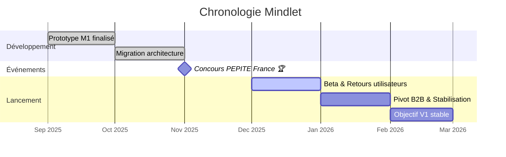

import { Aside, Badge, Card, CardGrid, Steps } from '@astrojs/starlight/components';
import MermaidDownload from '../../../components/MermaidDownload.astro';

# 👥 Équipe et organisation

## Présentation de l'équipe

L'équipe Mindlet est composée de deux étudiants en **Master Informatique - Parcours Développement Full Stack** à l'Université de Corse.

<CardGrid>
  <Card title="Mehdi Ghoulam" icon="laptop">
    **Développeur Full Stack**
    
    - Développement frontend React Native
    - Développement backend Laravel
    - Architecture cloud et DevOps
    - Gestion de projet
  </Card>
  <Card title="Anthony Menghi" icon="rocket">
    **Ingénieur IA**
    
    - Développement des services IA
    - LangChain et LangGraph
    - Modèles de langage et embeddings
    - Recherche et développement
  </Card>
</CardGrid>

## Répartition des rôles

### Responsabilités détaillées

| Domaine | Mehdi Ghoulam | Anthony Menghi |
|---------|---------------|----------------|
| **Frontend** | ✅ Principal | 🔸 Support |
| **Backend API** | ✅ Principal | 🔸 Support |
| **Service IA** | 🔸 Support | ✅ Principal |
| **Base de données** | ✅ Principal | 🔸 Support |
| **DevOps/Cloud** | ✅ Principal | 🔸 Support |
| **Tests** | ✅ Partagé | ✅ Partagé |
| **Documentation** | ✅ Partagé | ✅ Partagé |

## Outils de gestion de projet

### Dépôt de code

<Badge text="GitHub" variant="success" size="large" />

Nous utilisons **GitHub** pour l'hébergement de notre code source :

- **Organisation** : [github.com/mindlet-app](https://github.com/mindlet-app)
- **Repositories** :
  - `mindlet-mobile` : Application React Native
  - `mindlet-api` : Backend Laravel
  - `mindlet-ai` : Service IA
  - `mindlet-docs` : Documentation technique

### Gestion des tâches

<Badge text="GitHub Projects" variant="note" size="large" />

**GitHub Projects** pour la planification et le suivi :

```mermaid
flowchart LR
    subgraph Backlog["📋 Backlog"]
        B1["○ Feature X"]
        B2["○ Feature Y"]
        B3["○ Feature Z"]
    end
    
    subgraph Todo["📝 À faire"]
        T1["○ Bug fix"]
        T2["○ Tests"]
    end
    
    subgraph InProgress["🔄 En cours"]
        I1["● API auth"]
        I2["● UI cards"]
    end
    
    subgraph Done["✅ Fait"]
        D1["✓ Setup"]
        D2["✓ CI/CD"]
        D3["✓ Deploy"]
    end
    
    Backlog --> Todo --> InProgress --> Done
    
    style Backlog fill:#424242,stroke:#757575
    style Todo fill:#e65100,stroke:#f57c00
    style InProgress fill:#1565c0,stroke:#1976d2
    style Done fill:#2e7d32,stroke:#388e3c
```

<MermaidDownload title="Kanban Board">

</MermaidDownload>

### Workflow Git

<Steps>
1. **Création d'une branche** depuis `main` pour chaque feature/fix
2. **Développement** avec commits réguliers et descriptifs
3. **Pull Request** avec description détaillée et screenshots
4. **Code Review** par l'autre membre de l'équipe
5. **Merge** après validation et passage des tests CI
</Steps>

#### Convention de nommage des branches

| Type | Format | Exemple |
|------|--------|---------|
| Feature | `feature/nom-feature` | `feature/card-generation` |
| Bug fix | `fix/description-bug` | `fix/login-crash` |
| Hotfix | `hotfix/description` | `hotfix/production-error` |
| Refactor | `refactor/description` | `refactor/api-structure` |

#### Convention de commits

```
type(scope): description

[body optionnel]

[footer optionnel]
```

**Types de commits :**
- `feat`: Nouvelle fonctionnalité
- `fix`: Correction de bug
- `docs`: Documentation
- `style`: Formatage, pas de changement de code
- `refactor`: Refactoring de code
- `test`: Ajout ou modification de tests
- `chore`: Maintenance, dépendances

## Méthodologie de travail

### Approche Agile simplifiée

<Aside type="note">
  En tant que petite équipe de 2 personnes, nous avons adapté les principes agiles à notre contexte.
</Aside>

#### Rituels

| Rituel | Fréquence | Durée | Objectif |
|--------|-----------|-------|----------|
| **Daily standup** | Quotidien | 10 min | Synchronisation rapide |
| **Sprint planning** | Hebdomadaire | 30 min | Planification de la semaine |
| **Rétrospective** | Bi-mensuelle | 1h | Amélioration continue |

#### Sprints

- **Durée** : 1 semaine
- **Objectif** : Livrer des incréments fonctionnels
- **Review** : Démonstration des fonctionnalités développées

### Communication

| Canal | Usage |
|-------|-------|
| **Discord** | Communication quotidienne, appels |
| **GitHub Issues** | Suivi des bugs et features |
| **GitHub Discussions** | Décisions techniques, architecture |
| **Notion** | Documentation interne, notes |

## Statut étudiant-entrepreneur

<Badge text="PEPITE France" variant="success" />

Notre statut d'**étudiant-entrepreneur** nous a permis de :

- Bénéficier d'un **accompagnement personnalisé**
- Accéder à des **formations entrepreneuriales**
- Participer au **concours PEPITE France**
- Obtenir des **conseils juridiques et business**

### Lauréats nationaux 🏆

Nous faisons partie des **30 lauréats nationaux** du concours PEPITE France, ce qui a :

- Validé notre projet et notre vision
- Ouvert des opportunités de networking
- Apporté une reconnaissance nationale
- Motivé l'équipe pour la suite

## Chronologie du projet

<MermaidDownload title="Chronologie Mindlet">

</MermaidDownload>

## Leçons apprises

### Ce qui a bien fonctionné

- ✅ Communication régulière et transparente
- ✅ Répartition claire des responsabilités
- ✅ Utilisation efficace de GitHub
- ✅ Flexibilité et adaptation

### Points d'amélioration

- ⚠️ Mieux estimer les tâches
- ⚠️ Plus de tests en amont
- ⚠️ Documentation continue
- ⚠️ Gestion du stress en période de crunch

---

*Une équipe soudée, des objectifs clairs.*
