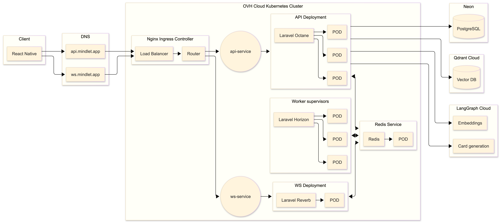

import { Aside, Badge, Card, CardGrid, TabItem, Tabs } from '@astrojs/starlight/components';

# 📊 Performances et scalabilité

## État actuel des performances

### Métriques clés

| Métrique | Valeur actuelle | Objectif |
|----------|-----------------|----------|
| **Temps de réponse API (p50)** | 45ms | < 100ms |
| **Temps de réponse API (p95)** | 180ms | < 500ms |
| **Génération IA (moyenne)** | 8s | < 15s |
| **Uptime** | 99.2% | 99.9% |
| **Utilisateurs simultanés** | 100 testés | 10 000 cible |

### Benchmarks

<Tabs>
  <TabItem label="API Backend">
    ```
    Endpoint: GET /api/v1/collections
    Concurrency: 50 users
    Duration: 60 seconds
    
    Results:
    ├── Requests/sec: 450
    ├── Avg latency: 42ms
    ├── P95 latency: 156ms
    ├── P99 latency: 312ms
    └── Errors: 0%
    ```
  </TabItem>
  
  <TabItem label="Génération IA">
    ```
    Operation: Generate 10 cards from document
    Document size: 5000 words
    Model: GPT-4
    
    Results:
    ├── Avg duration: 8.2s
    ├── Token usage: ~3500 tokens
    ├── Cost per generation: ~$0.12
    └── Success rate: 98%
    ```
  </TabItem>
</Tabs>

## Architecture cloud



### Infrastructure actuelle

| Composant | Configuration | Fournisseur |
|-----------|---------------|-------------|
| **API (Kubernetes)** | 2 pods, 1 CPU, 2GB RAM | OVHcloud |
| **PostgreSQL** | Managed, 2 vCPU, 4GB RAM | OVHcloud |
| **Redis** | Managed, 1GB RAM | OVHcloud |
| **Qdrant** | 1 instance, 2GB RAM | Hetzner |
| **MinIO** | Object storage, 50GB | OVHcloud |

## Stratégies de scalabilité

### Scalabilité horizontale

<CardGrid>
  <Card title="Kubernetes HPA" icon="rocket">
    Auto-scaling des pods API basé sur CPU/mémoire
  </Card>
  <Card title="Load Balancer" icon="random">
    Distribution de charge entre les instances
  </Card>
  <Card title="Stateless Design" icon="setting">
    Chaque pod peut traiter n'importe quelle requête
  </Card>
  <Card title="Queue Workers" icon="list-format">
    Traitement asynchrone des tâches lourdes
  </Card>
</CardGrid>

### Configuration Kubernetes

```yaml
# deployment.yaml
apiVersion: apps/v1
kind: Deployment
metadata:
  name: mindlet-api
spec:
  replicas: 2
  selector:
    matchLabels:
      app: mindlet-api
  template:
    spec:
      containers:
        - name: api
          image: mindlet/api:latest
          resources:
            requests:
              cpu: "500m"
              memory: "1Gi"
            limits:
              cpu: "1000m"
              memory: "2Gi"
          readinessProbe:
            httpGet:
              path: /health
              port: 8000
            initialDelaySeconds: 5
            periodSeconds: 10
---
# hpa.yaml
apiVersion: autoscaling/v2
kind: HorizontalPodAutoscaler
metadata:
  name: mindlet-api-hpa
spec:
  scaleTargetRef:
    apiVersion: apps/v1
    kind: Deployment
    name: mindlet-api
  minReplicas: 2
  maxReplicas: 10
  metrics:
    - type: Resource
      resource:
        name: cpu
        target:
          type: Utilization
          averageUtilization: 70
    - type: Resource
      resource:
        name: memory
        target:
          type: Utilization
          averageUtilization: 80
```

### Traitement asynchrone

```php
// Job de génération de cartes
class GenerateCardsJob implements ShouldQueue
{
    use Dispatchable, InteractsWithQueue, Queueable, SerializesModels;
    
    public int $tries = 3;
    public int $timeout = 120;
    
    public function __construct(
        private Document $document,
        private User $user
    ) {
        $this->onQueue('high');
    }
    
    public function handle(AIService $aiService): void
    {
        $cards = $aiService->generateCards($this->document);
        
        event(new CardsGenerated($cards, $this->user));
    }
    
    public function failed(Throwable $exception): void
    {
        Log::error('Card generation failed', [
            'document_id' => $this->document->id,
            'error' => $exception->getMessage(),
        ]);
        
        $this->user->notify(new GenerationFailedNotification());
    }
}
```

## Projections de montée en charge

### Scénarios de croissance

| Utilisateurs | API Pods | IA Workers | DB Size | Coût estimé/mois |
|--------------|----------|------------|---------|------------------|
| **100** (actuel) | 2 | 1 | 5GB | 50€ |
| **1 000** | 4 | 2 | 20GB | 150€ |
| **10 000** | 8 | 4 | 100GB | 500€ |
| **100 000** | 16+ | 8+ | 500GB | 2 000€+ |

### Points de friction identifiés

<Aside type="caution">
  Ces points nécessitent une attention particulière lors de la montée en charge.
</Aside>

| Composant | Risque | Solution prévue |
|-----------|--------|-----------------|
| **Base de données** | Connexions saturées | Connection pooling (PgBouncer) |
| **Service IA** | Coûts LLM | Cache des réponses, modèles locaux |
| **Stockage** | Croissance rapide | Politique de rétention, compression |
| **Qdrant** | Mémoire insuffisante | Sharding, clustering |

## Optimisations réalisées

### Cache applicatif

```php
class CollectionController extends Controller
{
    public function index(Request $request): JsonResponse
    {
        $userId = $request->user()->id;
        
        $collections = Cache::remember(
            "user:{$userId}:collections",
            now()->addMinutes(5),
            fn () => Collection::where('user_id', $userId)
                ->with('cards:id,collection_id')
                ->get()
        );
        
        return CollectionResource::collection($collections);
    }
}
```

### Optimisation des requêtes

```php
// Avant : N+1 queries
$collections = Collection::all();
foreach ($collections as $collection) {
    echo $collection->cards->count(); // Requête à chaque itération
}

// Après : Eager loading
$collections = Collection::withCount('cards')->get();
foreach ($collections as $collection) {
    echo $collection->cards_count; // Pas de requête supplémentaire
}
```

### Indexation base de données

```sql
-- Index pour les requêtes fréquentes
CREATE INDEX idx_cards_collection_type ON cards(collection_id, type);
CREATE INDEX idx_cards_user_created ON cards(user_id, created_at DESC);
CREATE INDEX idx_collections_user ON collections(user_id);

-- Index pour la recherche full-text
CREATE INDEX idx_cards_question_gin ON cards 
  USING gin(to_tsvector('french', question));
```

## Monitoring et alertes

### Stack de monitoring

| Outil | Usage |
|-------|-------|
| **Prometheus** | Collecte de métriques |
| **Grafana** | Visualisation |
| **Sentry** | Error tracking |
| **Laravel Telescope** | Debug en développement |

### Métriques surveillées

```php
// Middleware de métriques
class MetricsMiddleware
{
    public function handle($request, $next)
    {
        $start = microtime(true);
        
        $response = $next($request);
        
        $duration = microtime(true) - $start;
        
        Metrics::histogram('http_request_duration_seconds', $duration, [
            'method' => $request->method(),
            'path' => $request->path(),
            'status' => $response->status(),
        ]);
        
        return $response;
    }
}
```

### Alertes configurées

| Métrique | Seuil | Action |
|----------|-------|--------|
| CPU > 80% pendant 5min | Warning | Notification Slack |
| Latency p95 > 1s | Critical | Alerte email + Slack |
| Error rate > 5% | Critical | Alerte immédiate |
| Disk usage > 85% | Warning | Notification |

---

*Prêt pour la croissance, conçu pour la performance.*
