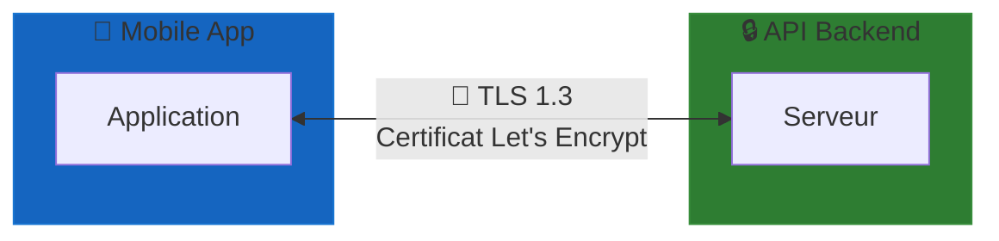

import { Aside, Badge, Card, CardGrid, Steps, TabItem, Tabs } from '@astrojs/starlight/components';
import MermaidDownload from '../../../components/MermaidDownload.astro';

# 🔒 Sécurité et protection des données

<Aside type="caution">
  La sécurité et la protection des données sont au cœur de notre architecture. Nous respectons les normes **RGPD** et les meilleures pratiques de sécurité.
</Aside>

## Vue d'ensemble

Mindlet manipule des données sensibles (contenus éducatifs personnels, données d'apprentissage) et doit garantir :

- **Confidentialité** : Les données ne sont accessibles qu'aux utilisateurs autorisés
- **Intégrité** : Les données ne peuvent être modifiées sans autorisation
- **Disponibilité** : Le service reste accessible de manière fiable

## Sécurité des communications

### HTTPS obligatoire

<Badge text="TLS 1.3" variant="success" />

Toutes les communications sont chiffrées :

<MermaidDownload title="Communication TLS">

</MermaidDownload>

**Configuration :**
- Protocole : **TLS 1.3** (minimum TLS 1.2)
- Certificats : **Let's Encrypt** (renouvellement automatique)
- HSTS : Activé avec `max-age=31536000`
- Cipher suites : Suites modernes uniquement

### Protection des API

```php
// Middleware de sécurité Laravel
Route::middleware([
    'auth:sanctum',           // Authentification JWT
    'throttle:60,1',          // Rate limiting
    'verified',               // Email vérifié
    EnsureJsonResponse::class // Réponses JSON uniquement
])->group(function () {
    // Routes protégées
});
```

## Authentification et autorisation

### Authentification JWT

<Steps>
1. L'utilisateur envoie ses credentials (email/password)
2. Le serveur vérifie et génère un JWT signé
3. Le token contient l'ID utilisateur et l'expiration
4. Le client stocke le token de manière sécurisée
5. Chaque requête inclut le token dans le header `Authorization`
</Steps>

```php
// Génération du token
$token = $user->createToken('mobile-app', [
    'expires_at' => now()->addDays(7),
])->plainTextToken;

// Structure du token (décodé)
{
    "sub": "user_123",
    "iat": 1705536000,
    "exp": 1706140800,
    "scopes": ["read", "write"]
}
```

### Stockage sécurisé côté mobile

```typescript
import * as SecureStore from 'expo-secure-store';

// Stockage du token
await SecureStore.setItemAsync('auth_token', token, {
  keychainAccessible: SecureStore.WHEN_UNLOCKED,
});

// Récupération du token
const token = await SecureStore.getItemAsync('auth_token');
```

### Politiques d'autorisation

```php
class CardPolicy
{
    public function view(User $user, Card $card): bool
    {
        // Seul le propriétaire ou les membres du groupe peuvent voir
        return $card->user_id === $user->id 
            || $card->collection->isSharedWith($user);
    }
    
    public function update(User $user, Card $card): bool
    {
        // Seul le propriétaire peut modifier
        return $card->user_id === $user->id;
    }
    
    public function delete(User $user, Card $card): bool
    {
        return $card->user_id === $user->id;
    }
}
```

## Protection des données

### Chiffrement en base de données

<Tabs>
  <TabItem label="Données sensibles">
    ```php
    use Illuminate\Database\Eloquent\Casts\Attribute;

    class User extends Model
    {
        protected function personalNotes(): Attribute
        {
            return Attribute::make(
                get: fn ($value) => decrypt($value),
                set: fn ($value) => encrypt($value),
            );
        }
    }
    ```
    
    **Données chiffrées :**
    - Notes personnelles
    - Préférences d'apprentissage
    - Données médicales (troubles d'apprentissage)
  </TabItem>
  
  <TabItem label="Mots de passe">
    ```php
    // Hashage bcrypt avec cost factor 12
    $hashedPassword = Hash::make($password, [
        'rounds' => 12,
    ]);
    
    // Vérification
    if (Hash::check($password, $hashedPassword)) {
        // Authentification réussie
    }
    ```
    
    **Politique de mots de passe :**
    - Minimum 8 caractères
    - Au moins 1 majuscule, 1 minuscule, 1 chiffre
    - Vérification contre les mots de passe compromis (HaveIBeenPwned)
  </TabItem>
</Tabs>

### Validation des entrées

```php
class CreateCardRequest extends FormRequest
{
    public function rules(): array
    {
        return [
            'question' => [
                'required',
                'string',
                'max:1000',
                new NoHtmlContent(), // Empêche l'injection HTML
            ],
            'answer' => [
                'required',
                'string',
                'max:5000',
                new NoHtmlContent(),
            ],
            'collection_id' => [
                'required',
                'exists:collections,id',
                new UserOwnsCollection(), // Vérifie l'ownership
            ],
        ];
    }
}
```

### Protection contre les attaques courantes

| Attaque | Protection |
|---------|------------|
| **SQL Injection** | Eloquent ORM, requêtes préparées |
| **XSS** | Échappement automatique, CSP headers |
| **CSRF** | Tokens CSRF (sessions web) |
| **Brute Force** | Rate limiting, captcha après 5 échecs |
| **Mass Assignment** | `$fillable` explicite sur les modèles |

## Conformité RGPD

<Badge text="RGPD Compliant" variant="success" size="large" />

### Principes respectés

<CardGrid>
  <Card title="Minimisation des données" icon="document">
    Nous ne collectons que les données strictement nécessaires au fonctionnement du service.
  </Card>
  <Card title="Consentement explicite" icon="approve-check">
    L'utilisateur donne son consentement clair avant toute collecte de données.
  </Card>
  <Card title="Droit d'accès" icon="magnifier">
    L'utilisateur peut consulter toutes ses données à tout moment.
  </Card>
  <Card title="Droit à l'effacement" icon="close">
    L'utilisateur peut supprimer son compte et toutes ses données.
  </Card>
</CardGrid>

### Données collectées

| Catégorie | Données | Finalité | Durée de conservation |
|-----------|---------|----------|----------------------|
| **Compte** | Email, nom, mot de passe (hashé) | Authentification | Jusqu'à suppression du compte |
| **Contenu** | Documents, cartes, collections | Service | Jusqu'à suppression par l'utilisateur |
| **Apprentissage** | Progression, scores, temps | Personnalisation | 2 ans après dernière connexion |
| **Technique** | Logs, IP, device | Sécurité, debug | 1 an |

### Implémentation des droits

```php
class UserDataController extends Controller
{
    // Droit d'accès - Export des données
    public function exportData(Request $request): JsonResponse
    {
        $user = $request->user();
        
        $data = [
            'profile' => $user->only(['name', 'email', 'created_at']),
            'collections' => $user->collections->load('cards'),
            'progress' => $user->learningProgress,
            'preferences' => $user->preferences,
        ];
        
        return response()->json($data);
    }
    
    // Droit à l'effacement
    public function deleteAccount(Request $request): JsonResponse
    {
        $user = $request->user();
        
        // Suppression en cascade
        $user->collections()->delete();
        $user->documents()->delete();
        $user->notifications()->delete();
        
        // Anonymisation des logs
        Log::info('User account deleted', ['user_id' => $user->id]);
        
        // Suppression du compte
        $user->delete();
        
        return response()->json(['message' => 'Account deleted']);
    }
}
```

### Sous-traitants et transferts

<Aside type="note">
  Tous nos sous-traitants sont situés dans l'**Union Européenne** pour garantir la conformité RGPD.
</Aside>

| Service | Fournisseur | Localisation | Données traitées |
|---------|-------------|--------------|------------------|
| **Hébergement** | OVHcloud | France 🇫🇷 | Toutes les données |
| **Serveurs** | Hetzner | Allemagne 🇩🇪 | Données de traitement |
| **Email** | - | UE | Emails transactionnels |
| **LLM** | OpenAI | Accord DPA | Contenu pour génération |

## Éthique de l'IA

<Aside type="caution">
  L'utilisation de l'intelligence artificielle soulève des questions éthiques importantes que nous prenons en compte.
</Aside>

### Principes éthiques

1. **Transparence** : L'utilisateur sait quand l'IA est utilisée
2. **Contrôle humain** : L'utilisateur peut modifier/supprimer le contenu généré
3. **Non-discrimination** : Pas de biais dans les contenus générés
4. **Respect de la propriété intellectuelle** : Pas de copie de contenus protégés

### Mesures concrètes

```python
class EthicalAIService:
    async def generate_content(self, input: str) -> GeneratedContent:
        # Vérification du contenu d'entrée
        if self.contains_sensitive_content(input):
            raise EthicalViolationError("Contenu sensible détecté")
        
        # Génération avec garde-fous
        content = await self.llm.generate(
            input,
            system_prompt=ETHICAL_SYSTEM_PROMPT,
            max_tokens=1000,
        )
        
        # Vérification du contenu généré
        if self.contains_harmful_content(content):
            raise EthicalViolationError("Contenu généré inapproprié")
        
        # Ajout de métadonnées de traçabilité
        return GeneratedContent(
            content=content,
            generated_at=datetime.now(),
            model_version=self.model_version,
            is_ai_generated=True,
        )
```

## Audits et monitoring

### Journalisation des accès

```php
// Logging des actions sensibles
Log::channel('security')->info('Sensitive action', [
    'action' => 'data_export',
    'user_id' => $user->id,
    'ip' => $request->ip(),
    'user_agent' => $request->userAgent(),
    'timestamp' => now(),
]);
```

### Alertes de sécurité

| Événement | Alerte | Action |
|-----------|--------|--------|
| 5 tentatives de login échouées | Email à l'utilisateur | Blocage temporaire |
| Connexion depuis nouveau pays | Email de vérification | Validation requise |
| Export de données | Email de confirmation | Notification |
| Changement de mot de passe | Email de notification | - |

---

*La sécurité n'est pas une option, c'est une fondation.*
